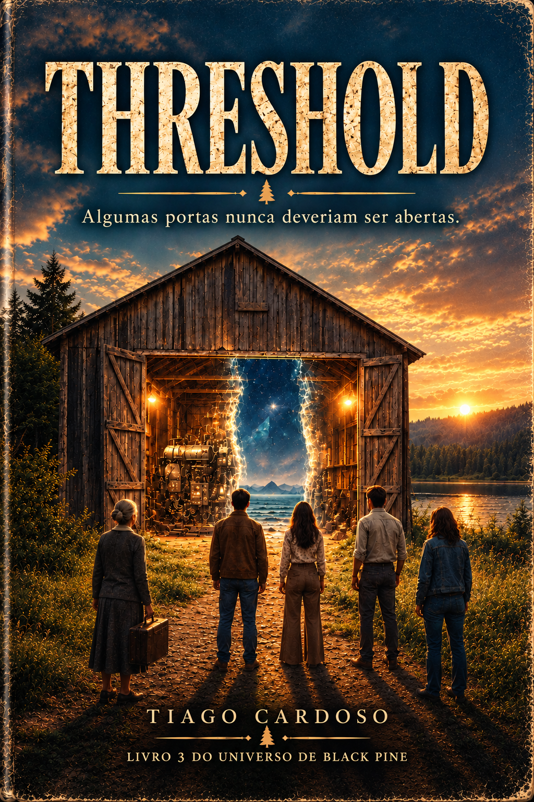
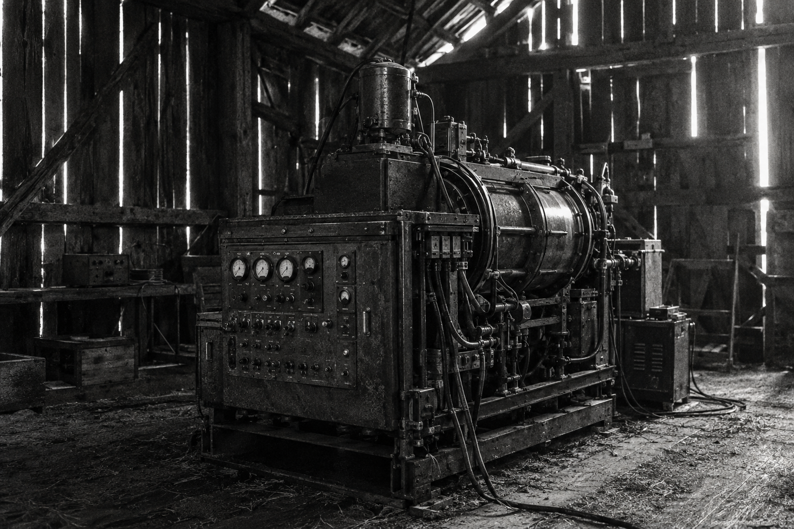
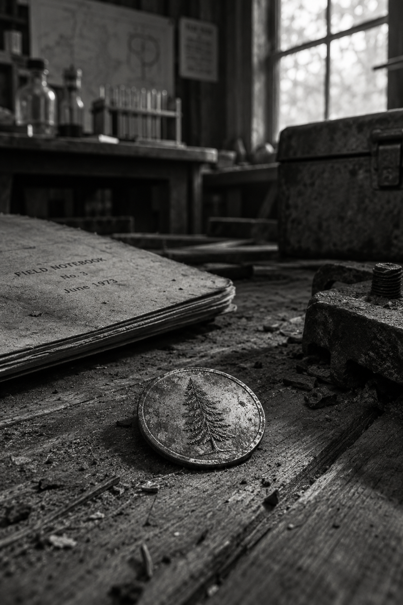
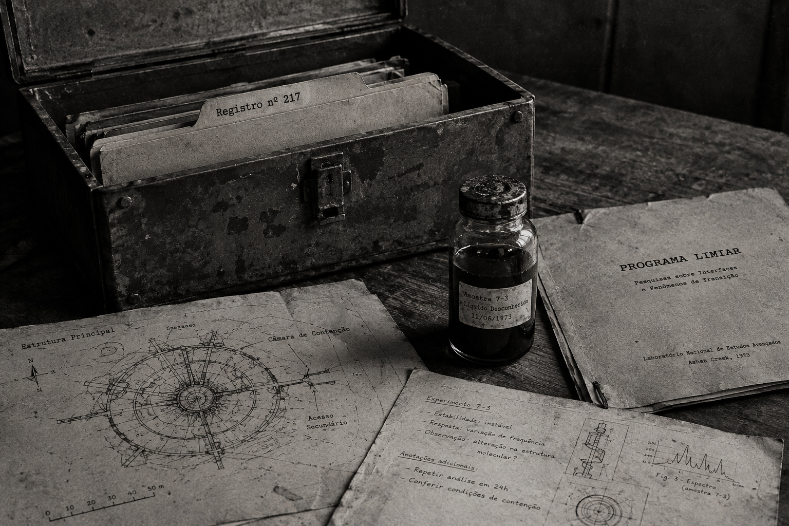
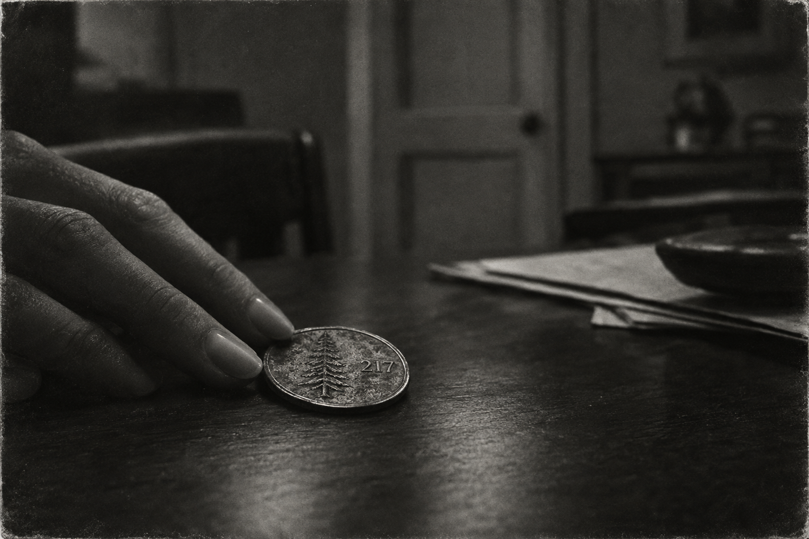

# THRESHOLD
### Livro 3 — Trilogia Black Pine
*Romance de terror, ficção científica e body horror*

**Tiago Cardoso**

**Trilogia Black Pine:**
Livro 1 — *Black Pine*
Livro 2 — *Sparrow Hollow*
Livro 3 — *Threshold*

*Os três livros são independentes e podem ser lidos em qualquer ordem.*

---

## PRÓLOGO — O Verão em Que Eu Aprendi a Ter Medo do Silêncio
### Décadas depois

Tem um tipo de silêncio que só existe depois de um grito.

Não o silêncio de antes — aquele é só ausência de barulho, inofensivo, o tipo que eu passava a vida inteira ensinando meus pacientes a tolerar sem entrar em pânico. Esse outro silêncio é diferente. Esse fica esperando. Ele sabe de alguma coisa que você ainda não sabe, e o pior é que ele não tem pressa nenhuma de te contar.

Eu tinha trinta anos naquele verão.

Tinha acabado de aceitar um pedido de casamento que eu não sabia, ainda, se merecia aceitar — não porque não o amasse, mas porque uma parte de mim, a parte que já tinha sido esposa de outro homem e tinha visto aquilo desmoronar, ainda não confiava totalmente na própria capacidade de escolher direito duas vezes na vida.

Ele estava viajando. Do outro lado do mundo, numa escala de fuso horário que eu tinha desistido de calcular certo. E eu estava em Ashen Creek, na casa onde cresci, com uma taça de vinho, um livro que eu não conseguia largar, e a sensação exata — que eu reconheceria, profissionalmente, como um sintoma clássico de algo maior — de que estava fugindo de alguma coisa fingindo que estava só "dando um tempo".

Eu não sabia, naquela primeira noite, quantas vezes ao longo daquele verão eu ia parar de respirar de propósito, só pra não fazer barulho.

Não sabia que ia aprender a reconhecer o som de uma junta se movendo onde junta nenhuma deveria existir.

Não sabia que ia olhar nos olhos de alguém que eu amava desde os oito anos de idade e não ter a menor certeza — nem um segundo de certeza — se era ainda ele quem olhava de volta.

Existem três noites daquele verão em que eu deveria ter morrido. Consigo te explicar direito só uma delas. As outras duas eu ainda reconstruo, décadas depois, através do que os outros me contaram, porque o meu próprio corpo, num gesto de misericórdia que levei anos pra perdoar, decidiu que era mais seguro eu não lembrar de tudo sozinha.

Sou psicóloga. Passei a vida inteira ajudando gente a dar nome pro que sente. E ainda assim, até hoje, existe uma palavra específica que eu nunca consegui pronunciar em voz alta pra descrever o que vi sair de dentro do Caleb naquela noite, na cozinha da Dra. Voss, enquanto ele ainda tentava, com a garganta errada, me chamar pelo nome.

Vou tentar mesmo assim.

Porque foi naquele verão — entre uma taça de vinho que esfriou sem eu beber, um aparelho que quatro adultos crescidos o bastante pra saber melhor ligaram só por curiosidade, e um silêncio que aprendeu, em algum lugar muito distante daqui, a imitar exatamente o som de alguém que você ama pedindo ajuda — que Ashen Creek se tornou a segunda cidade pequena demais para guardar o que trouxe pra dentro de si.

E a primeira vez, em trinta anos de vida, em que alguma coisa não humana soube meu nome antes de eu dizer.

---

## CAPÍTULO 1 — Diagnóstico Diferencial
### Junho de 1973

Se você me pedisse, profissionalmente, pra descrever o estado mental de uma mulher que larga o próprio consultório em Boston por seis semanas pra "ajudar a mãe a organizar a casa" três meses depois de aceitar um pedido de casamento, eu escreveria no prontuário uma palavra só, sublinhada duas vezes.

Evitação.

E depois eu mesma ignoraria completamente o meu próprio diagnóstico, do jeito que todo terapeuta jura, em algum seminário de ética que ninguém realmente absorve, que nunca vai fazer.

Minha mãe não precisava de ajuda nenhuma pra organizar coisa alguma. A casa em Ashen Creek estava exatamente como sempre esteve — impecável, cheirando a café requentado e cera de móvel, o tipo de casa que parece existir fora do tempo porque a mulher que mora nela se recusa, com uma teimosia quase religiosa, a deixar qualquer coisa mudar. Foi ela quem me olhou de cima a baixo na porta, a mala ainda na minha mão, e disse a única frase que eu precisava ouvir e não queria.

— Você não veio me ajudar, Iara. Veio se esconder.

— Vim passar o verão com a senhora, mãe.

— Você tem noivo novo, consultório cheio e trinta anos recém-feitos. Ninguém nessa situação larga tudo seis semanas sem estar fugindo de alguma coisa.

Ela não estava errada. Ela quase nunca estava.

Passei a primeira noite sentada na varanda de trás com uma taça de vinho que enchi duas vezes e bebi menos da metade, o livro que eu trouxera — o mesmo que já tinha lido duas vezes antes, porque recomeçar histórias conhecidas era, eu sabia perfeitamente bem, outro item pra somar na minha própria lista de evitações — fechado no colo, sem que eu conseguisse me concentrar o suficiente pra abrir de novo.

Ashen Creek, à noite, tem um jeito de silêncio que Boston nunca teve. Não falta de barulho — os grilos, uma coruja em algum lugar da mata atrás da represa, o rangido ocasional da casa se ajustando ao relento da noite. É mais que o silêncio ali parece *pertencer* ao lugar, do jeito que o barulho de sirene pertence a uma cidade grande. Cresci ouvindo aquele silêncio. Levei anos, morando fora, pra perceber o quanto tinha sentido falta dele.

O anel ainda parecia estranho no meu dedo. Não desconfortável — só novo, do jeito que um músculo recém-trabalhado ainda avisa a própria existência por dois ou três dias antes de virar parte de você.

Ele tinha me ligado antes de embarcar, a voz cansada e apressada daquele jeito que sempre ficava nas vésperas de viagem longa.

— Você vai ficar bem sozinha?

— Não vou ficar sozinha. Vou ficar com minha mãe e com um bando de gente que eu conheço desde os oito anos.

— Você sabe o que quero dizer.

Eu sabia. E, com a honestidade profissional que eu reservava só pra mim mesma, tarde da noite, quando ninguém mais estava ouvindo, eu também sabia que a resposta verdadeira pra pergunta dele não era "sim".

Fui casada antes. Isso não é segredo — está lá, num parágrafo burocrático de cartório, junto com um sobrenome que devolvi sem drama nenhum e uma coleção de coisas que aprendi, do jeito mais caro possível, sobre a diferença entre amar alguém e confiar que esse alguém continua sendo a mesma pessoa todos os dias da semana. Não vou contar tudo agora. Só digo que existe um tipo específico de medo que só desenvolve quem já viu, de perto, algo bom desmoronar sem aviso — e que esse medo não desaparece só porque a pessoa nova é diferente, é melhor, é exatamente quem você queria.

Ele continua sendo diferente. Continua sendo melhor.

Isso não impediu meu corpo inteiro de tremer, um pouquinho, cada vez que o telefone tocava naquele verão e eu não sabia ainda se era ele.

Foi Priya quem apareceu primeiro na manhã seguinte, buzinando o carro na entrada com uma urgência completamente desproporcional ao fato de ela só estar ali pra tomar café.

— Você chegou ontem e ainda não me ligou? — Ela já estava subindo os degraus da varanda antes de eu conseguir responder, um vestido de linho amassado do jeito proposital que só advogada boa demais no que faz consegue usar sem parecer desleixo. — Isso é falta de consideração profissional, Iara. Eu devia processar você.

— Você processa todo mundo, Priya. É seu hobby.

— É minha *profissão*. O hobby é fazer isso com estilo.

Ela me abraçou forte o bastante pra doer um pouco, do jeito que só quinze anos de amizade permitem, e recuou segurando meus dois ombros, os olhos correndo pelo meu rosto com aquela atenção de advogada acostumada a farejar o que as pessoas não estão dizendo.

— Você tá com essa cara de quem fugiu de alguma coisa.

— Minha mãe já usou exatamente essas palavras ontem.

— Sua mãe é uma mulher sábia. Café?

Tomamos café na cozinha, a mesma cafeteira velha que minha mãe se recusava a substituir desde que eu tinha memória, e Priya me contou, entre um gole e outro, tudo que eu tinha perdido nos últimos dois anos que passei mais ocupada demais pra visitar — o escritório novo dela em Albany, o divórcio feio dos pais do Marlon, e, por último, baixando a voz com um prazer safado que eu reconheceria em qualquer década da nossa amizade, a novidade que ela claramente vinha guardando pro final.

— O Caleb comprou um celeiro.

— Ele já tinha um celeiro, Priya. A família dele é dona da metade dos celeiros dessa cidade.

— Não esse. Comprou a propriedade velha da represa. Aquela que era da Dra. Voss.

Alguma coisa, muito de leve, se moveu no fundo do meu estômago — não medo, ainda não, só aquele tipo de atenção instintiva que eu tinha aprendido, profissionalmente, a nunca ignorar por completo.

— A cientista maluca?

— A "cientista reclusa", Iara, tenha modos. — Priya sorriu, mas o sorriso não chegou totalmente aos olhos dela. — Ele diz que encontrou um monte de equipamento velho lá dentro. Está obcecado. Fala nisso desde que a papelada fechou.

— Obcecado como assim?

— Do jeito que só o Caleb fica obcecado com coisa que devia deixar quieta.

Ela riu quando disse isso, um risinho fácil, do tipo que a gente solta sem pensar demais — mas eu, treinada havia anos pra reconhecer o momento exato em que uma piada carrega, escondido dentro dela, um medo real que a pessoa ainda não decidiu levar a sério, guardei aquilo numa gaveta mental que eu só abriria de novo, com muito mais peso, três dias depois.

Não sabia, tomando aquele café requentado na cozinha da minha mãe, que estava prestes a conhecer o objeto que ia mudar, de forma permanente, o significado que a palavra "diferente" teria pro resto da minha vida.

Não sabia que ia aprender a temer não pela minha própria vida primeiro — mas pela de gente que eu amava havia mais tempo do que sabia amar qualquer outra coisa.

Isso, como quase tudo naquele verão, eu só entenderia tarde demais pra fazer alguma diferença.

---

## CAPÍTULO 2 — O Celeiro
### Junho de 1973

O Caleb sempre teve o tipo de entusiasmo que devia vir com aviso de bula.

Encontrei ele três dias depois, no meio da tarde, debruçado sobre uma bancada improvisada no celeiro da propriedade Voss, as mangas da camisa arregaçadas, graxa até o cotovelo, o cabelo cortado curto demais pro calor de junho de um jeito que eu reconheci imediatamente como coisa da mãe dele, não escolha própria.

— Você não bate na porta? — perguntei, parada no vão da entrada, o sol da tarde ainda quente nas minhas costas.

— É um celeiro, Iara. Tecnicamente não tem porta pra bater.

— Tem um portão gigante que você deixou aberto de propósito, o que é ainda mais convite.

Ele riu, aquele riso largo e sem cerimônia que eu conhecia desde os oito anos de idade, quando ele ainda usava aparelho e insistia em me ensinar a andar de skate no estacionamento vazio da igreja metodista, sempre prometendo que dessa vez eu não ia cair, sempre estando errado.

— Vem ver uma coisa.

Entrei. O celeiro por dentro era maior do que parecia de fora, o teto alto o suficiente pra abrigar uma estrutura de madeira que provavelmente já tinha guardado feno de verdade, décadas atrás, antes de virar o que quer que a Dra. Voss tivesse transformado aquilo depois. Prateleiras de metal corriam ao longo das paredes, cheias de caixas etiquetadas numa letra pequena e apertada, e no centro do espaço, coberto por uma lona empoeirada que Caleb já tinha puxado pela metade, havia algo do tamanho de um piano de cauda pequeno, todo em metal escurecido, com um painel de controles que parecia ter saído direto de um filme de ficção científica de orçamento baixo demais pros efeitos especiais convencerem.

Numa das prateleiras mais baixas, entre um maço de cadernos de campo e um frasco de parafusos enferrujados, alguma coisa pequena e prateada rolou de leve quando esbarrei de raspão na estante — uma moeda, ou algo do tamanho de uma moeda, opaca demais pra brilhar direito sob a luz fraca que entrava pelas frestas do telhado. Nem parei pra olhar direito. Só empurrei de volta pro lugar com a ponta do dedo, sem pensar duas vezes, e segui o Caleb até o centro do celeiro.

— O que é isso?

— Não sei ainda ao certo. — Ele passou a mão pela superfície do aparelho com um cuidado quase reverente. — Mas os documentos que encontrei junto mencionam uma coisa chamada Programa Limiar. Financiamento federal, encerrado abruptamente em 68. Não achei relatório final nenhum — só rascunhos incompletos, cálculos que nem sempre batem entre si, e isso.

— Programa Limiar pra fazer o quê?

Caleb hesitou, e essa hesitação — vinda dele, que normalmente falava rápido demais até sobre as próprias dúvidas — me fez sentir, pela segunda vez em três dias, aquele mesmo puxão de atenção no fundo do estômago.

— Pelos cálculos que consegui entender, e olha que entendi talvez uns vinte por cento... isso não foi feito pra viajar no espaço. Foi feito pra abrir uma passagem *até* ele. Uma janela. Curta, instável, mas real.

— Isso é loucura, Caleb.

— É exatamente o que eu pensei. Até ligar.

Meu estômago virou de um jeito bem menos sutil dessa vez.

— Você *ligou* isso?

— Por trinta segundos. — Ele ergueu as duas mãos, na defensiva, o mesmo gesto que eu lembrava dele fazendo aos doze anos depois de quebrar a janela da cozinha da mãe dele com uma bola de beisebol. — Nada aconteceu. Um zumbido, as luzes do painel acenderam, e desligou sozinho. Acho que precisa de mais energia do que a fiação daqui aguenta.

— E se você conseguisse mais energia?

Ele sorriu, e foi ali, exatamente ali, olhando pra aquele sorriso que eu conhecia havia mais de vinte anos, que eu deveria ter dito não. Deveria ter dado meia-volta, ligado pro meu noivo do outro lado do mundo só pra ouvir a voz dele, bebido o resto daquela garrafa de vinho sozinha na varanda da minha mãe, e deixado a Dra. Eleanor Voss continuar sendo só uma lenda engraçada de cidade pequena.

Em vez disso, perguntei a pergunta errada.

— Você já contou pro Marlon e pra Priya?

— Vou contar hoje à noite. — Ele baixou a lona de volta sobre o aparelho, quase com carinho, do jeito que a gente cobre alguma coisa que já decidiu, no fundo, que vai voltar a descobrir em breve. — Achei que você merecia ser a primeira a ver, considerando que técnica é sua também, sabe. Formada em ciência do comportamento e tudo mais.

— Ciência do comportamento é sobre gente, Caleb. Não sobre... isso, seja lá o que for isso.

— Talvez seja a mesma coisa — disse ele, num tom leve demais pra frase que estava dizendo. — Talvez a gente só ainda não saiba o comportamento de quem vive do outro lado.

Saímos do celeiro quando o sol já baixava, pintando a represa de um laranja pesado que eu reconheceria, mais tarde, décadas depois, em quase toda memória boa que eu ainda conseguia ter daquele verão antes de tudo mudar. Caleb trancou o cadeado do portão com um cuidado exagerado, quase cerimonial, e eu me peguei olhando pra trás, pro celeiro, com a mesma sensação estranha e específica que eu só sentiria de novo, semanas depois, olhando pra um espelho que devolvia o reflexo certo um segundo tarde demais.

A sensação de estar sendo observada por alguma coisa que ainda não tinha decidido se valia a pena se revelar.

Naquela noite, liguei pro meu noivo antes de dormir, a ligação cortando duas vezes por causa da distância, a voz dele chegando atrasada e comprimida através de quilômetros de cabo submarino.

— Como foi o dia? — perguntou ele.

Pensei no aparelho coberto de lona, no zumbido que durou trinta segundos, no jeito que o Caleb tinha dito "do outro lado" como se já soubesse, de algum lugar dentro dele mesmo, exatamente o que aquilo significava.

— Tranquilo — menti, a primeira de muitas mentiras pequenas que eu contaria naquele verão, todas com a mesma justificativa gasta que eu reconheceria, qualquer dia normal de consultório, como a raiz de praticamente todo segredo destrutivo que meus pacientes já tinham confessado pra mim.

*Não quero que você se preocupe.*

Eu não sabia, desligando o telefone naquela noite, que "se preocupar" seria, em muito pouco tempo, a reação mais razoável que qualquer pessoa que me amasse poderia ter.

---

## CAPÍTULO 3 — Quatro em Volta de uma Mesa
### Junho de 1973

O Marlon chegou por último no jantar, como sempre chegava por último em tudo, a câmera pendurada no pescoço mesmo sendo um jantar comum numa cozinha comum, porque em vinte e dois anos de amizade eu nunca tinha visto aquele homem sair de casa sem ela, nem pra ir comprar cigarro.

— Você trouxe trabalho pra um jantar de amigos — falei, abrindo a porta pra ele.

— Trouxe testemunha — corrigiu ele, me dando um beijo rápido no rosto e entrando direto pra cozinha, onde Caleb já discutia com Priya sobre o ponto certo do frango que ela insistia estar quase queimando e ele jurava estar "perfeitamente dourado, Priya, existe uma diferença entre dourado e queimado, é uma linha fina mas ela existe".

A casa da mãe de Caleb — ele ainda morava lá, formalmente, embora passasse mais noites naquele celeiro do que em qualquer cama de verdade, segundo a própria Priya reclamava — cheirava a alho e manteiga derretida, as janelas abertas deixando entrar o som de grilos e o cheiro de grama cortada que só existe em final de tarde de junho em cidade pequena.

— Não vou comer isso — avisei, olhando pro molho branco borbulhando na panela.

— Por quê, você virou vegetariana enquanto eu não olhava? — perguntou Caleb, ofendido de um jeito teatral só pra fazer graça.

— Virei intolerante a lactose desde os vinte e três anos, Caleb, isso não é novidade nenhuma, você simplesmente nunca presta atenção quando eu falo sobre comida.

— Eu presto atenção nas coisas importantes.

— Meu sistema digestivo é extremamente importante pra mim, pessoalmente.

Priya riu tão alto que quase deixou cair a colher de pau na panela, e por um momento — só um momento, curto o suficiente pra eu quase não notar o quanto eu precisava dele — aquilo pareceu exatamente como qualquer outro jantar entre nós quatro nos últimos vinte anos. Ninguém falando de aparelho nenhum. Ninguém falando de programa federal encerrado abruptamente em 68. Só quatro adultos que já tinham sido quatro crianças brigando bobamente sobre ponto de frango numa cozinha que cheirava a infância.

Durou até a sobremesa.

— Então — falou Marlon, baixando a câmera pela primeira vez a noite inteira, os olhos indo direto pra Caleb com aquele tipo de atenção quieta que eu sempre invejei nele profissionalmente, a capacidade de simplesmente *esperar* que alguém preenchesse o silêncio em vez de forçar a conversa. — Você vai contar pra gente sobre o celeiro, ou eu preciso adivinhar pelas fotos que tirei da sua cara toda vez que alguém menciona a palavra "Voss"?

Caleb olhou pra mim primeiro — pedindo permissão, percebi, pra confirmar que eu já sabia — e eu assenti, devagar.

Ele contou tudo. O aparelho. Os documentos. Programa Limiar. Os trinta segundos de zumbido.

Priya ficou em silêncio o tempo inteiro, os braços cruzados, o tipo de silêncio cético que eu reconhecia dela desde que a gente tinha doze anos e ela se recusava a acreditar em qualquer história de fantasma até ver prova documentada, testemunhas juramentadas e, de preferência, uma confissão assinada.

— Isso é a coisa mais idiota que eu já ouvi — declarou ela, quando Caleb finalmente terminou. — E olha que eu já ouvi você defender, com toda seriedade, que colocar moeda no micro-ondas "só por dez segundos" era seguro.

— Aquilo foi um erro de julgamento isolado.

— Aquilo foi um incêndio pequeno, Caleb.

— Controlado.

— Foram os bombeiros que controlaram.

Marlon, entre risadas, ergueu a câmera de novo e tirou uma foto dos dois discutindo, o flash cortando a cozinha por meio segundo, e naquele meio segundo eu vi, sem entender ainda por quê, alguma coisa na expressão dele mudar — rápido, quase invisível, o tipo de mudança que só alguém treinado a ler microexpressões passaria a vida inteira aprendendo a notar.

— O que foi? — perguntei, baixinho, só pra ele.

— Nada. — Ele abaixou a câmera de novo, sorrindo rápido demais pra ser inteiramente verdade. — Achei que vi alguma coisa no visor. Deve ser reflexo da lâmpada.

Não insisti. Décadas depois, ainda me pergunto se aquele foi o primeiro erro real da noite, ou só o primeiro que eu consegui identificar em retrospecto.

— Eu quero ver — disse Priya, de repente, interrompendo a própria discussão com Caleb no meio da frase. — Não pra ligar. Só pra ver. Se for besteira, a gente ri e volta pra sobremesa.

— E se não for besteira? — perguntei.

Ela deu de ombros, aquele gesto de advogada que já sabia a resposta e só queria ouvir alguém mais dizer em voz alta primeiro.

— Então a gente descobre isso juntos, não é? Sempre foi assim.

Foi, sim. Sempre tinha sido assim, desde as bicicletas velhas que a gente empilhava atrás da igreja, desde os verões inteiros brincando de detetive atrás de mistérios que nunca eram mistério nenhum, só imaginação de criança entediada numa cidade pequena demais pra oferecer qualquer coisa mais interessante.

Eu não sabia, terminando aquele jantar, que estava prestes a descobrir a diferença exata entre imaginação de criança e algo que criança nenhuma jamais deveria ter chance de imaginar sozinha.

---

## CAPÍTULO 4 — Trinta Segundos, Outra Vez
### Junho de 1973, noite seguinte

A Dra. Eleanor Voss ainda morava a menos de um quilômetro do celeiro, numa casa pequena de tijolo que a cidade inteira conhecia de vista e ninguém, até onde eu sabia, tinha visitado por dentro em pelo menos uma década.

Fomos até lá antes — Caleb insistiu, contra a própria vontade de simplesmente ligar o aparelho de uma vez, dizendo que "pelo menos avisar a mulher que ainda é dona disso tudo, tecnicamente" era o mínimo de decência que devíamos.

Ela abriu a porta antes mesmo de batermos, como se já estivesse esperando, os olhos claros e alertas demais pra uma mulher que devia estar na casa dos setenta, o cabelo branco preso num coque apertado que não deixava escapar um fio sequer.

— Vocês encontraram o Limiar — não era pergunta.

— Encontramos um aparelho, senhora — corrigiu Caleb, um pouco encolhido, do jeito que homem crescido nenhum consegue evitar diante de professora que já foi assustadora o suficiente pra virar lenda de cidade pequena. — Não sabíamos se a senhora ainda—

— Desliguem isso.

A ordem saiu seca, sem espaço pra negociação, e por um segundo ninguém disse nada.

— A senhora sabe o que é? — perguntei, dando um passo à frente, a voz mais calma do que eu realmente estava sentindo por dentro. — O que ele faz, exatamente?

Ela me olhou por um longo momento, avaliando, do mesmo jeito clínico que eu reconheceria em qualquer colega de profissão avaliando um paciente novo.

— Você é psicóloga — falou, não como pergunta também.

— Sou.

— Então você entende, melhor que qualquer um desses três, o que significa abrir uma porta que a mente humana talvez nunca tenha sido construída pra atravessar. — Ela deu um passo pra trás, quase fechando a porta de novo. — Não fizemos aquilo pra transportar gente, criança. Fizemos pra escutar. Achávamos que era só isso. E, em algum momento que eu nunca cheguei a entender de verdade, parece ter deixado de ser só a gente que estava escutando. Digo "parece" porque, honestamente, passei cinco anos tentando decidir se aquilo aconteceu mesmo ou se fui eu que enlouqueci sozinha, tempo suficiente pra parar de ter certeza da diferença.

— O que aconteceu em 68? — perguntou Marlon, baixinho, a câmera esquecida pela primeira vez a noite inteira. — Por que o programa fechou?

A Dra. Voss ficou quieta tempo demais antes de responder, os olhos fixos em algum ponto além de nós, na direção do celeiro que mal dava pra ver dali, escondido atrás da curva da represa.

— Porque a última vez que ligamos aquilo por mais de trinta segundos, alguma coisa pareceu ficar sabendo que a porta existia. Não posso provar isso. Ninguém nunca conseguiu provar. — Sua voz baixou, quase um sussurro. — Mas passei cinco anos rezando pra que ela tivesse esquecido o caminho de volta, e rezar por uma coisa que você não sabe explicar direito já é, sozinho, um tipo de resposta.

Ninguém disse nada por um bom tempo.

— A senhora vem com a gente — falei, finalmente, surpreendendo a mim mesma tanto quanto aos outros três. — Se isso é perigoso do jeito que a senhora está descrevendo, a gente vai precisar de alguém que realmente entenda o que está fazendo. Melhor a senhora lá com a gente do que a gente lá sozinho, tentando adivinhar.

Ela riu — um som seco, sem humor nenhum de verdade.

— Vocês vão de qualquer jeito, não vão? Não importa o que eu diga.

Ninguém respondeu. Não precisava.

— Então sim — disse ela, pegando um casaco pendurado atrás da porta com o movimento cansado de quem já sabia, havia anos, que esse dia ia chegar de novo, mais cedo ou mais tarde. — Eu vou com vocês. Só pra ter certeza de que, dessa vez, alguém sabe como desligar rápido o suficiente.

O celeiro, à noite, tinha uma acústica diferente — cada passo nosso ecoando contra as vigas altas, o ar parado carregando um cheiro de metal e óleo de máquina que eu não tinha notado da primeira vez, sob a luz do dia.

Caleb ligou o gerador auxiliar que tinha passado a semana montando, a luz amarela do painel do aparelho piscando devagar, como algo respirando depois de décadas dormindo.

— Trinta segundos — instruiu a Dra. Voss, parada ao lado do painel, um dedo pairando sobre um interruptor vermelho que eu suspeitava ser o desligamento de emergência. — Nem um segundo a mais. E ninguém — ela olhou pra cada um de nós, um de cada vez, com uma severidade que apagou completamente qualquer resquício de humor daquela noite — ninguém chega perto do campo enquanto ele estiver ativo.

Caleb assentiu, a mão trêmula sobre os controles principais.

— Todo mundo pronto?

Ninguém respondeu que sim, exatamente. Mas ninguém disse não, também.

Ele ligou.

O zumbido começou baixo, quase abaixo da audição, uma vibração que eu senti mais nos dentes e nos ossos do peito do que nos ouvidos, crescendo devagar até um tom agudo e constante que fez as luzes penduradas no teto do celeiro tremularem.

E então, no centro do espaço em frente ao aparelho, o ar começou a se dobrar.

Não é a palavra certa, e eu passei anos tentando encontrar uma melhor. Dobrar é a coisa mais próxima que consigo chegar — como olhar através de água correndo rápido demais sobre vidro, uma distorção que ia ficando mais definida a cada segundo, até formar, impossivelmente, uma abertura de talvez um metro de largura, as bordas pulsando com uma luz que não tinha cor que eu conseguisse nomear.

E do outro lado daquela abertura — por uma fração de segundo, rápida demais pra eu ter certeza absoluta décadas depois, mas real o suficiente pra nunca mais sair da minha cabeça — eu vi céu.

Um céu errado. Estrelas demais, num padrão que nenhuma constelação da Terra jamais desenharia, e sob elas, silhuetas de formações que pareciam montanhas, só que com uma geometria que doía nos olhos de tanto tentar entender.

— Vinte segundos — anunciou a Dra. Voss, a voz tensa mas controlada.

Foi Priya, sempre a cética, sempre a que precisava ver com os próprios olhos, quem deu o passo à frente que ninguém mais teve coragem de dar.

— Priya, não! — gritei.

Tarde demais.

Ela já estava perto o bastante da abertura pra que o vento do outro lado — um vento que não deveria existir dentro de um celeiro fechado, carregando um cheiro que eu só conseguiria descrever, muitos anos depois, como "metal molhado e alguma coisa doce demais pra ser natural" — bagunçasse o cabelo dela pra trás.

— Dez segundos!

Caleb correu, puxando Priya pelo braço pra longe da abertura no exato instante em que a Dra. Voss bateu o interruptor vermelho com a palma da mão inteira.

O zumbido morreu. A dobra no ar se fechou com um estalo seco, quase como um elástico esticado demais voltando ao lugar, e o celeiro mergulhou de volta no silêncio comum de qualquer noite de junho.

Ficamos parados ali por um longo momento, ninguém respirando direito, o painel do aparelho apagando devagar até restar só a luz fraca de uma lâmpada pendurada no teto.

— Todo mundo bem? — perguntei, a voz tremendo mais do que eu queria admitir.

Assentimentos. Priya, pálida, esfregando o próprio braço onde a mão do Caleb tinha apertado forte demais. Marlon, a câmera esquecida no chão, os olhos ainda fixos no ponto onde a abertura tinha estado.

Foi só mais tarde, já em casa, deitada na cama sem conseguir dormir, repassando cada segundo daquela luz impossível, que eu percebi o detalhe pequeno demais pra qualquer um de nós ter notado na hora, ocupados demais com o próprio medo pra prestar atenção nos outros.

Marlon tinha ficado mais perto da abertura do que qualquer um de nós, além da Priya.

E, quando finalmente saímos do celeiro naquela noite, ele não tirou uma única foto.

Pela primeira vez em vinte e dois anos de amizade, a câmera dele tinha ficado completamente esquecida, pendurada e imóvel no peito, o resto do caminho até em casa.

---

## CAPÍTULO 5 — Coisas Pequenas Demais Pra Contar
### Julho de 1973

Duas semanas se passaram sem mais nenhuma ativação — Caleb tinha prometido, de mãos erguidas e solenes como se estivesse fazendo juramento de tribunal, que só ligaríamos o aparelho de novo com a Dra. Voss presente, e nunca sozinhos.

Foi durante essas duas semanas, olhando pra trás agora, que os primeiros sinais realmente começaram, pequenos demais pra qualquer um de nós levar a sério na hora.

Eu voltei à minha rotina do jeito que consegui — corri de manhã cedo pela margem da represa, liguei pro meu noivo sempre que a diferença de fuso permitia, e retomei as aulas de balé que fazia questão de manter mesmo longe de Boston, num estúdio pequeno em cima da mercearia que cheirava a giz e madeira envernizada.

— Você ainda faz isso? — perguntou Priya, me encontrando na saída de uma aula, o cabelo ainda preso no coque apertado, as pernas doendo daquele jeito bom que só treino de verdade consegue deixar.

— Faço. É a única hora do dia em que meu cérebro para de analisar todo mundo ao redor e só... conta compasso.

— Deve ser difícil, essa cabeça de terapeuta ligada o tempo inteiro.

— Você não faz ideia. — Sorri, enxugando o suor da testa com a toalha. — Minha irmã sempre disse que eu ia enlouquecer algum paciente um dia desses, de tanto observar em vez de simplesmente viver.

— Sua irmã sempre foi engraçada assim, ou só com você?

— Só comigo. É praticamente um esporte de família.

Rimos, e por um instante aquilo pareceu, de novo, só um verão comum entre amigas de infância — nada de aparelho, nada de céu errado, nada de zumbido que eu ainda sentia, à noite, ecoando de leve nos dentes mesmo sem fonte nenhuma pra explicar.

Foi Priya quem primeiro comentou sobre o Marlon, três dias depois, os dois sentados no píer velho perto da represa enquanto eu terminava de trançar o cabelo antes de outra aula.

— Ele tá estranho — falou ela, sem rodeios, do jeito que só advogada boa consegue ser sem rodeios sobre praticamente qualquer coisa.

— Estranho como?

— Não sei dizer direito. Ele não fotografa mais nada. — Ela franziu a testa, procurando as palavras certas. — Você sabe como ele é. Câmera grudada nele desde os quinze anos. E agora, nada. Perguntei outro dia se ele queria fotografar o pôr do sol, aquele exagerado, alaranjado, do jeito que ele sempre amou, e ele só... deu de ombros. Disse que não via mais "sentido" nisso.

Alguma coisa gelou dentro de mim, o mesmo tipo de atenção clínica que eu vinha acumulando havia semanas, item por item, numa lista mental que eu me recusava, teimosamente, a admitir que estava fazendo.

— Ele está dormindo bem?

— Não sei. Por quê?

— Curiosidade profissional — menti, mal.

Encontrei Marlon dois dias depois, na cozinha da mãe do Caleb de novo, sozinho, olhando pela janela pra represa com uma expressão que eu só conseguiria descrever, na época, como "vazia" — não triste, não perdida no próprio pensamento do jeito normal que a gente às vezes fica. Vazia mesmo. Do jeito que um quarto fica vazio depois que alguém termina de se mudar.

— Tudo bem com você? — perguntei, sentando ao lado dele.

Ele demorou pra responder, o tipo de pausa que, profissionalmente, eu classificaria como latência de resposta anormalmente longa — o tipo de coisa que a gente anota, discretamente, num prontuário, pra observar de novo na consulta seguinte.

— Tenho tido uns sonhos estranhos — disse ele, finalmente, a voz mais baixa do que o normal. — Não lembro os detalhes. Só acordo com a sensação de que vi alguma coisa. Grande. Longe. Chamando.

— Chamando você?

— Chamando... alguma coisa. — Ele esfregou os olhos, cansado. — Não sei explicar melhor que isso, Iara. Desculpa.

— Não precisa se desculpar.

— Você tá me olhando do jeito que olha os pacientes seus.

Não neguei. Não havia razão pra negar.

— Eu tô preocupada com você.

Ele sorriu, um sorriso pequeno, cansado, que quase — quase — pareceu inteiramente dele.

— Eu também tô preocupado comigo, se te faz sentir melhor.

Foi a última conversa realmente normal que tivemos naquele verão.

---

## CAPÍTULO 6 — O Que as Fotos Não Mostram
### Julho de 1973

A câmera do Marlon reapareceu de forma abrupta, uma semana depois, sem aviso — ele apareceu na casa da minha mãe numa manhã de sábado, batendo na porta cedo demais, os olhos vermelhos de quem não tinha dormido, um envelope pardo apertado contra o peito.

— Preciso te mostrar uma coisa. Só você.

Sentamos na cozinha, minha mãe ainda dormindo lá em cima, o sol da manhã entrando fraco pela janela, e ele espalhou as fotos sobre a mesa com mãos que tremiam de leve.

Fotos da noite no celeiro. Da abertura. Do céu impossível do outro lado.

— Você revelou isso sozinho? — perguntei, surpresa. — Achei que tinha dito que não fotografou nada aquela noite.

— Eu não lembrava de ter fotografado. — A voz dele saiu estranha, fina. — Encontrei o rolo no fundo da mochila ontem à noite. Não fazia ideia que existia.

Olhei as fotos, uma por uma. A maioria mostrava exatamente o que eu lembrava — o zumbido, a distorção no ar, as bordas pulsando.

A última foto era diferente.

Na última foto, através da abertura, entre as montanhas de geometria errada e o céu de estrelas demais, havia uma silhueta.

Não claramente definida — só uma sugestão de forma, alta demais pra ser humana, os membros num número e numa proporção que meu cérebro se recusava, fisicamente, a processar de forma completa, do jeito que os olhos às vezes recusam olhar direto pro sol.

E ela estava virada pra câmera.

No canto inferior da foto, quase fora de quadro, uma marca mal-revelada parecia formar alguma coisa — números, talvez, ou só um defeito de laboratório caseiro. Nenhum de nós dois comentou aquilo. Havia coisa demais na foto pedindo atenção primeiro.

— Marlon — sussurrei, a voz falhando. — Isso estava lá a noite inteira? Enquanto a gente...

— Não sei. — Ele engoliu em seco, os olhos fixos na foto como se não conseguisse desgrudar. — Mas Iara... eu lembro dela. Agora que vi a foto, eu lembro. Como se a lembrança tivesse ficado guardada em algum lugar que eu não conseguia acessar até ver a prova.

— O que você lembra?

Ele olhou pra mim, e pela primeira vez desde a noite no celeiro, vi nos olhos dele algo que reconheci — não vazio, dessa vez.

Terror puro, genuíno, humano.

— Eu lembro dela olhando pra mim de volta, Iara. E eu lembro — a voz dele quebrou completamente — de sentir, com uma certeza que eu não sei explicar, que ela também estava me reconhecendo.

Peguei a foto da mesa, as mãos geladas, e olhei mais de perto pra aquela silhueta impossível, tentando convencer a mim mesma que era só um borrão de revelação, um defeito de câmera, qualquer explicação que meu cérebro treinado insistia em oferecer primeiro, antes de qualquer coisa mais assustadora.

Foi então que notei.

A silhueta, na foto, parecia mais perto da abertura do que deveria.

Mais perto do lado de *cá*.

— Precisamos mostrar isso pra Dra. Voss — falei, já me levantando, o coração disparado. — Agora.

Marlon não se moveu.

— Marlon?

— Desculpa — disse ele, baixinho, olhando pras próprias mãos sobre a mesa como se as visse pela primeira vez. — Eu só... preciso de um minuto.

Havia algo no jeito que ele disse aquilo — na pausa entre as palavras, na forma como os dedos dele, por uma fração de segundo, pareceram se dobrar num ângulo que juntas normais não deveriam permitir — que fez cada instinto profissional que eu tinha passado anos treinando disparar de uma vez só, em uníssono, gritando a mesma mensagem simples.

*Alguma coisa está errada aqui. Alguma coisa está muito, muito errada.*

Eu não sabia, naquela manhã de sábado, com o sol ainda fraco entrando pela janela da cozinha da minha mãe, que aquele seria o último momento em que eu conseguiria olhar pro rosto do Marlon e ter certeza absoluta de que era inteiramente ele quem olhava de volta.

---

## CAPÍTULO 7 — O Que os Ossos Sabem
### Julho de 1973, três dias depois

Marlon parou de atender o telefone na quinta-feira.

Não foi imediato — na terça, ainda tínhamos conversado, a voz dele arrastada, cansada, dizendo que só precisava "descansar um pouco, processar tudo". Na quarta, atendeu só uma vez, a ligação durando menos de um minuto, ele desligando no meio de uma frase com uma desculpa qualquer sobre a mãe chamando.

Na quinta, nada. Só o toque vazio, repetido, ecoando do outro lado de uma linha que ninguém atendia.

— Isso não é do feitio dele — falou Priya, andando de um lado pro outro na cozinha da minha mãe, os braços cruzados com força suficiente pra deixar marca. — Mesmo na pior fase depois do divórcio dos pais, ele sempre atendia. Sempre.

— Vamos até lá — decidi, já pegando as chaves do carro.

A casa do Marlon ficava na beira oposta da cidade, uma construção pequena de madeira que ele tinha herdado de um tio, cercada por um jardim que a mãe dele mantinha impecável e que, percebi assim que descemos do carro, estava começando a murchar de um jeito estranho e localizado — um círculo de terra enegrecida bem debaixo da janela do quarto dele, as plantas ao redor curvadas pra longe daquele ponto específico, como se tivessem tentado fugir e não conseguido.

— Isso não estava aqui semana passada — sussurrou Caleb.

Batemos na porta. Nada. Priya tentou a maçaneta — destrancada, o que já era estranho o suficiente pra fazer meu estômago se apertar, porque o Marlon era o tipo de pessoa que trancava a porta até pra tirar o lixo.

O cheiro nos atingiu antes de qualquer coisa — doce demais, quase enjoativo, misturado com algo mais profundo por baixo, metálico, orgânico, o tipo de cheiro que o corpo humano reconhece como perigo muito antes da mente consciente conseguir nomear por quê.

— Marlon? — chamei, a voz saindo mais fraca do que eu pretendia.

Um som veio do quarto dele. Não uma resposta — um som úmido, rítmico, quase como respiração, só que errado demais no ritmo, longo demais nas pausas, como se os pulmões produzindo aquilo tivessem um formato diferente do normal.

Fomos até lá juntos, ninguém disposto a ir sozinho, ninguém disposto também a ficar pra trás.

A porta do quarto estava entreaberta.

Marlon estava sentado na cama, de costas pra nós, a postura errada de um jeito que levei um segundo inteiro pra processar — a coluna dele curvada numa posição que nenhuma coluna saudável devia conseguir sustentar, os ombros caídos baixos demais, quase alinhados com o meio das costas.

— Marlon — chamei de novo, dando um passo pra dentro.

Ele virou a cabeça.

Não o corpo inteiro, como uma pessoa normalmente faria. Só a cabeça, girando sobre o pescoço num ângulo que arrancou de Priya um grito curto e sufocado, os olhos dele — ainda os olhos dele, ainda castanhos, ainda reconhecíveis, e isso, de alguma forma, tornava tudo pior — nos encarando com uma mistura de reconhecimento e terror que quebrou meu coração antes mesmo do medo terminar de me atingir por completo.

— Ajuda — a palavra saiu embargada, arrastada, como se a língua dele já não coubesse mais direito na própria boca. — Iara... dói...

— Deus do céu — sussurrou Caleb, a mão cobrindo a própria boca.

A camisa do Marlon estava rasgada nas costas, e sob a pele — pálida, suada, esticada demais sobre uma estrutura que não deveria estar ali — eu consegui ver, com um horror que travou cada músculo do meu corpo ao mesmo tempo, um movimento. Uma protuberância deslizando devagar de um lado pro outro sob a superfície, como um cotovelo empurrando um lençol, só que na altura errada, no ângulo errado, multiplicando-se onde só devia haver uma coluna comum.

— A gente precisa levar ele pra Dra. Voss — falei, a voz tremendo tanto quanto o resto de mim. — Agora.

— Não — a palavra saiu de Marlon com uma urgência súbita, quase lúcida, os olhos se arregalando de um jeito que parecia genuinamente ele, lutando contra alguma coisa por baixo. — Não... não vai dar tempo. Sinto isso... crescendo. Cada hora... mais rápido.

Um estalo — alto, úmido, terrível — cortou o quarto, e Marlon se dobrou pra frente com um grito que começou humano e terminou em algo que nenhuma garganta humana deveria produzir, dois tons sobrepostos, como se duas vozes tentassem sair ao mesmo tempo pelo mesmo caminho estreito demais pra as duas.

— PRIYA, CHAMA O CALEB PRO CARRO, AGORA! — gritei, correndo até a cama, ajoelhando ao lado dele, tentando, sem saber exatamente como, oferecer algum tipo de conforto que minha formação inteira, todos os anos de faculdade, nenhum deles tinha me preparado pra oferecer.

Marlon ergueu os olhos pra mim, e por um momento — só um momento, breve e desesperado — ele conseguiu, através de tudo aquilo, formar uma frase inteira e coerente.

— Não deixa... que eu machuque vocês. — As lágrimas escorriam pelo rosto dele, misturadas com um suor que já não parecia inteiramente humano em cor. — Promete.

Eu não prometi.

Não porque não quisesse. Porque, no fundo, uma parte de mim — a mesma parte treinada a reconhecer padrões, a prever comportamento, a antecipar o pior antes que o pior acontecesse — já sabia, com uma certeza gelada, que aquela era uma promessa que nenhum de nós teria escolha de cumprir.

---

## CAPÍTULO 8 — O Que Saiu do Marlon
### Julho de 1973, mesma noite

Não conseguimos levá-lo até o carro.

A três passos da porta do quarto, o corpo do Marlon convulsionou com uma violência que o jogou contra a parede, e o som que veio dele depois — um rasgo, longo e molhado, acompanhado por um grito que ainda hoje, décadas depois, acorda parte de mim no meio da noite — foi o som exato do momento em que percebi que não estávamos mais tentando salvar nosso amigo.

Estávamos tentando sobreviver a alguma coisa que costumava ser ele.

A pele das costas dele se abriu — não como um corte, mas como algo se dividindo ao longo de uma costura que sempre esteve lá, esperando, invisível até o momento certo — e o que emergiu de dentro não tinha nome em nenhum idioma que eu conhecesse.

Membros. Longos demais, finos demais, cobertos por uma membrana escura e brilhante que pulsava com uma luz fraca por baixo, como veias carregando algo que não era sangue. Uma cabeça se formando onde não deveria haver cabeça nenhuma, pequena, quase delicada, virando na nossa direção com uma curiosidade fria e insetóide que gelou cada célula do meu corpo.

E, pendurado embaixo daquilo tudo, ainda parcialmente conectado por fios de tecido que eu me recuso, até hoje, a descrever em detalhe — o rosto do Marlon. Vazio agora, os olhos sem vida, a boca aberta num último grito que nunca chegou a sair, usado como uma segunda pele já descartada, balançando como uma máscara mole a cada movimento da coisa que tinha crescido dentro dele.

Priya gritou. Caleb me puxou pelo braço, gritando meu nome, mas meus pés não conseguiam se mover, presos num tipo de paralisia que nenhum manual de psicologia jamais tinha me preparado pra vivenciar em primeira pessoa.

A criatura moveu a cabeça na minha direção.

E, com uma velocidade que nada daquele tamanho deveria possuir, avançou.

Caleb me jogou pro lado no último segundo possível, os dois rolando pelo corredor estreito enquanto um dos membros da criatura atravessava o espaço onde, um segundo antes, minha garganta estivera. Senti o vento do movimento contra meu rosto, ouvi o estalo seco de garras — ou o que quer que fossem aquelas extremidades — cravando na madeira da parede a centímetros da minha cabeça.

— CORRE! — gritou Caleb, já me puxando de novo pelo braço, os três correndo pelo corredor estreito enquanto atrás de nós a criatura desvencilhava os membros da estrutura de madeira com um som de lascas se partindo.

Chegamos à porta da frente com a criatura logo atrás, o chão da casa tremendo levemente sob o peso desproporcional daquele corpo novo, e foi Priya quem, com uma presença de espírito que eu jamais esqueceria, arrancou um abajur pesado de uma mesinha e o arremessou pra trás, ganhando os dois segundos exatos que precisávamos pra atravessar a porta e descer os degraus da varanda.

O carro estava a vinte metros. Pareceu vinte quilômetros.

Corremos pelo gramado escuro, o som da coisa quebrando através da porta da frente atrás de nós — madeira estilhaçando, um rugido duplo e dissonante que não tinha nada de humano restando nele — e eu me lembro, com uma clareza que só o terror puro consegue gravar permanentemente numa memória, de pensar, no meio daquela corrida pela própria vida, na voz do meu noivo perguntando "você vai ficar bem sozinha?" e na mentira fácil demais que eu tinha dado como resposta.

Caleb chegou ao carro primeiro, destrancando a porta com mãos tremendo tanto que a chave quase caiu duas vezes. Priya entrou atrás, eu por último, jogando o corpo pro banco de trás no exato instante em que a criatura emergiu do jardim, iluminada por um segundo completo pelos faróis que Caleb tinha, por puro instinto, deixado ligados.

Vi ela inteira, pela primeira e única vez sob luz direta.

E soube, com uma certeza que nunca mais me abandonaria pelo resto da vida, que o rosto vazio do Marlon, balançando frouxo sob aquele corpo impossível, seria a última imagem que eu veria antes de fechar os olhos toda noite, por muito, muito tempo depois daquele verão terminar.

O carro arrancou, os pneus cantando contra o asfalto, e através do vidro traseiro eu vi a criatura parar na beira do gramado, não nos perseguindo mais — só observando, a cabeça pequena inclinando de leve, como se estivesse memorizando a direção que tínhamos tomado.

Como se soubesse, com uma paciência que não tinha nada de animal e tudo de calculado, que teria outras chances.

— Ela sabe onde a gente mora — sussurrou Priya, a voz quebrada, olhando pra trás através do vidro embaçado de respiração acelerada. — Meu Deus, Iara. Ela sabe exatamente onde cada um de nós mora.

---

## CAPÍTULO 9 — A Casa da Dra. Voss
### Julho de 1973, madrugada

Caleb dirigiu direto pra casa da Dra. Voss, os faróis cortando a escuridão da Old Mill Road numa velocidade que eu normalmente teria questionado, se qualquer parte de mim ainda estivesse funcionando no registro de "normalmente".

Ela abriu a porta antes mesmo de pararmos o carro direito — como se já estivesse esperando, de novo, do mesmo jeito estranho e cansado que eu vinha começando a associar com ela.

— O Marlon — falei, quase caindo pra fora do carro. — Ele... não é mais ele. Alguma coisa saiu de dentro dele.

O rosto da Dra. Voss, já pálido sob a luz fraca da varanda, perdeu qualquer cor que ainda restava.

— Entrem. Rápido.

A casa dela por dentro era exatamente o oposto do que eu esperava de alguém que tinha passado a vida trabalhando pro governo em segredo — pequena, aconchegante quase demais, prateleiras cheias de livros de poesia ao lado de manuais técnicos, uma coleção de xícaras de chá emparelhadas com pires que claramente não combinavam entre si, cada uma contando uma história diferente.

— Sentem. Contem tudo, do começo, sem pular nada.

Contamos. Priya, com a precisão de quem estava acostumada a depor em tribunal, narrou cada detalhe — o cheiro, o som, o corpo se abrindo, a criatura que emergiu, os olhos vazios do Marlon pendurados como uma máscara descartada.

A Dra. Voss ouviu tudo em silêncio, as mãos entrelaçadas com força sobre o colo, os nós dos dedos brancos.

— Incubação — disse ela, finalmente, a voz baixa. — É a única palavra que consigo pensar pra descrever o que os relatórios antigos chamavam de "processo de vetor". Achávamos que era teórico. Um risco calculado, nunca confirmado.

— A senhora sabia que isso podia acontecer? — perguntei, a raiva subindo pela primeira vez através do choque. — E deixou a gente ligar aquilo mesmo assim?

— Eu disse pra desligarem — respondeu ela, sem se abalar, encarando meus olhos com uma firmeza que quase me fez recuar. — Eu disse "não cheguem perto do campo". Vocês passaram trinta segundos inteiros com aquela abertura ativa, tempo suficiente, aparentemente, pra alguma coisa perceber presença viva do lado de cá e decidir agir.

— O que fazemos agora? — perguntou Caleb, a voz tremendo. — Como a gente mata aquilo?

A Dra. Voss ficou em silêncio por um longo momento, os olhos fixos numa das prateleiras, num ponto específico que eu só notaria depois ser onde ela guardava, atrás de uma fileira de livros de poesia, uma caixa de metal trancada com um cadeado pesado demais pra qualquer chave doméstica comum.

— Não sei se "matar" é a palavra certa — falou ela, finalmente. — Mas sei que existe um protocolo. Nunca testado em campo, só em teoria, desenvolvido depois que perdemos contato com uma equipe inteira, décadas atrás, numa instalação que eu nunca vou nomear porque nomear aquele lugar é dar a ele mais poder do que já tem sobre minha memória.

— Que protocolo? — perguntei.

Ela se levantou, foi até a prateleira, e com mãos trêmulas começou a remover os livros um por um, revelando a caixa de metal por trás.

— A criatura, uma vez formada, precisa se alimentar — falou, sem se virar. — Precisa crescer, se multiplicar, encontrar um jeito de voltar pra abertura antes que ela se feche pra sempre, o que acontece, segundo meus cálculos mais otimistas, dentro de aproximadamente setenta e duas horas depois que uma criatura emerge por completo de um hospedeiro.

— Setenta e duas horas contadas de quando? — perguntou Priya.

A Dra. Voss se virou pra nós, o rosto marcado por décadas de medo finalmente materializado em carne e sangue diante dela.

— Da noite de hoje. Ele emergiu há poucas horas. Se meus cálculos ainda servirem pra alguma coisa, restam menos de vinte e quatro horas antes que a passagem se feche de vez.

— E se ela se fechar com aquilo ainda do lado de cá? — perguntei, o estômago se revirando com a resposta que eu já pressentia.

— Então ela fica — respondeu a Dra. Voss, simplesmente. — Presa aqui. Pra sempre. Crescendo, se multiplicando, transformando cada pessoa que conseguir alcançar em mais uma versão de si mesma, até que Ashen Creek inteira deixe de ser uma cidade e vire só... um ninho.

O silêncio que se seguiu foi absoluto, quebrado só pelo tique-taque de um relógio de parede antigo que eu só notei naquele momento, contando segundos que, de repente, pareciam valer mais do que qualquer coisa jamais tinha valido na minha vida inteira.

---

## CAPÍTULO 10 — O Protocolo
### Julho de 1973, madrugada (continuação)

A caixa de metal continha, entre outras coisas, um mapa desenhado à mão da estrutura do celeiro, marcado com anotações antigas em tinta já desbotada, uma pasta fina com "Registro nº 217" datilografado na lombada — que ela nem tocou, empurrando pro fundo da caixa sem comentário, como quem afasta algo sem querer olhar de novo — e um único frasco de vidro grosso, chumbado, contendo um líquido espesso e escuro que parecia absorver a luz da sala em vez de refletir.

— O que é isso? — perguntou Caleb, se inclinando pra olhar mais de perto.

— Um concentrado de radiação eletromagnética instável, contido de forma segura — explicou a Dra. Voss, erguendo o frasco com um cuidado quase religioso. — Desenvolvido especificamente pra interferir com a estrutura celular que essas criaturas usam pra se manter coesas. Nunca testado. Só simulado, em laboratório, décadas atrás.

— A senhora quer jogar isso nela? — perguntei, incrédula.

— Quero *forçá-la* de volta pra abertura, e usar isso pra selar a passagem atrás dela antes que se feche sozinha. — A voz da Dra. Voss ganhou uma firmeza nova, quase militar, o tipo de determinação que só vem depois de anos carregando um medo específico esperando exatamente por esse momento. — É a melhor teoria que tenho, entendam isso. Nunca testamos em campo. Mas, se a passagem se fechar naturalmente com ela ainda aqui, perdemos — isso eu sei. Se conseguirmos empurrá-la de volta antes, e selar atrás, existe uma chance real de que ela não consiga voltar. Não posso prometer mais que isso.

— Isso significa voltar pro celeiro — falou Priya, a voz tremendo, mas os olhos firmes, aquela determinação teimosa de advogada que eu vinha admirando desde os doze anos. — Onde ela provavelmente já está esperando.

— Ela não vai estar esperando no celeiro — corrigiu a Dra. Voss, guardando o frasco numa bolsa de couro reforçado. — Vai estar caçando. E, pelo que vocês descreveram, ela já sabe onde cada um de vocês mora.

Aquilo pousou entre nós como uma pedra fria.

— Precisamos avisar as famílias — falei, já me levantando. — Minha mãe está sozinha em casa agora.

— Não — a Dra. Voss segurou meu braço, com uma força surpreendente pra uma mulher da idade dela. — Se você for até lá, você a leva direto pra perigo. A criatura vai seguir o rastro de quem ela já reconhece. Ligue. Avise pra trancar tudo, ficar longe das janelas, e não abrir a porta pra ninguém, nem que pareça a voz de alguém conhecido.

— Nem que pareça a voz de quem? — perguntou Caleb, engolindo em seco.

A Dra. Voss não respondeu diretamente. Só olhou pra ele com uma expressão que dizia tudo que as palavras não precisavam.

Liguei pra minha mãe de um telefone na cozinha da Dra. Voss, as mãos tremendo tanto que quase derrubei o aparelho duas vezes, e disse só o suficiente pra assustá-la sem explicar o inexplicável — que havia um animal perigoso solto na região, que ela devia trancar tudo e não sair por nenhum motivo, que eu explicaria tudo depois, que ela precisava confiar em mim sem perguntar por quê.

— Iara, você está me assustando — disse ela, a voz já tensa do outro lado da linha.

— Eu sei, mãe. Eu sei. Só... tranca tudo. Por favor.

Desliguei antes que ela pudesse insistir em mais perguntas que eu não tinha coragem de responder.

Foi então, olhando pro relógio de parede da Dra. Voss marcando quase três da manhã, que percebi o telefone na minha própria mão ainda quente do aperto nervoso — e a vontade quase física, avassaladora, de ligar pro meu noivo, do outro lado do mundo, só pra ouvir a voz dele, só pra ter certeza de que existia, em algum lugar seguro e distante, alguém que ia continuar existindo do jeito certo, do jeito humano, independente do que acontecesse comigo naquela madrugada impossível.

Não liguei.

Não porque não quisesse.

Porque, olhando pros rostos exaustos e apavorados de Caleb e Priya, pra determinação silenciosa da Dra. Voss guardando aquele frasco de vidro escuro na bolsa, entendi, com uma clareza terrível, que se eu ouvisse a voz dele naquele momento, talvez não conseguisse mais encontrar coragem de voltar pro celeiro.

E, por mais que meu corpo inteiro gritasse o contrário, eu sabia que precisava voltar.

Porque em algum lugar daquela escuridão, usando o rosto vazio do meu amigo como uma lembrança cruel do que estava em jogo, havia algo que precisava ser impedido antes que o sol nascesse.

Antes que Ashen Creek se tornasse, como a Dra. Voss tinha dito, com uma simplicidade que doía mais que qualquer grito, apenas um ninho.

---

## CAPÍTULO 11 — Walkie-Talkies e Luzes de Natal em Julho
### Julho de 1973, madrugada avançada

Caleb tinha uma caixa de walkie-talkies no porta-malas do carro — sobra de um projeto de escoteiros que ele nunca tinha terminado de organizar, empoeirada, as pilhas quase mortas, mas funcionando o suficiente pra Dra. Voss aprovar com um aceno seco de cabeça.

— Um canal só — instruiu ela, distribuindo os aparelhos. — Ninguém fala, a não ser que seja urgente. Aquilo pode ouvir rádio também, pelo que os relatórios antigos sugerem. Melhor não dar informação de graça.

— Isso é levemente aterrorizante — comentou Priya, testando o botão do seu aparelho, a estática crepitando baixinho.

— Bem-vinda ao meu mundo dos últimos cinco anos — respondeu a Dra. Voss, sem humor nenhum na voz.

Passamos pela casa de Caleb no caminho, e foi ele quem teve a ideia — meio desesperada, meio genial, do tipo que só nasce quando o medo empurra o cérebro pra soluções que ele nunca consideraria em circunstância normal.

— Minha mãe guarda as luzes de Natal no porão o ano inteiro — falou, já correndo pra dentro de casa. — Se a gente estender um fio ao redor do celeiro, ligado a uma campainha, a gente sabe se alguma coisa cruzar o perímetro antes de chegar perto de verdade.

— Em julho? — perguntei, incrédula, mesmo ajudando ele a carregar as caixas de fiação pro carro.

— A criatura não vai perguntar que mês é, Iara.

Funcionou melhor do que qualquer um de nós esperava — meia hora depois, o perímetro do celeiro estava cercado por uma linha fina de fio elétrico entrelaçado com as luzinhas coloridas da mãe do Caleb, ligado a uma campainha velha de bicicleta presa dentro do celeiro, o tipo de sistema tosco e improvisado que só cidade pequena, gente inventiva e nenhuma outra opção conseguem produzir juntos.

O rádio do carro tocava baixinho enquanto trabalhávamos — Caleb tinha deixado ligado, dizendo que o silêncio total "deixava tudo pior", e ninguém discordou o suficiente pra desligar. Uma estação tocando os sucessos do momento, entre um e outro bloco de propaganda, até que os primeiros acordes de "Riders on the Storm" começaram a tocar baixinho, aquele órgão arrastado e chuvoso enchendo o ar noturno de um jeito que parecia quase proposital demais pra ser coincidência.

— Essa música sempre me deu arrepio — comentou Priya, os braços se arrepiando visivelmente mesmo no calor de julho.

— Agora vai te dar arrepio pro resto da vida — respondeu Caleb, tentando fazer graça e falhando completamente, a voz saindo mais fina do que pretendia.

Trabalhamos em silêncio depois disso, só o som da música baixinho e o ocasional grilo cortando a escuridão ao redor, até a Dra. Voss finalmente declarar o perímetro pronto, testando a campainha com um puxão cuidadoso no fio mais distante — o som agudo e absurdamente alegre ecoando pelo celeiro vazio, contrastando de um jeito quase cômico com o terror que todos sentíamos por baixo.

— Agora — falou ela, guardando o frasco de vidro escuro dentro de uma mochila de lona reforçada — a gente espera.

— Espera o quê? — perguntei.

— O amanhecer. — Ela olhou pro relógio, o rosto cansado sob a luz fraca de uma lanterna. — Meus cálculos indicam que a passagem fica mais instável, mais fácil de manipular, nas primeiras horas de luz. E precisamos que ela volte pra cá antes que a instabilidade feche tudo sozinha.

— E se ela não voltar? — perguntou Priya. — E se ela simplesmente ficar longe, esperando a gente baixar a guarda?

A Dra. Voss não teve resposta pra isso, e o silêncio que se seguiu foi pior do que qualquer resposta ruim poderia ter sido.

Sentamos dentro do celeiro, as costas contra a parede de madeira, o walkie-talkie de Caleb estático baixinho entre nós, esperando um amanhecer que parecia, naquela madrugada interminável, decidido a nunca chegar.

Foi durante essa espera que Priya, tentando quebrar o silêncio pesado demais pra suportar em conjunto, puxou um baralho de cartas surrado do bolso da jaqueta — hábito antigo dela, desde os tempos de escola, sempre carregar um baralho "pra qualquer emergência social", como ela mesma explicava.

— Isso é uma emergência bem específica — comentei, aceitando as cartas que ela distribuía mesmo assim.

— Toda emergência é social até prova em contrário — respondeu ela, embaralhando com mãos que ainda tremiam de leve. — E além disso, prefiro morrer jogando pôquer do que morrer olhando pro relógio.

Jogamos, mal prestando atenção nas próprias cartas, o som da estática do walkie-talkie e da música baixinho do rádio do carro criando uma trilha sonora estranha e quase reconfortante pra aquela vigília impossível — até que, por volta das quatro da manhã, a campainha da bicicleta, presa lá fora no perímetro de luzes de Natal, começou a tocar.

Não uma vez.

Continuamente, freneticamente, um som agudo e desesperado que cortou a noite inteira e fez os quatro pularmos de pé ao mesmo tempo, as cartas espalhando-se esquecidas pelo chão empoeirado do celeiro.

Ela tinha voltado.

---

## CAPÍTULO 12 — O Que Espera na Escuridão
### Julho de 1973, quase amanhecer

— Todo mundo nas posições — ordenou a Dra. Voss, a voz cortando através do pânico com uma autoridade que eu só tinha visto antes em cirurgiões experientes lidando com emergência médica real. — Caleb, o gerador. Priya, a porta principal, trancada assim que eu entrar no campo. Iara—

— O que eu faço? — perguntei, o coração martelando tão forte que doía.

— Você fica comigo. Perto o suficiente pra ajudar, longe o suficiente pra correr se eu mandar.

A campainha continuava tocando, cada vez mais frenética, e através das frestas da madeira do celeiro eu conseguia ver, agora, as luzinhas coloridas de Natal começarem a apagar uma por uma ao longo do perímetro — não queimando, não estourando, só *apagando*, na ordem exata em que alguma coisa grande demais passava por cima de cada fio, se aproximando devagar, deliberadamente, do celeiro.

— Ela está brincando com a gente — sussurrou Caleb, a mão tremendo sobre os controles do gerador.

— Ela está estudando o perímetro — corrigiu a Dra. Voss, sem tirar os olhos da porta. — Aprendendo os limites antes de decidir como atravessar.

O gerador ligou com um rugido baixo, o painel do aparelho começando a piscar devagar, e foi nesse exato momento que a porta principal do celeiro, a que Priya tinha acabado de trancar, começou a se dobrar pra dentro sob uma pressão que nenhuma força humana normal poderia produzir.

— ELA TÁ NA PORTA! — gritou Priya, recuando.

A madeira estilhaçou com um estrondo que ecoou por todo o celeiro, e através da abertura irregular que se formou, iluminada por trás pela claridade cinzenta e fraca do amanhecer se aproximando, a criatura entrou.

Vi ela inteira, pela segunda vez, e a segunda vez não foi nem um pouco mais fácil de suportar do que a primeira.

Tinha crescido. Os membros mais longos, mais numerosos, o corpo central pulsando com aquela luz fraca e doentia por baixo da membrana escura, e pendurado ainda, patético e horrível, o que restava do rosto do Marlon — mais fino agora, mais transparente, como um véu que logo se dissolveria por completo, levando consigo a última prova física de que ele já tinha existido como pessoa.

— AGORA! — gritou a Dra. Voss, avançando com o frasco de vidro escuro erguido acima da cabeça.

A criatura se virou pra ela com uma velocidade brutal, um dos membros açoitando o ar, e só o reflexo puro — anos de treino de balé, meu corpo reagindo antes mesmo da minha mente processar o perigo — me fez puxar a Dra. Voss pro lado no último instante possível, os dois caindo juntos no chão empoeirado enquanto o membro da criatura atravessava o espaço vazio onde ela estivera parada.

— Obrigada — ofegou a Dra. Voss, o frasco ainda intacto em sua mão, apertado contra o peito.

Não tive tempo de responder.

A criatura já tinha se virado pra nós de novo, a cabeça pequena inclinando naquele jeito insetóide e curioso, e dessa vez — dessa vez, com uma clareza terrível que gelou cada célula do meu corpo — percebi que ela não estava olhando pra Dra. Voss.

Estava olhando pra mim.

Como se, de alguma forma que eu não conseguia compreender, tivesse me reconhecido especificamente entre os quatro — como se, no meio segundo em que a abertura tinha estado aberta semanas antes, alguma coisa sobre mim tivesse ficado marcada, catalogada, guardada pra depois.

— Iara, corre! — gritou Caleb, do outro lado do celeiro, mas meus pés, pela segunda vez naquele verão, se recusaram completamente a obedecer.

A criatura avançou.

E eu, paralisada, treinada a vida inteira pra entender o comportamento humano, pra prever reação, pra nomear medo alheio com precisão clínica, descobri, naquele segundo interminável, que nada de tudo isso me preparara nem um pouco pra encarar sozinha o próprio fim chegando através da escuridão de um celeiro em Ashen Creek, ao som de uma campainha de bicicleta ainda tocando, cada vez mais fraca, ao longe.

---

## CAPÍTULO 13 — O Que Ela Não Fez
### Julho de 1973, amanhecer

O tempo, nesses momentos, não passa do jeito que passa numa vida normal.

Ele se estilhaça. Eu me lembro de cada fração de segundo separadamente, como fotografias soltas de um álbum que alguém derrubou no chão — a criatura avançando, o membro comprido erguido acima da própria cabeça pequena, o brilho fraco e doentio pulsando mais forte sob a membrana escura, como se estivesse se preparando pra alguma coisa.

Fechei os olhos.

Não por escolha consciente. Por puro instinto animal, o mesmo instinto que faz qualquer criatura viva fechar os olhos diante do que ela já sabe, em algum lugar mais fundo que pensamento, ser o fim.

A dor veio um segundo depois — aguda, ardente, cortando através do meu ombro esquerdo com uma força que me jogou de lado contra o chão empoeirado do celeiro, um grito escapando de mim antes que eu conseguisse decidir se queria gritar ou não.

Mas não foi o fim.

Abri os olhos a tempo de ver a criatura recuar — não afastada por nenhum de nós, não ferida por nada que tivéssemos feito. Recuando sozinha, a cabeça pequena inclinando de um jeito que, décadas depois, ainda tento descrever sem encontrar palavra melhor que "confusa". Como se tivesse tocado em alguma coisa que não esperava tocar, e não soubesse mais o que fazer com aquela informação nova.

— IARA! — Caleb estava ao meu lado num segundo, as mãos pressionando o ombro que sangrava através do tecido rasgado da minha camisa, o rosto branco de pânico. — Fica comigo, fica comigo, olha pra mim—

— Tô aqui — consegui dizer, através dos dentes cerrados de dor. — Ainda tô aqui.

A Dra. Voss não perdeu o momento de hesitação da criatura. Avançou com o frasco erguido, quebrando-o contra o corpo pulsante da coisa com um estrondo de vidro se despedaçando, o líquido escuro se espalhando pela membrana e reagindo instantaneamente — uma luz branca e crua explodindo por baixo da pele estranha da criatura, arrancando dela um guincho duplo e dissonante que fez todos nós cobrirmos os ouvidos.

— PRA TRÁS! ELA PRECISA VOLTAR PRA ABERTURA! — gritou a Dra. Voss, empurrando o gerador pra potência máxima com a mão livre.

O aparelho no centro do celeiro despertou com violência, o zumbido subindo rápido demais, forte demais, as luzes penduradas no teto estourando uma por uma numa sequência de faíscas, até que o ar diante do painel começou, mais uma vez, a se dobrar.

A criatura, ferida e desorientada, cambaleou na direção da abertura que se formava — não por escolha própria, percebi, mas puxada, como se a distorção que a machucava por dentro estivesse sendo sugada de volta pra origem que a tinha cuspido ali.

— MAIS PERTO, ELA PRECISA ATRAVESSAR TODA! — gritou a Dra. Voss.

Priya, sem hesitar um segundo, pegou uma barra de metal caída no chão e correu na direção da criatura, batendo com toda a força contra o membro mais próximo, empurrando aquela coisa impossível centímetro a centímetro na direção da luz pulsante e distorcida.

A criatura resistiu por um momento inteiro, os membros se agarrando ao chão de terra batida do celeiro, mas o líquido da Dra. Voss continuava queimando através dela, e finalmente, com um último guincho que carregava, de forma perturbadora, um eco final e fraco da voz humana do Marlon dentro dele, a criatura atravessou de volta.

— SELA AGORA! — gritei, apertando o ombro ferido com a mão livre, o sangue quente escorrendo entre meus dedos.

A Dra. Voss puxou uma segunda alavanca no painel, uma que eu não tinha notado antes, e o zumbido do aparelho mudou de tom — mais agudo, mais instável, as bordas da abertura pulsando com uma velocidade cada vez maior até que, com um estrondo final que sacudiu todo o celeiro, a passagem simplesmente deixou de existir.

Silêncio.

Um silêncio tão completo, tão repentino, que por um momento nenhum de nós conseguiu processar que realmente tinha acabado.

Caleb foi o primeiro a se mover, ainda ajoelhado ao meu lado, examinando meu ombro com mãos trêmulas.

— Precisamos te levar pra um médico.

— Estou bem — falei, embora meu corpo inteiro tremesse tanto que eu mal conseguia formar as palavras direito.

A Dra. Voss se aproximou, ajoelhando do outro lado, os dedos experientes examinando o corte com uma atenção clínica que eu reconheci imediatamente, o mesmo tipo de atenção que eu própria usava com pacientes em crise.

— Isso não devia ter acontecido assim — murmurou ela, mais pra si mesma que pra qualquer um de nós.

— O quê não devia? — perguntei, através da dor latejante.

Ela ergueu os olhos pra mim, e havia neles algo que eu não conseguia nomear direito — não alívio, exatamente. Mais parecido com um tipo específico de perplexidade científica, o tipo que vem quando um resultado experimental se recusa a seguir qualquer teoria previamente estabelecida.

— Ela tocou em você — falou, devagar, escolhendo as palavras com cuidado. — Direto. Pele com o que quer que aquilo fosse por baixo daquela membrana. E ainda assim...

— Ainda assim o quê?

A Dra. Voss não respondeu de imediato. Só limpou o sangue ao redor do corte com um pedaço de pano que tirou da própria mochila, examinando a ferida com uma intensidade que me deixou mais nervosa do que a própria dor.

— Ainda assim isso parece um corte comum — disse ela, finalmente. — Só isso. Nenhum sinal do que vi acontecer com o Marlon. Nenhuma alteração na pele ao redor, nenhum crescimento anormal sob a superfície.

— Isso é bom, não é? — perguntou Priya, se aproximando, ainda segurando a barra de metal com força suficiente pra deixar os nós dos dedos brancos.

— É — respondeu a Dra. Voss, devagar. — É muito bom. Só não sei explicar por quê.

---

## CAPÍTULO 14 — Depois
### Julho de 1973, manhã seguinte

O sol nasceu sobre Ashen Creek como se nada tivesse acontecido — o mesmo jeito injusto e indiferente que o mundo sempre tem de continuar girando exatamente igual no dia depois de tudo mudar pra sempre.

Levaram-me pra um pequeno hospital duas cidades adiante, longe o suficiente pra evitar perguntas que nenhum de nós tinha resposta boa o bastante pra responder. O médico de plantão, um homem cansado e desinteressado que claramente só queria terminar o turno, deu treze pontos no meu ombro e uma história plausível o bastante pra registrar no prontuário — "acidente com equipamento de fazenda", sugerida pela própria Dra. Voss com uma naturalidade que só vinha de anos de prática em inventar explicações pra coisas inexplicáveis.

Ninguém mencionou o Marlon.

Não porque tivéssemos esquecido — longe disso. Porque nenhum de nós, ainda, tinha encontrado palavras suficientes pra começar a processar o que realmente tinha acontecido com ele, e muito menos pra decidir o que a família dele merecia ouvir sobre o próprio filho desaparecido.

Foi Caleb quem finalmente quebrou o silêncio, os quatro — três, agora, mais a Dra. Voss — sentados na cozinha da minha mãe naquela tarde, xícaras de café esfriando intocadas na mesa entre nós.

— O que a gente fala pra mãe dele?

Ninguém teve resposta.

— A verdade não existe — falou a Dra. Voss, finalmente, a voz cansada carregando o peso de décadas guardando exatamente esse tipo de silêncio. — Não uma que qualquer família devesse ter que carregar. Vocês vão precisar aprender, do jeito mais difícil possível, a viver com uma versão da história que proteja quem ficou, mesmo que doa carregar sozinhos o resto.

— Isso é terrível — sussurrei, o ombro latejando sob o curativo.

— É — concordou ela, simplesmente. — E é exatamente assim que cidades pequenas sobrevivem a coisas grandes demais pra explicar. Aprendi isso do jeito mais difícil, há muitos anos, numa instalação que eu nunca vou nomear.

Fiquei pensando, pelo resto daquela tarde, no jeito que ela dissera aquilo — "numa instalação que eu nunca vou nomear" — e na quantidade exata de história pessoal que aquela frase escondia, guardada atrás de décadas de silêncio profissional que eu reconhecia, profissionalmente, como sendo exatamente do mesmo tipo que eu vinha ajudando pacientes a desmontar, devagar, ano após ano, no meu próprio consultório em Boston.

Só que agora era eu quem carregava o silêncio.

Liguei pro meu noivo naquela noite, finalmente, a voz tremendo mais do que eu pretendia enquanto tentava soar normal.

— Você parece estranha — disse ele, a preocupação evidente mesmo através da distância e do atraso na linha. — Aconteceu alguma coisa?

Olhei pro curativo no meu ombro, escondido sob a manga comprida que eu tinha escolhido de propósito, e menti pela segunda vez naquele verão — uma mentira maior agora, mais pesada, carregando dentro dela a primeira semente real de tudo que eu ainda precisaria esconder dele pelo resto da vida, se quisesse manter aquele relacionamento vivo do outro lado de um segredo daquele tamanho.

— Só saudade — falei. — Só isso.

Ele riu, aliviado, e mudou de assunto pra contar sobre a viagem, sobre lugares que eu prometi a mim mesma visitar com ele algum dia, numa vida onde coisas assim não existiam, onde meu maior problema seria decidir que vestido usar pro casamento em vez de decidir como esconder uma cicatriz que se recusava, teimosamente, a parecer qualquer coisa além de perfeitamente comum.

Foi só depois de desligar, sentada sozinha na varanda da minha mãe com uma taça de vinho que dessa vez eu bebi inteira, que finalmente permiti a mim mesma chorar — não só pelo Marlon, embora ele estivesse no centro de tudo, mas por cada mentira pequena que eu já tinha contado naquele verão e por cada uma maior que eu já sabia, com uma certeza triste e profissional, que ainda viria depois.

A Dra. Voss tinha razão sobre uma coisa, pelo menos.

Eu estava aprendendo, do jeito mais difícil possível, exatamente como carregar um segredo grande demais pra qualquer pessoa sozinha.

E ainda não fazia ideia — sentada naquela varanda, o ombro latejando sob o curativo, o vinho já quase acabando na taça — de que o verão estava longe, muito longe, de ter terminado.

---

## CAPÍTULO 15 — Coisas que Crescem no Escuro
### Agosto de 1973, duas semanas depois

Ashen Creek enterrou um caixão vazio pelo Marlon num sábado de agosto abafado demais pra qualquer roupa de luto formal, o padre local recitando palavras genéricas sobre "perda repentina" enquanto a mãe dele, sentada na primeira fila, segurava uma fotografia emoldurada com uma força que parecia a única coisa mantendo o próprio corpo dela de pé.

Eu não conseguia olhar pra ela por mais que alguns segundos de cada vez.

Sabia demais. Sabia exatamente o suficiente pra que cada "sinto muito" que eu oferecia soasse, aos meus próprios ouvidos, como a mentira exata que era.

— Você está bem? — perguntou Priya, baixinho, os dois de pé um pouco afastados da multidão principal depois do enterro, o sol pesado demais sobre nós.

— Não. — Foi a primeira vez, em semanas, que eu permiti a mim mesma responder aquela pergunta com honestidade total. — E acho que não vou ficar bem tão cedo.

— Eu também não. — Ela olhou pro caixão sendo baixado, o rosto vazio de qualquer ceticismo que normalmente carregava. — Continuo esperando acordar de tudo isso, Iara. Continuo esperando que alguém me diga que foi só um pesadelo particularmente elaborado.

— Isso ia ser mais fácil de acreditar, com certeza.

— Mas não vai acontecer, vai?

Balancei a cabeça, devagar, e ela assentiu, aceitando a resposta com a mesma resignação cansada que eu vinha carregando havia dias.

Foi Caleb quem apareceu na minha casa naquela noite, tarde demais pra ser visita social qualquer, o rosto tenso sob a luz fraca da varanda.

— Preciso te mostrar uma coisa. No celeiro.

— Achei que a gente tinha selado aquilo pra sempre.

— Selamos a passagem. — Ele hesitou, os olhos evitando os meus. — Não sei se selamos tudo mais que precisava ser selado.

Fomos juntos, o silêncio da estrada pesado entre nós, até o celeiro que eu não tinha coragem de revisitar desde aquela madrugada. Por fora, parecia exatamente como qualquer celeiro comum — a porta reforçada com tábuas novas que Caleb tinha instalado, o perímetro de luzes de Natal ainda pendurado, agora desligado, um lembrete estranho e fora de época da noite que quase nos matou.

Ele me levou até os fundos, uma área que eu não lembrava de ter visto antes, onde a terra batida cedia lugar a um pedaço de chão que parecia... diferente. Escurecido, de um jeito que não combinava com sujeira comum, com pequenas protuberâncias emergindo da superfície, do tamanho de botões, pulsando com um brilho fraco e intermitente que gelou meu sangue instantaneamente.

— Isso apareceu ontem — sussurrou Caleb. — Vim checar o perímetro, do jeito que venho fazendo todo dia, e encontrei isso crescendo bem aqui, onde ela ficou parada mais tempo antes de atravessar de volta.

— O que é isso?

— Não sei. Mas está crescendo, Iara. Comparado com ontem, já dobrou de tamanho.

Me ajoelhei, mantendo distância cautelosa, examinando aquelas protuberâncias com o mesmo tipo de atenção clínica que eu reservava, normalmente, pra sintomas físicos inexplicados em consulta.

— Precisamos chamar a Dra. Voss.

— Já chamei. Ela devia estar chegando a qualquer minuto.

A Dra. Voss chegou quinze minutos depois, examinando o crescimento com uma lanterna e uma expressão que só piorou a cada segundo de observação.

— Esporos — declarou, finalmente, a voz tensa. — Deixados pra trás antes da passagem fechar. Eu deveria ter pensado nisso. Deveria ter verificado o perímetro inteiro antes de declarar aquilo resolvido.

— Isso é perigoso? — perguntei, já sabendo, no fundo, qual seria a resposta.

— Extremamente. — Ela se levantou, limpando as mãos na calça com uma urgência nervosa. — Se algum animal, ou pior, alguma pessoa, entrar em contato direto com isso antes de conseguirmos neutralizar, o processo que vocês viram acontecer com o Marlon pode começar de novo. Sem precisar de nenhuma passagem aberta. Só precisa de um hospedeiro disposto a chegar perto o suficiente.

Ninguém disse nada por um longo momento, o peso daquela informação afundando devagar em cada um de nós.

— Achamos que tinha acabado — falei, finalmente, a voz pequena.

— Eu também achei — respondeu a Dra. Voss, e pela primeira vez desde que a conhecíamos, ouvi nela algo genuinamente parecido com medo, não só determinação cansada. — Mas talvez essas coisas nunca acabem completamente. Talvez só aprendamos, com sorte, a ficar um passo à frente delas por tempo suficiente.

---

## CAPÍTULO 16 — O Cachorro do Vizinho
### Agosto de 1973, três dias depois

Não conseguimos neutralizar os esporos a tempo.

Foi um cachorro — um labrador dourado gigante e afetuoso chamado Buster, pertencente à família Hendricks, que morava na propriedade vizinha à represa — quem encontrou o caminho até o celeiro primeiro, farejando através de uma brecha na cerca que nenhum de nós tinha notado, atraído, imagino agora, por algum cheiro que só o faro apurado de um animal conseguiria detectar através da madeira.

Foi a senhora Hendricks quem bateu na porta da Dra. Voss na manhã seguinte, o rosto marcado de preocupação genuína, sem ideia nenhuma do horror que estava prestes a se desenrolar.

— Meu Buster desapareceu ontem à noite — disse ela, a voz tremendo de preocupação de dona de animal, não de terror real, ainda. — Alguém aqui viu ele? Costumava passar pela propriedade dos Voss às vezes.

A Dra. Voss, presente naquela manhã porque tínhamos combinado de nos encontrar cedo pra discutir o plano de neutralização dos esporos, empalideceu instantaneamente.

— Não vimos ele, senhora Hendricks. — A mentira saiu suave demais, treinada demais. — Vamos ficar de olho.

Encontramos Buster naquela mesma tarde, atrás do celeiro, e o que restava dele já não tinha nada de labrador dourado, nada de afetuoso, nada que qualquer dono amoroso reconheceria como o próprio animal de estimação.

O processo, aparentemente, era mais rápido em corpos menores.

A criatura que emergiu — menor que a que tínhamos enfrentado, mais rápida, mais errática em seus movimentos, ainda carregando, de forma perturbadora, fragmentos do pelo dourado original grudados de forma irregular pela membrana escura que cobria seu novo corpo — nos atacou no instante em que nos aproximamos o suficiente pra confirmar nossos piores medos.

— OUTRA! — gritou Priya, recuando rápido demais, tropeçando na própria pressa.

Caleb reagiu primeiro, agarrando um ancinho encostado na parede do celeiro e brandindo-o com mais determinação que técnica, mantendo a criatura menor à distância enquanto ela avançava e recuava, testando, do mesmo jeito calculado e paciente que sua versão maior tinha testado antes.

— Precisamos do frasco! — gritei.

— Usamos o único que tínhamos — respondeu a Dra. Voss, o pânico genuíno rachando pela primeira vez através da fachada calma que ela normalmente mantinha. — Não temos mais radiação concentrada disponível. Vai levar dias pra sintetizar mais, se é que consigo replicar a fórmula sem o laboratório completo que eu tinha décadas atrás.

— Então o que a gente faz agora?

A criatura menor escolheu esse exato momento pra atacar de novo, saltando sobre Caleb com uma velocidade que ele mal conseguiu esquivar, o ancinho voando longe de suas mãos, e por um segundo terrível pensei que fôssemos perder mais um de nós ali mesmo, no mesmo pedaço de terra amaldiçoada atrás do mesmo celeiro.

Foi Priya, mais uma vez, quem encontrou a solução mais rápida — não elegante, não planejada, mas efetiva o suficiente pra funcionar naquele momento de desespero puro.

Fogo.

Ela agarrou a lata de gasolina que Caleb mantinha pro gerador auxiliar, derramando o conteúdo sobre a criatura menor enquanto ela ainda se debatia sobre Caleb, e num movimento que eu jamais esqueceria, riscou um fósforo do próprio bolso da jaqueta — hábito antigo de fumante que ela jurava ter abandonado anos atrás — e o jogou sobre o corpo encharcado da coisa.

O fogo se espalhou instantaneamente, um guincho agudo cortando o ar enquanto a criatura se contorcia em chamas, e por um momento interminável ninguém se moveu, ninguém respirou, todos assistindo aquela coisa impossível se consumir diante dos nossos olhos até restar só cinzas fumegantes e o cheiro nauseante de carne queimada misturado com algo mais, algo mais estranho, mais químico, que nenhum de nós conseguiria identificar completamente.

— Fogo — sussurrou a Dra. Voss, olhando pras cinzas com uma mistura de horror e revelação científica genuína. — Claro. Devia ter pensado nisso antes. A estrutura celular delas provavelmente não tolera combustão direta do mesmo jeito que organismos terrestres evoluíram pra resistir.

— Isso é ótimo pra ciência — disse Caleb, ainda sentado no chão, o corpo tremendo de adrenalina — mas alguém precisa me dizer o que a gente fala pra senhora Hendricks sobre o cachorro dela.

Ninguém teve resposta boa pra aquilo.

Só ficamos ali, os quatro, olhando pras cinzas do que restara de Buster, entendendo, com uma clareza terrível e compartilhada, que a Dra. Voss tinha razão desde o início.

Aquilo nunca ia simplesmente "acabar".

A gente só ia, com sorte, continuar encontrando jeitos de sobreviver a mais uma noite por vez.

---

## CAPÍTULO 17 — Quem Ainda é Quem
### Agosto de 1973, uma semana depois

O deputado Frank Boyle apareceu na porta da Dra. Voss numa terça-feira de manhã, o uniforme engomado demais pro calor de agosto, um bloco de anotações na mão e aquele tipo de educação profissional que sempre carrega, escondida por baixo, uma desconfiança que se recusa a ir embora.

— Só mais algumas perguntas sobre o rapaz desaparecido — disse ele, os olhos passando por cima do ombro da Dra. Voss pra dentro da casa, como se esperasse encontrar alguma prova visível ali, na sala de estar comum. — O caso do Marlon Ashford ainda tá aberto, sabe. "Acidente com equipamento de fazenda" foi o que constou no registro do hospital, mas nunca encontramos equipamento nenhum, nem sangue suficiente pra explicar a gravidade que os pontos sugeriam.

Eu estava lá naquela manhã, tomando café com a Dra. Voss antes de mais um dia tentando localizar e neutralizar novos focos de esporo, e senti meu estômago se apertar ao ouvir aquilo.

— Não sei de nada além do que já foi dito, deputado — respondeu a Dra. Voss, com uma calma treinada que eu já reconhecia como máscara profissional, não ausência real de medo.

— A senhora comprou a propriedade velha da represa recentemente. — Boyle folheou o bloco de anotações, sem pressa nenhuma. — Curioso, o rapaz desaparecer justo depois. Curioso também os quatro amigos dele terem sido vistos entrando e saindo dessa propriedade repetidamente nas últimas semanas.

— Cidade pequena, deputado. Gente se visita.

— Gente se visita, sim. — Ele fechou o bloco, os olhos fixos nos meus por um segundo longo demais pra ser casual. — Mas gente normalmente não volta dessas visitas com ombro cortado precisando de treze pontos, do jeito que ouvi dizer que a senhorita aqui voltou.

Meu coração disparou, mas mantive o rosto neutro através de puro treino profissional — a mesma expressão que eu usava com pacientes que tentavam me testar, ver até onde conseguiam empurrar antes de eu reagir.

— Acidente doméstico — falei, simplesmente. — Aconteceu na cozinha da minha mãe. A senhora pode confirmar, se quiser.

Boyle nos observou por mais um longo momento, e havia nele — reconheci, profissionalmente, o mesmo tipo de instinto apurado que eu via em bons policiais e melhores terapeutas — a certeza clara de que estava sendo enganado, misturada com a frustração igualmente clara de não ter prova nenhuma pra provar isso.

— Vou continuar de olho nessa investigação — disse ele, finalmente, guardando o bloco no bolso do uniforme. — Vocês têm um bom dia.

Ele foi embora, o carro da polícia levantando poeira pela estrada de terra, e só quando o som do motor desapareceu completamente ao longe foi que permiti a mim mesma respirar de novo.

— Isso é ruim — falei.

— É — concordou a Dra. Voss. — Mas resolvível, por enquanto. O que me preocupa mais é outra coisa.

— O quê?

Ela hesitou, os olhos evitando os meus por um momento antes de finalmente encará-los de frente.

— Preciso perguntar uma coisa, Iara, e preciso que você responda com total honestidade, não importa o quão desconfortável seja.

— Tá bem.

— Você tem certeza absoluta de que nenhum de vocês quatro — Caleb, Priya, você mesma — teve contato direto com os esporos antes de identificarmos o perigo deles? Nenhum toque acidental, nenhum momento em que alguém chegou perto demais sem perceber?

A pergunta pendurou no ar entre nós, pesada, e senti um arrepio genuíno subir pela minha espinha ao processar completamente a implicação por trás dela.

— A senhora está perguntando se um de nós já pode estar... infectado. Incubando. Sem saber.

— Estou perguntando exatamente isso.

Não tive resposta imediata. Porque, pensando bem, repassando cada momento daquelas semanas terríveis, eu não conseguia ter certeza absoluta de nada mais.

Encontrei Caleb e Priya naquela tarde, contando a preocupação da Dra. Voss, e vi o mesmo medo cru se espalhar pelos rostos dos dois, o tipo de medo que rapidamente se transforma, quando ninguém tem certeza de nada, em algo mais perigoso ainda.

Desconfiança.

— Você anda estranho ultimamente — falou Priya, de repente, olhando pra Caleb com uma suspeita que ela claramente odiava sentir mas não conseguia mais reprimir.

— Estranho como? — Caleb recuou, ofendido e assustado ao mesmo tempo. — Todo mundo tá estranho, Priya, a gente viu um amigo se transformar em monstro há um mês.

— Você não sente mais frio — continuou ela, a voz tremendo. — Ontem, na varanda, tava congelando e você só de camiseta, tranquilo.

— Isso é... — Ele parou, processando a própria explicação antes de terminar de dizer. — Isso é porque eu sempre tive circulação melhor que a maioria das pessoas, Priya, isso não é novidade nenhuma.

— Como eu sei que é verdade?

— Porque você me conhece desde os oito anos!

— Eu conhecia o Marlon desde os oito anos também.

O silêncio que se seguiu foi devastador, os três nos encarando com uma mistura de medo e culpa por sequer termos permitido aquele pensamento existir em voz alta entre nós.

— Isso não pode continuar assim — falei, finalmente, a voz mais firme do que eu realmente sentia por dentro. — A gente não pode ficar desconfiando um do outro. É exatamente isso que aquela coisa quer, mesmo que já tenha ido embora — nos ver desmoronar de dentro pra fora, sem precisar fazer nada além de plantar a dúvida.

— Então o que a gente faz? — perguntou Caleb, os olhos úmidos.

Não tive resposta perfeita. Só a única coisa que, profissionalmente e pessoalmente, eu sabia ser verdadeira.

— A gente escolhe confiar. Mesmo com medo. Porque a alternativa é pior que qualquer coisa que aquela criatura já fez.

---

## CAPÍTULO 18 — Sozinha no Escuro
### Agosto de 1973, mesma noite

Foi a Dra. Voss quem sugeriu o teste, mais tarde naquela noite, ligando pra minha casa com uma urgência incomum na voz.

— Encontrei uma referência nos documentos antigos — disse ela, sem preâmbulo. — Um método pra verificar exposição precoce, antes de sintomas visíveis aparecerem. Preciso que todos vocês venham até aqui amanhã de manhã.

— Que tipo de teste?

— Vou explicar quando chegarem. Só... venham cedo. Por favor.

Desliguei o telefone com um nó no estômago que não desapareceu pelo resto da noite.

Minha mãe tinha ido visitar uma amiga fora da cidade por dois dias, a casa ficando estranhamente silenciosa ao meu redor enquanto eu tentava, sem sucesso, me concentrar no livro que carregava havia semanas sem conseguir avançar mais que algumas páginas.

Foi por volta da meia-noite que ouvi o som.

Baixo, arranhando, vindo de algum lugar perto da porta dos fundos — o tipo de som que qualquer pessoa razoável atribuiria a um guaxinim, ou um galho batendo contra a janela pelo vento, se as últimas semanas da minha vida não tivessem me ensinado, do jeito mais brutal possível, a nunca mais confiar em explicações razoáveis.

Peguei a lanterna que eu vinha mantendo, desde aquela noite no celeiro, permanentemente ao lado da cama, e desci as escadas com o coração martelando tão forte que doía o peito inteiro.

A cozinha estava vazia. Silenciosa.

O som veio de novo, mais próximo agora, do lado de fora da porta dos fundos, e através do vidro fosco eu consegui distinguir, na escuridão quase completa, uma silhueta pequena e irregular se movendo devagar contra a madeira.

Meu primeiro instinto foi ligar pra Dra. Voss. O telefone, porém, quando levantei o fone, só devolveu um silêncio morto — a linha cortada, por vento ou por algo mais deliberado, eu não tinha como saber na hora.

O walkie-talkie de Caleb estava em cima da mesa da cozinha, esquecido ali desde nossa última reunião de emergência. Peguei, apertando o botão com dedos trêmulos.

— Caleb? Priya? Alguém aí?

Estática. Nada além de estática.

A silhueta do lado de fora parou de se mover, e por um momento terrível o silêncio absoluto tomou conta de tudo, quebrado só pela minha própria respiração acelerada demais pra parecer normal.

Então, devagar, a maçaneta da porta começou a girar.

Trancada — eu tinha certeza absoluta de ter trancado, do jeito compulsivo que vinha trancando cada porta e janela havia semanas — mas o metal rangeu mesmo assim, testando, procurando alguma fraqueza que eu rezava não existir.

Recuei pra sala, o coração disparado, procurando qualquer coisa que pudesse servir de arma, e foi então que a porta dos fundos, com um estrondo súbito de madeira estilhaçando, finalmente cedeu.

A criatura que entrou não era do tamanho da que tínhamos enfrentado no celeiro, nem do tamanho da que emergira do pobre Buster.

Era menor ainda. Mais nova. Recém-formada, os movimentos ainda descoordenados, quase infantis em sua brutalidade desajeitada, mas de forma alguma menos aterrorizante por isso — os pequenos membros escuros testando o ar, a cabeça minúscula virando na minha direção com aquele mesmo reconhecimento frio e insetóide que eu já tinha visto antes, uma vez, num celeiro, numa madrugada que eu nunca conseguiria esquecer completamente.

— Fica longe — sussurrei, a voz tremendo, recuando um passo de cada vez em direção à cozinha, tentando lembrar onde minha mãe guardava os fósforos.

A criatura avançou, rápida, mais rápida do que seu tamanho pequeno sugeria, e eu me joguei pro lado no último segundo possível, sentindo o vento do movimento dela passar perigosamente perto do meu rosto, as costas batendo com força contra o balcão da cozinha.

Meus dedos encontraram a caixa de fósforos por puro instinto, meio segundo antes da criatura atacar de novo, e com uma coordenação que eu só reconheceria depois como puro pânico disfarçado de treino de bailarina, risquei um fósforo e o joguei diretamente no caminho dela.

A chama pequena não fez muito, no início — só o suficiente pra fazer a criatura hesitar, recuar um passo, os pequenos olhos refletindo o fogo com algo que parecia, horrivelmente, curiosidade.

Foi tempo suficiente.

Agarrei a garrafa de óleo de cozinha da bancada, derramando o conteúdo sobre a criatura com mãos que mal obedeciam, e antes que ela conseguisse se recompor completamente do susto do fogo, risquei um segundo fósforo e o deixei cair.

O fogo se espalhou rápido, o guincho agudo da criatura enchendo minha cozinha de um som que eu sentiria nos ouvidos por dias depois, e recuei pra o mais longe possível enquanto ela se contorcia em chamas até finalmente parar de se mover, restando só um pequeno monte de cinzas fumegantes sobre o linóleo que minha mãe mantinha impecável havia trinta anos.

Fiquei sentada no chão da cozinha, tremendo incontrolavelmente, por tempo suficiente pra que o fogo dos meus próprios fósforos ainda queimasse alto o bastante pra eu precisar apagar as chamas que tinham começado a lamber o pé do balcão de madeira.

Caleb apareceu na minha porta vinte minutos depois — tinha vindo verificar assim que percebeu que meu telefone parecia fora do ar — e encontrou-me exatamente ali, sentada no meio de cinzas e restos de uma cozinha destruída, viva por pouco, mais uma vez, através de nada além de sorte cega e reflexo desesperado.

— Meu Deus, Iara — ele me ajudou a levantar, o rosto branco de choque. — Você está bem? Você está machucada?

— Estou viva — respondi, a voz oca, tremendo tanto quanto o resto do meu corpo. — Não sei se isso conta como "bem" nesse momento, Caleb, mas estou viva.

Ele me abraçou forte, e eu deixei, permitindo a mim mesma, pela primeira vez em semanas, simplesmente chorar sem tentar analisar ou processar ou entender clinicamente o próprio medo.

Só sentir.

Só sobreviver, mais uma vez, a mais uma noite impossível naquele verão que se recusava, teimosamente, a terminar.

---

## CAPÍTULO 19 — O Que o Teste Revelou
### Agosto de 1973, manhã seguinte

Chegamos à casa da Dra. Voss ainda tremendo pelos eventos da noite anterior, Caleb contando pra ela, entre frases entrecortadas, o que tinha encontrado na minha cozinha destruída.

— Ela apareceu sozinha, de novo — murmurou a Dra. Voss, anotando algo num caderno com mãos tensas. — Isso significa que os esporos estão se espalhando mais rápido do que consegui mapear. Precisamos revisar todo o perímetro da propriedade, e possivelmente além dela.

— E o teste? — perguntei, ainda sentindo o cheiro de fumaça grudado no meu próprio cabelo, por mais banhos que tivesse tomado naquela manhã. — A senhora disse que tinha um jeito de verificar exposição.

Ela assentiu, guiando-nos até um pequeno laboratório improvisado nos fundos da casa — uma sala que eu nunca tinha visto antes, cheia de equipamento que parecia décadas ultrapassado mas ainda meticulosamente cuidado, tubos de ensaio alinhados com uma precisão quase obsessiva.

— É simples, ao menos em teoria. — Ela preparou quatro lâminas de vidro, uma pequena agulha esterilizada ao lado de cada uma. — Uma gota de sangue de cada um de vocês, exposta a uma solução derivada dos mesmos esporos que enfrentamos. Se houver qualquer contaminação latente, por menor que seja, a reação será visível em minutos.

— E se algum de nós... — Priya não conseguiu terminar a pergunta, a voz falhando.

— Então saberemos, e agiremos rápido o suficiente pra impedir o processo antes que avance — respondeu a Dra. Voss, com uma firmeza que eu suspeitava esconder, por baixo, um medo genuíno do que aquele teste poderia revelar.

Fizemos o teste um por um. Caleb primeiro, a mão tremendo enquanto a agulha picava seu dedo, a gota de sangue caindo sobre a lâmina de vidro. Nada aconteceu — a solução permaneceu inalterada, clara, e todos soltamos um suspiro coletivo de alívio.

Priya depois, o mesmo resultado tranquilizador.

Fui a última, e enquanto a gota do meu próprio sangue tocava a solução, prendi a respiração com uma intensidade que doía no peito.

Nada.

Nenhuma reação, nenhuma mudança visível, exatamente igual aos outros dois — pelo menos no primeiro segundo.

— Graças a Deus — sussurrou Priya, e senti as pernas quase cederem de alívio puro.

Mas a Dra. Voss, examinando minha lâmina sob uma pequena lupa por mais tempo que examinara as outras, não relaxou o rosto do jeito que eu esperava.

— O que foi? — perguntei.

— Não sei ao certo. — Ela ajustou o foco da lupa, testou a lâmina de novo, uma segunda gota, um terceiro reagente que tirou de um frasco escuro. Cada teste voltava diferente do anterior — uma vez a solução parecia clarear de leve, na tentativa seguinte não fazia nada, na terceira o próprio equipamento antigo piscou um erro que ela teve que reiniciar duas vezes. — Isso não devia se comportar assim. Um teste bom dá o mesmo resultado toda vez que você repete. O seu não está dando.

— Isso significa o quê? — perguntou Caleb.

— Pode significar três coisas, e eu não tenho como saber qual — respondeu ela, a testa franzida, mais frustrada do que qualquer coisa. — Pode ser que exista alguma coisa genuinamente diferente no seu sangue. Pode ser que o teste em si tenha sido comprometido de algum jeito, pelo contato com o esporo ou com o próprio aparelho, sem eu conseguir saber como. Ou pode ser, simplesmente, que eu não tenha dados suficientes pra interpretar isso direito — que meu equipamento de trinta anos atrás não seja bom o bastante pra medir o que quer que esteja acontecendo.

— A senhora não sabe qual das três é a certa? — perguntei, incapaz de decidir se aquela incerteza me assustava mais ou menos do que uma resposta ruim teria assustado.

— Não sei. — Ela guardou a lâmina numa caixinha forrada, com um cuidado quase cerimonial, como quem guarda uma pergunta em vez de uma resposta. — E desconfio de qualquer cientista que finja saber uma coisa dessas só porque seria mais confortável saber.

Fiquei em silêncio pelo resto daquela manhã, processando a informação com o mesmo tipo de atenção clínica dividida que eu reservava, normalmente, pra sintomas inexplicáveis de pacientes complexos — só que dessa vez o paciente era eu mesma, e não havia diagnóstico nenhum no fim do processo. Só a certeza estranha e desconfortável de que alguma coisa tinha acontecido comigo que nenhum instrumento ali dentro sabia nomear.

Não sabia, sentada naquele pequeno laboratório improvisado, se algum dia eu chegaria a entender por quê. Só sabia — e essa certeza, sozinha, já bastava pra me manter acordada por muitas noites depois daquele verão — que fosse lá o que fosse, eu carregava aquilo comigo pra frente, sem manual de instruções, do mesmo jeito que carregava tudo mais que aquele verão tinha me ensinado a não conseguir explicar direito.

---

## CAPÍTULO 20 — Mapa de Guerra
### Agosto de 1973, tarde

Passamos o resto do dia mapeando cada foco possível de infestação — a Dra. Voss desenhando um mapa detalhado da propriedade e arredores sobre a mesa de sua cozinha, marcando com um X vermelho cada local onde já tínhamos confirmado ou suspeitado presença de esporos.

— Aqui, aqui, e provavelmente aqui — apontou ela, marcando três pontos ao longo da margem da represa. — O vento parece carregar os esporos na direção da água antes de se depositarem. Precisamos verificar cada um antes que mais algum animal, ou pior, alguma pessoa, tenha azar de passar perto demais.

— Quanto tempo isso vai levar? — perguntou Caleb, olhando pro mapa com uma expressão cansada que eu reconhecia bem demais, o mesmo cansaço que eu sentia refletido no espelho toda manhã ultimamente.

— Dias, provavelmente. Talvez mais, se o padrão de dispersão for tão amplo quanto suspeito.

— E o deputado Boyle? — perguntei. — Ele não vai parar de investigar, e cada dia que passa é mais um dia de risco dele descobrir alguma coisa que não devia.

A Dra. Voss ficou quieta por um longo momento, os olhos fixos no mapa espalhado diante dela.

— Talvez seja hora de considerar contar a ele. — Ela ergueu os olhos, encontrando nossa surpresa coletiva. — Não tudo. Mas o suficiente pra que ele entenda o perigo real, e nos ajude a proteger a cidade em vez de continuar investigando um crime que nunca aconteceu do jeito que ele imagina.

— Isso é arriscado — falou Priya, a advogada nela imediatamente calculando as implicações legais e práticas. — E se ele não acreditar? E se achar que a gente é culpado de alguma coisa e nos prender antes de dar chance de explicar direito?

— É um risco — concordou a Dra. Voss. — Mas cada dia que passa sem ajuda extra é outro dia de risco maior ainda, com esporos se espalhando e nenhum de nós com tempo suficiente pra cobrir toda a área sozinhos.

Passamos a tarde debatendo os prós e contras, sem chegar a uma decisão definitiva, até que Caleb, olhando pela janela da cozinha da Dra. Voss, avistou algo que fez seu rosto empalidecer instantaneamente.

— Gente. Venham ver isso.

Nos aproximamos da janela, seguindo o olhar dele até um ponto na margem da represa, onde um pequeno grupo de crianças da vizinhança brincava despreocupadamente perto exatamente de um dos pontos marcados com X vermelho no mapa da Dra. Voss.

— Meu Deus — sussurrei, já correndo pra porta. — Aquelas crianças estão bem no meio de um dos focos.

Corremos os quatro juntos, atravessando o gramado o mais rápido que nossas pernas permitiam, gritando pras crianças se afastarem, o coração de cada um de nós martelando com um terror que só quem já tinha visto de perto o que aquelas coisas faziam conseguiria compreender completamente.

Chegamos a tempo — as crianças, assustadas com nossos gritos urgentes, recuaram da área rapidamente, confusas mas ilesas, seus pais chamados às pressas explicando algo vago sobre "plantas venenosas" na região.

Mas, olhando pra aquele ponto na margem da represa, onde pequenas protuberâncias escuras já começavam a emergir da terra, exatamente como tínhamos visto crescer no celeiro, entendi, com uma clareza terrível e definitiva, que a Dra. Voss tinha razão sobre uma coisa fundamental.

Não podíamos mais fazer aquilo sozinhos.

Ashen Creek inteira estava em perigo agora, não só os quatro de nós, e continuar guardando segredo às custas da segurança de crianças inocentes brincando displicentemente perto da própria morte era um risco que nenhum de nós, moralmente, ainda tinha o direito de correr sozinho.

— Vamos falar com o deputado Boyle — decidi, a voz firme apesar do medo que ainda tremia por dentro de mim. — Hoje. Antes que outra criança tenha menos sorte que essas aqui tiveram.

---

## CAPÍTULO 21 — Diana
### Agosto de 1973, fim de tarde

Antes de ir até a delegacia, precisei passar em casa pra trocar de roupa — a manhã inteira correndo pela margem da represa tinha deixado tudo em mim cheirando a lama e fumaça antiga, e eu não conseguia me imaginar contando aquela história impossível pro deputado Boyle sem, pelo menos, parecer minimamente apresentável.

Foi Diana quem me recebeu primeiro, do jeito que sempre recebia qualquer pessoa que cruzasse aquela porta havia quase doze anos.

A cadela da minha mãe — uma pastora-alemã enorme e totalmente preta, com um olho perdido havia anos numa briga antiga com uma pitbull do bairro, muito antes de aprender, com o tempo e a paciência típica dela, a fazer as pazes com a espécie inteira — veio mancando pela sala assim que ouviu a porta, a idade já cobrando seu preço nas patas traseiras, mas a alegria no único olho bom dela tão intensa quanto sempre fora desde que eu me lembrava de existir.

— Oi, garota — sussurrei, ajoelhando pra recebê-la, ignorando completamente a pressa que sentia. — Sente saudade de mim?

Ela respondeu com aquele resmungo feliz e rouco que só cachorros de idade avançada sabem fazer, a cauda batendo devagar contra o chão de madeira, o focinho enfiando-se contra meu pescoço com uma confiança que nenhum trauma daquele verão terrível tinha conseguido tocar.

Diana sempre fora a mais sábia de todos nós, de um jeito que eu só entenderia completamente décadas depois, formada e treinada em observar comportamento humano complexo sem nunca conseguir alcançar a simplicidade genuína que aquele animal parecia carregar em cada gesto.

— Dá a pata — pedi, só pra ouvir o som familiar da unha dela batendo contra o chão quando ela obedecia, um pequeno ritual entre nós que sobrevivia intacto a qualquer coisa que mudasse ao redor.

Ela deu a pata, perfeitamente, os olhos — o bom e o cego, ambos igualmente atentos — fixos em mim esperando o elogio de sempre.

— Boa menina.

Foi então que ela parou.

O corpo inteiro travou, o resmungo feliz se transformando, num piscar de olhos, num rosnado baixo e contínuo que eu nunca tinha ouvido dela em toda a vida — não o latido de brincadeira que ela reservava pra Cindy, a pitbull dos vizinhos com quem brincava toda tarde no quintal, nem o rosnado de fome exagerada que ela fazia toda vez que sentia cheiro de comida sendo preparada na cozinha.

Esse era diferente. Mais fundo. Mais antigo.

— Diana? O que foi, garota?

Ela virou o corpo devagar, o focinho apontando na direção da porta dos fundos — a mesma porta que eu tinha reformado às pressas depois do ataque, madeira nova ainda cheirando a serragem fresca — e o pelo ao longo de suas costas se eriçou completamente, cada músculo tenso e imóvel.

Meu coração acelerou instantaneamente.

— Fica aqui — sussurrei, embora soubesse, mesmo dizendo, que ela nunca ia obedecer aquela ordem específica, não com aquele tipo de alarme no corpo inteiro.

Segui o olhar dela até o pequeno jardim atrás da casa, onde minha mãe cultivava tomates havia anos, e ali, entre duas fileiras de plantas, vi o que Diana já tinha farejado antes de qualquer sentido humano conseguir detectar.

Um pequeno aglomerado de protuberâncias escuras, ainda minúsculas, mal visíveis contra a terra escura, mas já pulsando com aquele brilho fraco e doentio que eu já reconhecia bem demais.

— Boa menina — sussurrei de novo, dessa vez com um peso completamente diferente na voz, ajoelhando ao lado dela, a mão afundando no pelo grosso do pescoço dela pra me ancorar. — Muito boa menina.

Diana continuou rosnando, o corpo posicionado entre mim e o jardim com uma proteção instintiva que nenhum comando meu jamais tinha ensinado a ela — puro amor animal, cru e incondicional, o tipo que eu vinha aprendendo, ao longo daquele verão terrível, a valorizar mais do que qualquer diploma ou título profissional que eu já tinha conquistado na vida.

Liguei pra Dra. Voss imediatamente, o coração ainda acelerado, explicando a nova localização enquanto Diana permanecia montando guarda ao meu lado, o rosnado baixo continuando até o momento exato em que a Dra. Voss chegou, trinta minutos depois, com equipamento de neutralização e uma expressão cansada que já virava rotina naquele verão impossível.

— Seu cachorro encontrou isso? — perguntou ela, incrédula, observando Diana com um respeito renovado.

— Ela sente as coisas antes da gente — respondi, orgulhosa o suficiente pra sorrir, pela primeira vez em dias, apesar de tudo. — Sempre sentiu.

---

## CAPÍTULO 22 — A Verdade, Parte Dela
### Agosto de 1973, noite

O deputado Boyle nos recebeu na delegacia com uma expressão que misturava exaustão e a mesma desconfiança de sempre, os quatro de nós — Caleb, Priya, a Dra. Voss e eu — sentados diante da mesa dele numa fileira desconfortável de cadeiras de madeira.

— Então — disse ele, cruzando os braços. — Vocês disseram que era urgente.

A Dra. Voss tomou a frente, do jeito calculado e cuidadoso que só alguém acostumado a lidar com informação perigosa demais pra ser dita de uma vez conseguiria manejar.

— Deputado, existe uma ameaça real na região da represa. Algo que causou o desaparecimento do Marlon Ashford, e que já matou pelo menos um animal doméstico que sabemos, provavelmente mais que não sabemos.

— Que tipo de ameaça? — Boyle se inclinou pra frente, o ceticismo profissional guerreando visivelmente contra a seriedade genuína no tom dela.

— Um contaminante biológico — respondeu a Dra. Voss, escolhendo as palavras com cuidado cirúrgico. — Resultado de uma pesquisa antiga, mal compreendida, que eu conduzi décadas atrás. Ele se espalha através de esporos, encontra hospedeiros, e transforma esses hospedeiros em algo... perigoso. Extremamente perigoso.

Boyle ficou em silêncio por um longo momento, os olhos passando de rosto em rosto ao redor da mesa, procurando, imagino, algum sinal de que aquilo era uma piada elaborada ou uma tentativa desesperada de esconder um crime real através de uma história absurda demais pra qualquer investigador levar a sério.

— Isso é a coisa mais maluca que já ouvi em vinte anos de trabalho — disse ele, finalmente.

— Eu sei como soa — respondeu a Dra. Voss, sem se abalar. — Mas tenho provas. E, se o senhor não agir rápido o suficiente, mais gente vai morrer do jeito que o Marlon morreu.

Foi Priya quem, com a precisão de uma advogada apresentando evidência num tribunal cético, colocou sobre a mesa o envelope com as fotografias que Marlon tinha revelado antes de sua transformação — a abertura, a silhueta impossível, tudo documentado em preto e branco granulado que carregava uma autenticidade que nenhuma palavra sozinha conseguiria igualar.

Boyle examinou as fotos por um longo tempo, o rosto perdendo cor gradualmente a cada imagem, até chegar à última — a silhueta alienígena olhando diretamente pra câmera através daquela abertura impossível.

— Isso pode ser forjado — falou ele, mas a convicção na voz já rachava visivelmente.

— Pode nos acompanhar até a represa amanhã de manhã — ofereceu a Dra. Voss. — Vai ver com os próprios olhos.

O silêncio que se seguiu carregava o peso de uma decisão que mudaria, de forma permanente, a vida profissional inteira daquele homem — a escolha entre continuar acreditando no mundo ordenado e explicável que ele conhecia, ou aceitar que existia algo ali, debaixo do próprio nariz, capaz de destruir tudo que ele jurara proteger.

— Tudo bem — disse ele, finalmente, a voz mais baixa, mais cansada. — Amanhã de manhã. Mas se isso for algum tipo de encenação elaborada, vocês quatro vão desejar nunca ter posto os pés na minha delegacia.

Saímos dali com um aliado incerto, mas aliado ainda assim, e pela primeira vez em semanas senti algo remotamente parecido com esperança genuína — a sensação frágil e cautelosa de que talvez, com ajuda suficiente, conseguíssemos realmente vencer aquilo antes que mais alguém pagasse o preço que o Marlon já tinha pago.

Não sabia, saindo daquela delegacia sob um céu de agosto carregado de estrelas, que a verdadeira prova que convenceria o deputado Boyle de uma vez por todas chegaria muito mais rápido — e muito mais violenta — do que qualquer passeio planejado pra manhã seguinte poderia preparar qualquer um de nós pra enfrentar.

---

## CAPÍTULO 23 — A Prova que Ninguém Pediu
### Agosto de 1973, mesma noite

Não cheguei nem a chegar em casa.

Estava a dois quarteirões da delegacia, o carro do Caleb ainda visível pelo retrovisor levando Priya de volta pra casa dela, quando o rádio da polícia instalado no painel — que Boyle tinha insistido em nos emprestar "só por precaução", um gesto que eu suspeitava ser mais desconfiança disfarçada de cortesia do que qualquer coisa realmente generosa — começou a crepitar com uma urgência que gelou meu sangue instantaneamente.

*Todas as unidades, temos um 10-33 na Mill Road, repito, 10-33 na Mill Road, envolvendo um oficial...*

Mill Road ficava a menos de um quilômetro da propriedade da Dra. Voss.

Virei o carro com um cantar de pneus que certamente violava qualquer limite de velocidade razoável pra Ashen Creek, o coração martelando com um terror que já se tornara terrivelmente familiar naquele verão, e cheguei à cena poucos minutos depois, o carro do deputado Boyle parado em ângulo estranho na beira da estrada, os faróis ainda acesos, iluminando uma cena que eu reconheceria, décadas depois, como um dos piores momentos de toda aquela temporada de horror.

Boyle estava caído no chão ao lado do próprio carro, o uniforme rasgado no ombro, sangue escuro escorrendo através do tecido esfarrapado, enquanto uma criatura — menor que a original, mas maior que as duas que já tínhamos enfrentado sozinhas, uma versão intermediária e ainda mais errática em seus movimentos — rondava ao redor dele, testando, decidindo o próximo ataque.

— BOYLE! — gritei, saindo do carro sem pensar duas vezes, o instinto puro superando qualquer cálculo racional que meu cérebro treinado normalmente insistiria em fazer primeiro.

A criatura virou a cabeça pequena na minha direção, aquele mesmo reconhecimento frio e insetóide que eu já vira antes, e por um segundo terrível pensei que ela fosse abandonar Boyle completamente pra vir atrás de mim de novo, do mesmo jeito específico e calculado de antes.

Em vez disso, ela avançou pra cima dele com mais força, como se sentisse, de alguma forma, que o tempo estava se esgotando.

Não tive tempo de pensar em estratégia. Peguei o extintor de incêndio que Boyle mantinha no porta-malas aberto do próprio carro — visível por sorte pura, deixado ali depois de alguma inspeção rotineira de segurança — e disparei o jato diretamente contra a criatura, o gás frio e branco cobrindo sua membrana escura numa nuvem espessa que a fez recuar, confusa, momentaneamente cega.

— Levanta! — gritei pra Boyle, agarrando seu braço bom, puxando com toda força que meu corpo conseguia produzir. — Precisa se levantar, AGORA!

Ele obedeceu, cambaleando, o rosto branco de choque e perda de sangue, e juntos conseguimos alcançar meu próprio carro no exato instante em que a criatura, recuperada da nuvem de extintor, avançou de novo com uma velocidade brutal.

Consegui fechar a porta um segundo antes dela alcançar o carro, o vidro tremendo sob o impacto de um dos membros escuros, uma rachadura se espalhando pela superfície reforçada enquanto eu acelerava pra longe, o coração disparado tão forte que doía o peito inteiro.

Levei Boyle direto pra casa da Dra. Voss, o único lugar naquela cidade inteira onde alguém saberia realmente como tratar um ferimento causado por aquilo, e ela nos recebeu na porta já vestida, como se estivesse esperando exatamente por aquela ligação de emergência.

— O que aconteceu? — perguntou, já puxando Boyle pra dentro, examinando o ferimento com mãos experientes.

— Ele estava investigando sozinho — respondi, ainda tremendo, o adrenalina começando a ceder espaço pro choque genuíno. — Deve ter ido conferir antes de amanhã, sem esperar a gente.

Boyle, deitado na mesa da cozinha enquanto a Dra. Voss trabalhava rápido pra estancar o sangramento, olhou pra mim com uma expressão que carregava, finalmente, aquele tipo de crença absoluta que nenhuma foto ou explicação verbal jamais conseguiria produzir sozinha.

— Eu vi — sussurrou ele, a voz fraca de dor e choque. — Deus do céu, eu vi aquela coisa com meus próprios olhos.

— Eu sei — respondi, sentando ao lado dele, segurando sua mão boa com uma compaixão profissional que, naquele momento, não tinha nada de performática. — Eu sei exatamente como isso parece.

— O que é aquilo? De verdade?

— A verdade completa é mais longa do que qualquer um de nós tem tempo pra contar agora — respondi, honestamente. — Mas prometo contar tudo, cada detalhe, assim que a senhora Voss terminar de cuidar do senhor.

Ele assentiu, os olhos fechando de exaustão e dor, e pela primeira vez desde que aquele pesadelo tinha começado, senti que finalmente tínhamos um aliado com autoridade suficiente pra nos ajudar a proteger Ashen Creek inteira, não só os quatro de nós lutando sozinhos contra algo grande demais pra qualquer grupo pequeno enfrentar.

---

## CAPÍTULO 24 — O Padrão
### Agosto de 1973, madrugada

Boyle, estabilizado mas fraco demais pra se mover, insistiu em ouvir a explicação completa ainda naquela madrugada, deitado no sofá da Dra. Voss com um cobertor sobre as pernas e uma xícara de chá que ele mal tocou, os olhos fixos em cada palavra que contávamos.

Contamos tudo — o aparelho, a viagem impossível de trinta segundos, o Marlon, os esporos, cada criatura que já tínhamos enfrentado e destruído desde então.

— Deus do céu — repetiu ele, quando terminamos, a voz ainda fraca. — E vocês estavam lidando com isso sozinhos esse tempo todo?

— Não tínhamos escolha — respondeu Caleb, que tinha chegado correndo assim que soube do ataque, o rosto ainda pálido de preocupação. — Quem ia acreditar em nós?

— Eu acredito agora — disse Boyle, simplesmente, olhando pro próprio ombro enfaixado como prova irrefutável. — E vou usar cada recurso que tenho disponível pra ajudar a resolver isso antes que mais alguém saia ferido, ou pior.

Foi a Dra. Voss quem, examinando um mapa atualizado que vinha desenhando ao longo das últimas semanas, marcando cada foco de esporo já identificado e destruído, notou algo que gelou o sangue de todos nós presentes naquela sala.

— Olhem isso — disse ela, girando o mapa pra que pudéssemos ver.

Os pontos marcados, conectados por linhas que ela tinha desenhado representando o padrão de dispersão dos esporos ao longo das semanas, formavam, quando vistos de conjunto, um desenho que nenhum de nós esperava reconhecer.

Uma flor de seis pétalas, cada ponto de infestação posicionado exatamente onde uma pétala terminaria, convergindo pra um único ponto central que a Dra. Voss ainda não tinha identificado completamente.

— Isso não pode ser coincidência — sussurrei, o estômago revirando com uma sensação de déjà vu que eu não conseguia explicar racionalmente, como se já tivesse visto aquele padrão específico antes, em algum lugar que minha própria memória se recusava a alcançar completamente.

— Onde fica o centro? — perguntou Priya, se inclinando sobre o mapa.

A Dra. Voss traçou as linhas com o dedo, calculando, até parar num ponto específico que fez o coração de todos nós parar por um segundo inteiro.

O celeiro.

O centro exato daquele padrão terrível era o próprio celeiro onde tudo tinha começado, onde o aparelho ainda permanecia, agora desligado mas intacto, esperando, talvez, por alguma coisa que nenhum de nós ainda compreendia completamente.

— Isso significa o quê? — perguntou Caleb, a voz tensa.

A Dra. Voss ficou em silêncio por um longo momento, os olhos ainda fixos no mapa, antes de responder com uma certeza sombria que carregava o peso de décadas de medo finalmente confirmado.

— Significa que isso nunca foi aleatório. — Ela ergueu os olhos, encarando cada um de nós, um de cada vez. — Significa que existe uma inteligência guiando tudo isso, construindo alguma coisa maior, usando cada foco de esporo como uma peça de um projeto muito mais ambicioso do que eu jamais imaginei possível.

— A senhora tem certeza disso? — perguntou Priya. — Que existe uma inteligência por trás?

A Dra. Voss hesitou, os olhos voltando pro mapa por um longo momento antes de responder.

— Não. Não tenho certeza nenhuma. — Sua voz baixou, quase confessional. — Pode ser exatamente isso que eu disse. Ou pode ser só a forma que isso sempre assume, em qualquer lugar que aparece, sem intenção nenhuma por trás — do mesmo jeito que um floco de neve forma hexágono sem decidir formar. Honestamente, não sei dizer qual das duas possibilidades me apavora mais.

— Que tipo de projeto? — perguntei, embora, no fundo, uma parte de mim já suspeitasse, com um terror crescente, que a resposta ia ser pior que qualquer coisa que já tínhamos enfrentado até então.

— O tipo — respondeu ela, devagar — que só vai ficar completamente claro quando a última pétala florescer.

E, olhando pro mapa mais uma vez, pro desenho terrível daquela flor de seis pétalas se formando lentamente ao redor de Ashen Creek, entendi, com uma clareza gelada que nunca mais me abandonaria, que tudo que tínhamos enfrentado até aquele momento — o Marlon, Buster, os ataques individuais, até mesmo o ferimento do deputado Boyle — tinham sido apenas os primeiros passos pequenos de algo imensamente maior se preparando, com paciência calculada e terrível, pra finalmente desabrochar por completo.

---

## CAPÍTULO 25 — Contagem Regressiva
### Agosto de 1973, dois dias depois

O deputado Boyle, ainda com o braço em tipoia mas irredutível quanto a participar de qualquer decisão dali em diante, conseguiu, com uma rapidez que só autoridade oficial local proporciona, reunir um pequeno grupo de homens de confiança — três ajudantes de delegacia e dois bombeiros voluntários que ele jurava serem "gente que sabe manter a boca fechada quando precisa".

— Eles vão acreditar? — perguntei, enquanto observávamos os cinco homens se aproximando da casa da Dra. Voss naquela manhã, o rosto de cada um carregando o mesmo ceticismo cauteloso que Boyle tinha carregado originalmente.

— Vão ver as fotos, vão ver meu ombro, e vão fazer o que eu mandar — respondeu ele, simplesmente. — É basicamente assim que funciona autoridade numa cidade pequena, Iara. As pessoas confiam na palavra de quem já provou merecer confiança, mesmo quando a história soa impossível.

A Dra. Voss tinha passado os últimos dois dias calculando, com uma precisão obsessiva que eu reconhecia como puro terror disfarçado de rigor científico, exatamente quanto tempo restava até que o padrão da flor completasse seu ciclo.

— Segundo meus cálculos mais atualizados — anunciou ela, reunindo todos nós ao redor da mesa de sua cozinha, o mapa espalhado diante de todos — temos até amanhã ao entardecer. Depois disso, o padrão se completa, e não tenho ideia precisa do que acontece exatamente quando isso ocorre, só que nenhuma das possibilidades que consigo imaginar é remotamente boa.

— Então amanhã de manhã a gente ataca — decidiu Boyle, a voz firme apesar da palidez ainda visível em seu rosto. — Todos os focos identificados, simultaneamente, usando fogo do jeito que vocês descobriram funcionar. E o celeiro por último, já que parece ser o centro de tudo.

Passamos aquela tarde organizando equipes, distribuindo latas de gasolina e extintores modificados que Caleb tinha engenhosamente adaptado pra dispersar líquido inflamável com mais precisão, cada detalhe planejado com o cuidado meticuloso de gente que já tinha aprendido, do jeito mais difícil possível, que erro nenhum naquela guerra específica vinha sem consequência severa.

Liguei pro meu noivo naquela noite, sabendo, com uma certeza pesada, que talvez fosse a última conversa tranquila que teríamos antes de tudo — de um jeito ou de outro — mudar completamente no dia seguinte.

— Você parece cansada — disse ele, a preocupação genuína evidente mesmo através da distância enorme entre nós.

— Semana difícil — respondi, a mentira já tão automática que quase não doía mais dizer. — Como está sua viagem?

— Terminando, finalmente. Volto em duas semanas.

Duas semanas. Eu não sabia, naquela noite, se conseguiria sobreviver até o dia seguinte, muito menos garantir duas semanas inteiras de futuro que ele descrevia com tanta naturalidade despreocupada.

— Mal posso esperar — falei, e essa, pelo menos, não era mentira nenhuma.

— Iara — sua voz mudou, ficando mais séria, mais atenta. — Tem certeza que está tudo bem? Você soa... diferente. Desde que chegou aí.

Fechei os olhos, sentindo o peso enorme de tudo que eu não podia contar pesando sobre cada palavra que ainda precisava escolher com cuidado.

— Só saudade de você — respondi, finalmente. — Só isso. Prometo que quando você voltar, vou te contar tudo sobre esse verão. Cada detalhe.

— Você promete estranho — ele riu, sem entender completamente a gravidade escondida atrás daquela promessa. — Te amo. Cuide-se.

— Eu também te amo. Muito.

Desliguei o telefone e fiquei sentada sozinha na cozinha da minha mãe por um longo momento, Diana deitada ao meu lado com a cabeça pesada apoiada sobre meu pé, o resmungo satisfeito dela oferecendo o único tipo de conforto que meu corpo inteiro parecia capaz de aceitar naquela noite.

— Amanhã vai ser diferente, garota — sussurrei pra ela, afagando o pelo grosso do pescoço. — De um jeito ou de outro.

Ela ergueu a cabeça, o único olho bom fixando-se nos meus com aquela sabedoria silenciosa e incondicional que só cachorros velhos parecem realmente possuir, e por um momento — só um momento breve, mas real o suficiente pra eu carregar comigo pelo resto daquela noite impossível — senti que talvez, com sorte suficiente e amor suficiente entre todos que se importavam comigo, eu realmente conseguisse sobreviver pra contar essa história inteira, algum dia, pra alguém que precisasse ouvir.

---

## CAPÍTULO 26 — O Que Esperava no Celeiro
### Agosto de 1973, entardecer seguinte

Atacamos os cinco focos periféricos primeiro, cada equipe se movendo com uma precisão coordenada que só dias de planejamento cuidadoso poderiam produzir — Boyle e seus homens cobrindo dois pontos ao longo da margem norte, Caleb e Priya outros dois na direção leste, enquanto eu e a Dra. Voss ficamos responsáveis pelo quinto ponto, mais próximo do celeiro.

O fogo consumiu cada foco de esporo com uma facilidade quase anticlimática, os pequenos aglomerados escuros queimando rapidamente até restar só cinzas fumegantes, e por um breve momento senti uma esperança genuína, quase ingênua, de que talvez aquilo fosse realmente tão simples quanto parecia.

Foi só quando nos aproximamos do celeiro, o sexto e último ponto, o próprio centro daquela flor terrível, que entendi completamente o quanto essa esperança tinha sido prematura.

O celeiro já não parecia mais o mesmo prédio simples de madeira que conhecíamos.

Uma luz fraca e pulsante escapava através de cada fresta na madeira, o mesmo tipo de luz doentia que tínhamos visto emanar da criatura original, só que agora mais intensa, mais abrangente, como se a estrutura inteira tivesse se tornado, de alguma forma orgânica e terrível, uma extensão viva daquilo que havíamos enfrentado semanas antes.

— Meu Deus — sussurrou a Dra. Voss, parando abruptamente diante da visão. — Ela reativou o aparelho sozinha. De alguma forma, aquilo aprendeu a se auto-sustentar.

Boyle e o resto do grupo nos alcançaram poucos minutos depois, cada rosto carregando o mesmo horror gelado diante daquela visão impossível.

— O que fazemos agora? — perguntou um dos ajudantes de delegacia, a voz tremendo visivelmente.

— Entramos — respondeu a Dra. Voss, simplesmente, verificando pela última vez o equipamento reforçado que carregava. — E terminamos isso de vez, antes que essa luz consiga completar o que quer que esteja tentando completar.

A porta do celeiro, quando finalmente a forçamos, revelou um interior completamente transformado — as paredes de madeira cobertas por uma fina camada da mesma membrana escura e pulsante que vestia cada criatura que já tínhamos enfrentado, como se a estrutura inteira estivesse, lentamente, sendo digerida e reconstruída em algo novo e terrível.

No centro, onde o aparelho original permanecia, a abertura que a Dra. Voss achava ter selado pulsava de novo, mais instável que nunca, as bordas tremulando com uma energia que parecia crescer a cada segundo que observávamos.

E diante dela, de costas pra nós, parada com uma imobilidade quase reverente, havia uma silhueta que meu cérebro levou um segundo inteiro pra processar completamente.

Humana. Ou o que restava de humano, pelo menos.

— Marlon? — sussurrei, incapaz de acreditar completamente no que meus próprios olhos insistiam em mostrar.

A silhueta virou devagar, e o rosto que nos encarou — pálido, esticado de um jeito sutil mas perturbador, os olhos brilhando com aquele mesmo dourado impossível que já tínhamos aprendido, da pior forma possível, a temer — não era exatamente Marlon.

Mas também não era completamente estranho.

— Vocês voltaram — disse a coisa, a voz carregando dois ou três tons sobrepostos, como se mais de uma garganta tentasse usar a mesma boca ao mesmo tempo.

— O que você é? — perguntou a Dra. Voss, a voz tensa mas controlada, o extintor modificado já erguido, pronto.

A criatura não respondeu à pergunta. Só inclinou a cabeça, devagar, o mesmo gesto curioso e insetóide que eu já tinha visto antes, uma vez, numa noite que eu preferia nunca mais lembrar.

— Chamando — disse ela, baixinho, quase pra si mesma. — Grande. Longe. Chamando.

Eram as palavras do Marlon. As mesmas que ele tinha usado, semanas antes, tentando descrever os próprios sonhos, antes de qualquer um de nós entender o que aquilo significava. Ouvir aquelas palavras específicas saindo daquela boca — reconhecíveis, mas erradas, como uma gravação tocada devagar demais — doeu mais do que qualquer ameaça direta teria doído.

— Reconhecendo — continuou a coisa, os olhos dourados fixos em mim, especificamente em mim, entre todos os presentes. — Ela reconhece.

— Reconhece o quê? — perguntei, a voz tremendo apesar de mim mesma.

A criatura sorriu — aquele sorriso amplo demais, esticando um rosto que ainda carregava, dolorosamente, fragmentos reconhecíveis do Marlon que tínhamos perdido semanas antes — mas não respondeu de novo. Só ergueu um braço, devagar, na minha direção, o gesto carregando uma intenção clara demais pra qualquer um de nós ignorar.

— Florescer — disse ela, a última palavra antes de avançar.

---

## CAPÍTULO 27 — O Preço de Florescer
### Agosto de 1973, entardecer

— AGORA! — gritou Boyle, e os homens avançaram, os extintores modificados de Caleb disparando jatos de líquido inflamável contra as paredes cobertas de membrana, o fogo se espalhando rápido demais pra qualquer coisa viva conseguir conter.

A criatura que usava o rosto do Marlon virou-se pra observar as chamas consumindo as paredes ao seu redor com uma calma perturbadora, quase curiosa, como se a destruição parcial de seu próprio corpo estendido não carregasse peso emocional nenhum além de leve interesse acadêmico.

— Fogo mata o que já cresceu — falou a coisa, a voz múltipla ecoando estranhamente contra o crepitar crescente das chamas.

A criatura sorriu — aquele sorriso amplo e errado, esticando o que restava do rosto de Marlon de um jeito que doía olhar diretamente — e ergueu um braço na minha direção, o gesto carregando uma intenção clara demais pra qualquer um de nós ignorar.

— Você — disse ela, só isso, a palavra pairando sozinha no ar quente.

Antes que eu conseguisse reagir, um dos membros escuros que ainda cobriam parte das paredes do celeiro disparou na minha direção com uma velocidade brutal, envolvendo meu tornozelo com uma força esmagadora que me derrubou instantaneamente, o ar sendo arrancado dos meus pulmões pelo impacto contra o chão de terra batida.

— IARA! — gritou Caleb, correndo na minha direção, mas mais dois membros surgiram das paredes em chamas, bloqueando seu caminho com uma velocidade impossível de superar.

Fui arrastada pelo chão, o tornozelo latejando de dor, direto na direção da abertura pulsante no centro do celeiro, o calor das chamas ao redor competindo com um frio impossível que emanava daquela distorção no ar, cada vez mais próxima.

— Solta ela! — gritou Priya, atacando o membro que me prendia com um machado que Boyle tinha trazido, o metal cortando através da membrana escura com um guincho agudo de dor que ecoou por todo o celeiro em chamas.

O membro cedeu momentaneamente, mas a criatura principal já estava sobre mim, os dedos longos e escuros envolvendo minha garganta com uma força que cortou completamente minha respiração, erguendo-me do chão com uma facilidade aterrorizante.

— Reconhecendo — sussurrou a coisa, o rosto do Marlon a centímetros do meu, os olhos dourados brilhando com uma intensidade quase hipnótica.

Minha visão começou a escurecer nas bordas, a falta de ar transformando cada segundo numa eternidade de pânico puro, e através do desespero crescente, senti minha mão livre — por puro instinto, sem pensamento consciente nenhum guiando o movimento — tocar diretamente na membrana escura que cobria o braço da criatura segurando minha garganta.

O efeito foi instantâneo e violento.

A criatura guinchou, um som agudo e duplo que rachou o ar ao redor, o aperto em volta da minha garganta afrouxando abruptamente enquanto ela recuava, o ponto exato onde minha mão tinha tocado fumegando com uma luz branca intensa, como se meu simples contato tivesse queimado através daquela carne impossível com mais eficiência que qualquer chama comum.

Caí no chão, tossindo desesperadamente, ar retornando aos meus pulmões numa dor aguda e bem-vinda, e ergui os olhos a tempo de ver a criatura cambaleando pra trás, o braço onde eu tinha tocado desintegrando-se lentamente numa poeira escura e brilhante.

Ela guinchou de novo — um som que não carregava mais palavra nenhuma, só puro desconforto animal — e recuou mais um passo, o rosto do Marlon distorcendo-se de dor e confusão.

Não tive explicação nenhuma pro que tinha acabado de acontecer. Só sabia, com uma certeza física e inegável, que meu próprio corpo tinha feito alguma coisa que nenhuma parte de mim conseguia nomear.

A Dra. Voss aproveitou o momento de confusão da criatura pra correr até o painel do aparelho, os dedos voando sobre os controles com uma urgência desesperada.

— PRECISO QUE ALGUÉM A EMPURRE DE VOLTA PRA ABERTURA! AGORA, ENQUANTO ELA AINDA ESTÁ DESORIENTADA!

Caleb e Boyle avançaram juntos, empurrando a criatura cambaleante na direção da distorção pulsante com toda força que conseguiam reunir, o fogo ao redor consumindo cada vez mais do celeiro, o calor tornando-se quase insuportável.

— Iara — gritou a Dra. Voss, os olhos encontrando os meus através da fumaça crescente, o rosto carregando uma pergunta que ela não teve tempo — ou coragem — de formular em voz alta. — Vem. Precisamos de você aqui.

Levantei-me, cambaleando, o tornozelo latejando a cada passo, e caminhei na direção da abertura onde a criatura ainda se debatia contra Caleb e Boyle, cada instinto de sobrevivência gritando pra correr na direção oposta.

Fui de qualquer forma.

---

## CAPÍTULO 28 — O Toque
### Agosto de 1973, mesmo momento

— O que eu faço? — gritei, através do rugido crescente das chamas.

— Toque nela! — respondeu a Dra. Voss, a voz quase se perdendo no calor e no barulho. — Agora, enquanto ela ainda estiver aqui!

Não tive tempo de questionar aquilo, nem de processar completamente o terror puro que sentia diante da ideia de tocar deliberadamente naquela coisa de novo.

Avancei, através do calor sufocante, e agarrei o que restava do braço da criatura com as duas mãos, pressionando com toda força que conseguia reunir.

O guincho que ela produziu dessa vez foi ensurdecedor, o corpo inteiro convulsionando sob meu toque, a luz branca se espalhando rapidamente por toda a superfície escura de sua pele impossível, consumindo-a de dentro pra fora numa velocidade que nenhum fogo comum jamais conseguiria igualar.

— Reconhecendo — sussurrou a coisa, a voz já fraquejando, os múltiplos tons colapsando devagar num único registro final, mais próximo, dolorosamente, da voz real do Marlon que eu conhecia desde antes de tudo aquilo começar.

Não tive resposta pra dar, nem soube, naquele instante, se havia resposta nenhuma pra dar. Só continuei segurando, através das lágrimas que já escorriam livremente pelo meu rosto, através da dor que meu próprio corpo sentia por proximidade com aquele calor impossível, até que a criatura, finalmente, começou a ser puxada pra trás pela força crescente da abertura atrás dela.

— Marlon — sussurrei, através do caos ao redor. — Se você ainda estiver aí, de qualquer jeito, saiba que a gente nunca esqueceu você. Nem por um segundo.

Por um instante — breve, mas real o suficiente pra eu carregar comigo pelo resto da vida — os olhos da criatura voltaram, por uma fração de segundo, ao castanho comum e humano que eu conhecia desde os seis anos de idade, e um fio de voz genuinamente dele, livre finalmente de qualquer distorção sobreposta, escapou através dos lábios que se desfaziam.

— Obrigado. Por não desistir.

E então, com um estrondo final que sacudiu todo o celeiro em chamas, a criatura atravessou de volta pra abertura, o corpo se dissolvendo completamente na distorção pulsante do outro lado, levando consigo, de uma vez por todas, o que restava do meu amigo.

A Dra. Voss puxou a alavanca final com toda força que seu corpo cansado conseguia produzir, e a abertura, com um estalo que ecoou como um trovão através de toda a estrutura em chamas, simplesmente parou de pulsar.

Ficamos ali, os dois, olhando pro ponto onde ela tinha estado, por mais tempo do que fazia sentido, esperando algum sinal — um zumbido, uma luz, qualquer coisa. Nada aconteceu.

O celeiro inteiro começou a desmoronar ao nosso redor, as vigas em chamas cedendo sob seu próprio peso.

— TODO MUNDO PRA FORA! — gritou Boyle, já puxando um dos ajudantes feridos na direção da saída.

Corremos, todos juntos, através da fumaça espessa e do calor sufocante, saindo pro ar livre da noite que caía sobre Ashen Creek exatamente no momento em que o celeiro inteiro desabou atrás de nós com um estrondo final, as chamas subindo alto contra o céu escurecido, consumindo completamente qualquer vestígio daquele pesadelo impossível que tinha começado ali, semanas antes, com nada além de curiosidade infantil e um aparelho velho coberto de poeira.

Caí de joelhos na grama, exausta além de qualquer coisa que já tinha sentido na vida, o tornozelo latejando, a garganta ainda doendo do aperto anterior, e olhei pras mãos que tinham acabado de tocar algo impossível não uma, mas duas vezes naquela noite.

Nenhum ferimento. Nenhuma marca. Só pele comum, tremendo, mas inteiramente minha.

A Dra. Voss ajoelhou ao meu lado, examinando minhas mãos com a mesma atenção clínica perplexa de sempre, o rosto marcado de fuligem e exaustão profunda.

— Você fez isso — sussurrou ela, mais pra si mesma que pra mim.

— Fiz o quê, exatamente? — perguntei, a voz rouca, mal reconhecendo a própria pergunta através do choque profundo que ainda dominava cada célula do meu corpo.

Ela não teve resposta. Só continuou olhando pras minhas mãos por um longo momento, e então balançou a cabeça, devagar, guardando a pergunta pra si mesma, enquanto atrás de nós o celeiro terminava de desmoronar em cinzas.

Ninguém, naquela noite, teve coragem de perguntar em voz alta se aquilo era o mesmo que ter certeza.

---

## CAPÍTULO 29 — A Gaveta
### Setembro de 1973, três semanas depois

Ashen Creek levou três semanas pra parecer normal de novo — ou o mais perto de normal que uma cidade consegue chegar depois de enterrar um filho com uma mentira em vez de verdade.

O deputado Boyle voltou ao trabalho antes do braço terminar de cicatrizar direito, dizendo que ficar parado em casa "dava mais tempo pra pensar do que ele conseguia aguentar". A Dra. Voss trancou o que restava da propriedade da represa e não voltou lá nem uma vez, até onde eu sei. Priya voltou pra Albany duas semanas depois, me abraçando forte demais na porta de casa, prometendo ligar todo domingo — promessa que, décadas depois, ainda cumpre. Caleb ficou. Continua até hoje, mora a duas ruas da mãe, e nunca mais, até onde eu sei, colecionou nada que tivesse mais de trinta anos.

Eu devia viajar de volta pra Boston no fim de semana seguinte.

Foi arrumando a última mala, revirando a gaveta da cômoda do meu quarto de infância atrás de um cachecol que eu jurava ter guardado ali, que encontrei.

Uma moeda.

Pequena, prateada, opaca demais pra brilhar direito mesmo sob a luz da tarde entrando pela janela. Fiquei parada olhando pra ela por um longo momento, tentando lembrar quando é que eu tinha guardado aquilo naquela gaveta específica, entre meias antigas e um bilhete de cinema de um filme que eu nem lembrava mais o nome.

Não lembrei.

Não tinha colocado ali. Tinha certeza absoluta disso — o tipo de certeza que eu já tinha aprendido, naquele verão, a desconfiar profundamente, mas que ainda assim eu carregava, teimosa, porque era tudo que me restava pra confiar.

Virei a moeda na mão.

De um lado, o desenho simples de um pinheiro, gasto pelo tempo. Do outro, um número entalhado, pequeno, quase invisível se você não soubesse exatamente onde procurar.

217.

Fiquei olhando pra aquele número por mais tempo do que consigo explicar direito, sentindo o mesmo tipo de atenção clínica dividida que eu vinha carregando o verão inteiro — aquela parte de mim que observava, catalogava, tentava nomear, e a outra parte, mais funda, que já sabia, sem precisar de nenhum nome, que algumas perguntas simplesmente não vêm com resposta.

Guardei a moeda no bolso do casaco, não na gaveta.

Fui até a janela fechar as cortinas antes de descer com a mala, e foi então que vi — do outro lado da rua, parada na sombra comprida que o poste de luz ainda não alcançava, uma silhueta que eu não conseguia identificar direito à distância daquele anoitecer de setembro.

Não se movia.

Fiquei ali, a mão ainda na cortina, o coração batendo um pouco mais rápido do que eu gostaria de admitir, esperando que fosse só o senhor Hendricks tirando o lixo, ou um galho de árvore fazendo sombra estranha, qualquer explicação razoável que meses atrás eu ainda teria aceitado sem pensar duas vezes.

A silhueta deu um passo à frente.

Só um.

Pisquei — um segundo, talvez menos — e quando abri os olhos de novo não havia mais nada além da rua vazia, o poste de luz, a sombra comprida de sempre.

Fechei a cortina.

Não contei pra ninguém. Nem pra minha mãe, que me chamava lá de baixo pra descer antes que escurecesse de vez. Nem, muito menos, pro meu noivo, que eu ligaria naquela mesma noite, a voz dele soando aliviada e distante do outro lado do mundo, perguntando se eu estava bem, se Ashen Creek tinha sido "tudo que eu esperava".

— Foi — respondi, a moeda ainda pesando no bolso do casaco. — Foi mais do que eu esperava.

---

*TRINTA E SETE ANOS DEPOIS*

---

## CAPÍTULO 30 — O Que Escolhemos Carregar
### Epílogo

Casei em outubro daquele mesmo ano — pequeno, no jardim da casa da minha mãe, as últimas folhas caindo devagar sobre convidados demais pro espaço que tínhamos, e ninguém, nem mesmo eu, reclamando do aperto.

Diana insistiu em participar, do jeito que só um cachorro velho e teimoso consegue insistir em qualquer coisa — sentada bem ao lado do altar improvisado, uma fita branca torta amarrada no pescoço que ela tentou tirar com a pata pelo menos quatro vezes durante a cerimônia inteira, arrancando mais risada dos convidados do que qualquer discurso que alguém fez naquele dia. Quando terminamos os votos, ela latiu — uma vez só, alto, no momento exato do beijo — e todo mundo riu, e por um segundo inteiro, ali no meio daquela risada boba e genuína, eu esqueci completamente de qualquer coisa que não fosse aquele instante.

Meu marido me tirou pra dançar antes até da primeira música oficial, girando os dois de qualquer jeito no gramado irregular, e sussurrou no meu ouvido, baixinho, só pra mim.

— Você nunca me contou o que aconteceu de verdade naquele verão.

— Não contei.

— Vai contar algum dia?

Olhei pra ele — os olhos dele, cansados de fuso horário e felizes de um jeito simples que eu tinha passado tanto tempo achando que não merecia mais sentir — e escolhi, naquele instante específico, a mesma escolha que eu vinha fazendo repetidamente desde setembro.

— Algum dia — prometi, sabendo, no fundo, que talvez nunca chegasse esse dia, e que tudo bem também.

Caleb veio até a mesa mais tarde, já sem gravata, um copo de uísque que ele bebia devagar demais pra ser só comemoração. Não fez piada nenhuma sobre o casamento, nenhum comentário sobre o vestido ou sobre a comida — só me abraçou, mais forte e mais quieto do que costumava abraçar, e disse, baixinho, antes de voltar pra mesa dele.

— Que bom que você teve um final feliz, Iara. Acho que eu preciso de mais tempo pra chegar no meu.

Priya dançou a noite inteira, do jeito exagerado e barulhento que sempre dançava, mas parou por um momento pra sentar ao meu lado, olhando o gramado cheio de gente, e falou, quase pra si mesma.

— Eu costumava precisar de prova pra tudo. Acho que não preciso mais tanto assim.

A Dra. Voss veio por último, já perto do fim da festa, um embrulho pequeno e sem cartão nas mãos. Não ficou pra conversa — só entregou o presente, apertou minha mão com mais força do que eu esperava, e disse a única frase que trocamos naquela noite inteira.

— Cuide bem dessa família, Iara. Do jeito que eu não consegui cuidar da minha.

Abri o embrulho só depois que todos os convidados já tinham ido embora. Dentro, sem bilhete nenhum, havia um pequeno livro de anotações de capa dura, as páginas em branco — exceto pela primeira, onde ela tinha escrito, numa letra apertada e cuidadosa, uma única linha: *"Algumas coisas a gente só entende guardando, não perguntando."*

Sam nasceu na primavera seguinte, gritando o suficiente pra acordar a ala inteira do hospital, os olhos castanhos e curiosos demais pra um recém-nascido, segundo a enfermeira comentou, rindo, enquanto o colocava nos meus braços pela primeira vez.

Eu não contei pra ninguém — nem pro meu marido, nem pra minha mãe, nem, décadas depois, pro próprio Sam — sobre a moeda que guardei numa caixa de metal no fundo do armário, junto com fotografias que eu nunca mostraria a ninguém e um recorte de jornal sobre um "acidente com equipamento de fazenda" que ninguém em Ashen Creek jamais questionou de verdade.

Não contei, tampouco, sobre a vez, anos depois, quando ele tinha uns dois anos e ainda mal formava frase inteira, em que o vi parado sozinho no meio da sala, olhando fixo pra um ponto vazio da parede, murmurando alguma coisa baixinho — sílabas soltas, sem sentido nenhum que eu conseguisse reconhecer, do tipo que qualquer criança daquela idade inventa o dia inteiro sem que ninguém precise se preocupar. Só que, daquela vez, por um motivo que eu nunca consegui nomear direito, um arrepio subiu inteiro pela minha espinha antes que eu conseguisse me convencer de que era exatamente isso: só balbucio de criança pequena, e nada mais.

Perguntei o que ele estava dizendo.

Ele só sorriu, do jeito solto e sem peso que só criança pequena consegue sorrir, e voltou pros próprios blocos de montar como se nada tivesse acontecido.

Eu segui em frente. Foi a única coisa que realmente aprendi a fazer direito naquele verão — não entender, não resolver, só seguir, carregando as perguntas junto com tudo mais que valia a pena carregar: o casamento, o filho, a amizade que sobrou dos quatro que um dia entramos juntos naquele celeiro.

Se você me pedisse, hoje, profissionalmente, pra diagnosticar a mim mesma daquele verão de 1973, eu escreveria a mesma palavra que escreveria sobre qualquer paciente carregando um segredo grande demais pra dividir.

Sobrevivência.

Sublinhada duas vezes.

E, no consultório vazio, décadas depois, com a porta trancada e ninguém além de mim mesma pra ouvir, ainda me pego, de vez em quando, virando uma moeda de prata entre os dedos, sentindo o peso pequeno e frio dela na palma da mão, sem nunca ter certeza — nem um pouco de certeza — se estou guardando aquilo, ou se aquilo, de algum jeito que eu nunca vou conseguir nomear direito, está me guardando.

---

## CONTRACAPA

**THRESHOLD**
*Livro 3 do universo de Black Pine*

Verão de 1973. Iara volta pra Ashen Creek fugindo do próprio casamento recente, sem imaginar que a cidadezinha onde cresceu guarda um segredo pior do que qualquer coisa que ela estivesse evitando em Boston: um aparelho esquecido décadas atrás por um programa científico secreto, capaz de abrir, por poucos segundos, uma fresta entre este mundo e outro que nenhum instrumento humano jamais conseguiu medir por completo.

Foi feito só pra escutar. Isso, ao menos, é o que diziam.

Quando um dos quatro amigos de infância de Iara desce mais fundo do que qualquer um deveria, o que volta usando o rosto dele carrega apenas fragmentos de quem ele era — e um apetite que a pequena Ashen Creek nunca esteve preparada pra enfrentar.

Numa corrida contra um relógio que ninguém consegue calcular direito, Iara vai precisar decidir até onde uma amizade de infância aguenta ir, o que realmente significa continuar sendo você mesma quando tudo que te definia pode ser copiado — e por que seu próprio corpo reage àquela coisa de um jeito que nem a melhor cientista da cidade consegue explicar.

*Threshold é uma história sobre identidade, sobrevivência e o preço de nunca desistir de quem se ama — e sobre uma fresta entre mundos que a ciência abriu de propósito, mas nunca conseguiu, de fato, voltar a fechar por completo.*