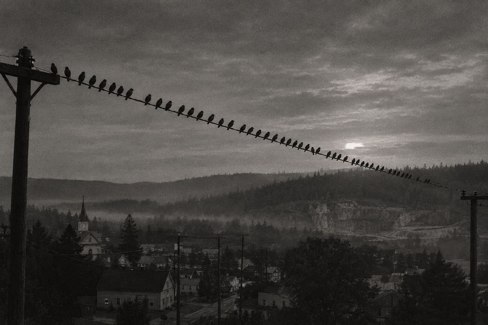
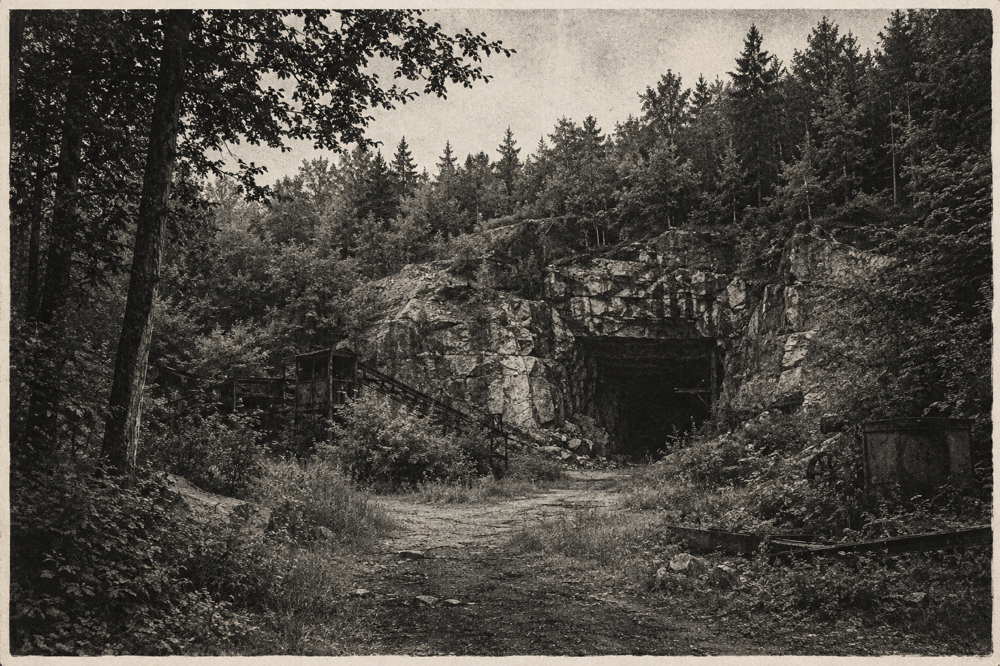
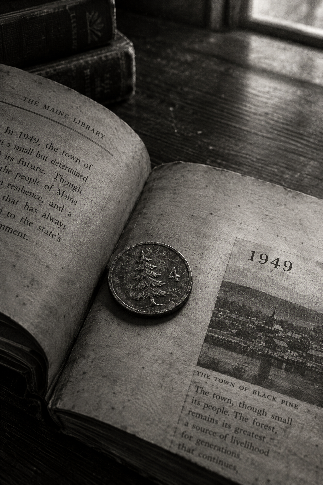
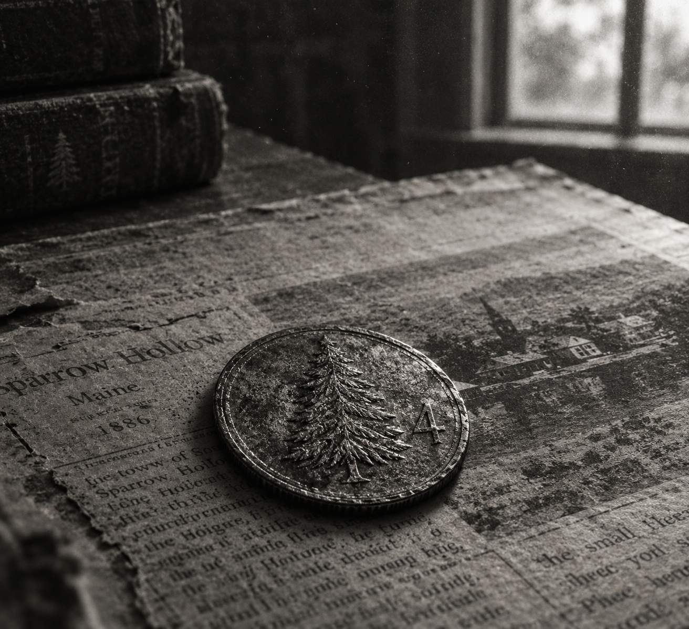

# SPARROW HOLLOW
### Livro 2 — Trilogia Black Pine
**Tiago Cardoso**

**Trilogia Black Pine:**  
Livro 1 — *Black Pine*  
Livro 2 — *Sparrow Hollow*  
Livro 3 — *Threshold*

*Os três livros são independentes e podem ser lidos em qualquer ordem.*

---

## PRÓLOGO — O Verão em Que Paramos de Contar Uns aos Outros a Verdade
### Trinta anos depois

Ninguém em Sparrow Hollow fala sobre o verão de 1986.

Não porque tenham esquecido. É o contrário — lembram demais, com detalhes demais, do tipo de lembrança que não desbota com o tempo, só afunda mais fundo. Mas perguntar sobre aquele verão, na cidade onde cresci, ainda hoje é como bater numa porta que todo mundo já decidiu, décadas atrás, manter trancada.

Eu tinha treze anos.

Éramos quatro.

E, no fim daquele verão, éramos três.

Ainda consigo fechar os olhos e sentir o cheiro exato daquela noite de agosto — grama recém-cortada, fumaça de fogueira distante, o metal quente das nossas bicicletas encostadas na cerca da pedreira velha. Consigo ouvir o Marcus rindo de alguma piada ruim, consigo ver a Cass baixando a lanterna primeiro, sempre ela primeiro, porque nenhum de nós três garotos tinha coragem de admitir que estava com medo antes dela.

Consigo lembrar, também, de uma coisa menor, e essa é a que ainda me acorda: de como não havia insetos.

Era agosto. Numa floresta. À noite. E não havia um único mosquito em volta das nossas lanternas.

Levei vinte anos para perceber que aquilo era a primeira coisa errada, e que estava ali antes de qualquer outra.

Existe uma segunda coisa que eu também levei anos para notar, menor ainda, quase boba de tão pequena — e por isso mesmo, hoje, a que mais me assombra. Naquele verão inteiro, de junho a setembro, eu não me lembro de nenhum de nós quatro brigando de verdade. Não à toa. Crianças de treze anos brigam. É o trabalho delas. E, no entanto, revirando a memória com o cuidado que só a idade adulta ensina, não encontro um único dia em que Denny, Cass, Sam e Marcus tenham ficado bravos uns com os outros por mais do que alguns minutos.

Achei, por muito tempo, que fosse só sorte. Um verão bom, com amigos bons.

Não sei mais dizer se foi sorte.

Não vou contar o que aconteceu depois.

Ainda não.

Porque, para você entender aquela noite — para entender por que um de nós nunca mais voltou a ser exatamente o mesmo, por que Sparrow Hollow inteira aprendeu naquele verão a desconfiar de quem dormia na casa ao lado, por que existe até hoje uma regra não escrita que ninguém segue trilhas depois do anoitecer entre junho e setembro — eu preciso primeiro te levar de volta para o início.

Para os dias em que Sparrow Hollow ainda era só isso: uma cidade pequena, morna, entediante, exatamente do jeito que uma cidade devia ser quando você tem treze anos e o verão inteiro pela frente.

Antes de sabermos que a pedreira estava vazia fazia trinta e sete anos por um motivo.

E muito antes daquela noite de agosto em que os quatro entramos naquele buraco na terra como quatro amigos comuns...

E só três saíram como se ainda fossem.

---

## CAPÍTULO 1 — Bicicletas ao Entardecer
### Junho de 1986

O primeiro dia de verão de verdade em Sparrow Hollow não é marcado no calendário.

É marcado pelo som.

É o dia em que a Elm Street acorda com o barulho de aspersores de jardim ligando ao mesmo tempo, com o rádio do senhor Tanner tocando beisebol alto demais pela janela da garagem, com o sino da bicicleta do jornaleiro, com quatro crianças gritando umas com as outras a três quarteirões de distância porque nenhuma delas tem paciência de esperar a resposta chegar em volume normal.

Naquele ano, esse dia caiu numa quinta-feira — o último dia de aula, na verdade, que a Sra. Alcott, nossa professora havia três anos seguidos, insistia em encerrar sempre com o mesmo ritual: os alunos amontoados na porta da sala, ela lendo em voz alta, sem nenhuma variação de um ano pro outro, o mesmo poema curto sobre o verão que ninguém prestava atenção de verdade, todo mundo olhando pra janela contando os segundos.

— Divirtam-se — dissera ela, fechando o livro. — E, por favor, não façam nada que me obrigue a ouvir falar de vocês em setembro.

Ninguém prometeu nada. Era o tipo de instrução que todo adulto de Sparrow Hollow dava, todo ano, sabendo perfeitamente que não seria cumprida.

---

Eu tinha treze anos, um short jeans surrado e uma bicicleta Schwinn vermelha que jurava, todo santo dia, que aquele seria o verão em que eu finalmente aprenderia a soltar as duas mãos do guidão sem cair.

Não foi.

Minha mãe já estava na cozinha quando desci, o rádio sintonizado numa estação de notícias que ela nunca escutava de verdade, só deixava ligada pro silêncio da casa não parecer tão grande quanto era desde que meu pai tinha ido trabalhar na fábrica em Portland durante a semana, voltando só nos fins de semana.

— Vai pra onde hoje? — perguntou, sem tirar os olhos da torrada.

— Por aí. Com o Marcus, a Cass e o Sam.

— "Por aí" tem hora de voltar?

— Antes do jantar.

Ela levantou os olhos.

— Promete?

— Prometo.

Ela me olhou por cima do ombro, aquele tipo de olhar que só mães sabem fazer, que consegue ser afetuoso e cético ao mesmo tempo.

— Leva um casaco. Esfria à noite.

— Mãe, são dez da manhã.

— E à noite continua sendo dez da manhã?

— Não.

— Então leva.

Levei. Não usei. Mas levei, amarrado na cesta da bicicleta, porque discutir com minha mãe sobre casaco era uma batalha que eu tinha aprendido, havia anos, que ninguém vencia.

Na porta, ela disse mais uma coisa, sem levantar a voz, do jeito que dizia as coisas que não queria que parecessem importantes.

— Se forem pro lago, fiquem do lado do píer.

— A gente sempre fica do lado do píer.

— Eu sei.

Ela pegou a torrada.

— Só estou dizendo.

Ela não disse *não vão pro oeste*. Ninguém dizia. Mas metade das frases que os adultos de Sparrow Hollow diziam às crianças era uma frase sobre o oeste com outra roupa, e a gente crescia entendendo isso do mesmo jeito que entende a diferença entre um trovão perto e um trovão longe: sem nunca ter aprendido, sem nunca ter perguntado.

---

— Denny! Anda logo, cara!

Marcus já estava na esquina, parado sobre os pedais, a barriga redonda pressionando contra a camiseta dos Boston Red Sox que ele usava desde 1984 e que a mãe dele jurava, todo verão, que não ia mais servir no verão seguinte. Sempre servia. Marcus só crescia para os lados que a camiseta permitia.

— Já vou!

Desci a Maple Street pedalando com tudo, o vento levantando poeira do asfalto rachado, e alcancei Marcus bem na hora em que Cass surgia da rua ao lado, de pé sobre os pedais também, os cabelos presos num rabo de cavalo que já tinha desistido de ficar arrumado.

— Vocês dois demoram mais que minha avó pra sair de casa — disse ela, já acelerando na frente.

— Sua avó nem tem bicicleta, Cass.

— Exatamente.

Marcus acelerou.

— Isso não faz sentido.

— Nunca disse que precisava fazer.

Cassidy Doyle nunca esperava ninguém. Isso não era falta de educação. Era só que, desde os sete anos, quando o pai dela foi embora e a mãe passou a trabalhar dois turnos na fábrica de papel, Cass tinha aprendido que esperar os outros geralmente significava ficar para trás.

— Você comeu no café da manhã? — perguntei, pedalando ao lado dela.

— Torrada.

— Só?

— Foi o que tinha.

Não perguntei mais.

Ela disse isso do mesmo jeito que dizia praticamente tudo relacionado à própria casa — rápido, sem drama, fechando a porta do assunto antes que alguém pudesse tentar abrir de novo. Eu já tinha aprendido, fazia anos, a não insistir quando a porta fechava daquele jeito.

O que eu não sabia ainda, aos treze anos, é que Marcus tinha aprendido outra coisa.

Ele acelerou até emparelhar comigo, e enquanto Cass abria distância na frente, enfiou a mão no bolso da bermuda, tirou meio pacote de bolacha recheada amassado, e me entregou sem dizer nada.

— Pra quê isso?

— Segura.

— Por quê?

— Daqui a pouco você oferece.

— Por que eu?

Marcus deu de ombros.

— Porque de mim ela não aceita.

Eu não entendi na hora. Achei que fosse alguma implicância boba entre os dois. Levei uns bons quinze anos e um punhado de amigos adultos com problemas de dinheiro pra entender que o Marcus, aos treze anos, já tinha descoberto sozinho uma coisa que muita gente crescida nunca descobre: que existe um jeito de ajudar alguém que deixa a pessoa menor, e existe outro jeito, e o segundo dá mais trabalho.

Ele fazia isso o tempo inteiro. Era ruim de esconder, e por isso ninguém percebia.

---

Sam já estava no ponto de encontro de sempre quando chegamos — o pequeno píer de madeira que se estendia sobre o Lago Whitfield, torto o suficiente para balançar embaixo dos nossos pés, mas firme o suficiente pra nunca ter afundado ninguém, pelo menos não que a gente soubesse.

Sam Reyes sentava sempre na ponta do píer, os pés balançando sobre a água, um caderno de desenho no colo. Ele desenhava desde que eu me lembrava de existir como pessoa — antes mesmo de eu saber o que "talento" significava, Sam já sabia que tinha um, e isso o deixava quieto de um jeito que os adultos confundiam com timidez e que, na verdade, era só ele prestando atenção em coisas que o resto de nós nunca notava.

— O que você tá desenhando? — perguntou Cass, se aproximando por trás dele.

Sam fechou o caderno.

— Nada.

— Não parecia nada.

— É um pássaro.

— Deixa eu ver.

— Não.

Cass levantou as mãos.

— Tudo bem. Eu sobrevivo.

Cass revirou os olhos, mas não insistiu — outra regra não escrita entre nós quatro, tão antiga quanto qualquer uma: ninguém obrigava o Sam a mostrar nada antes de ele estar pronto.

Marcus se jogou na grama ao lado da bicicleta, braços abertos, encarando o céu.

— Noventa e dois dias — anunciou.

— Noventa e dois dias de quê?

— Verão.

— Você contou?

— Ontem à noite.

Olhei para ele.

— Noventa e dois dias?

— Uma vida inteira, Denny.

Ele voltou a olhar pro céu.

— Gente já fez guerra em menos tempo.

— Gente já fez guerra em menos tempo — repetiu Cass, sem nenhuma entonação.

— Fez!

— Você vai gastar noventa e dois dias na arcade e vai ter exatamente a mesma cara de novembro que tem hoje.

— Aí é que você se engana. Eu vou gastar noventa e dois dias na arcade **e** vou bater o recorde da máquina nova. Duas coisas. É crescimento pessoal.

---

Passamos o resto daquela primeira manhã do jeito que passaríamos boa parte do verão inteiro, embora nenhum de nós soubesse disso ainda: sem plano nenhum, sem destino nenhum, só quatro bicicletas seguindo umas às outras pelas ruas que a gente já conhecia de cor.

Fomos até a ponte de pedestres sobre o riacho seco atrás da fábrica de papel, onde Marcus insistiu, como insistia todo verão, em tentar pular do parapeito mais baixo pra dentro do pouco de água que ainda corria, e como todo verão, escorregou na descida e caiu sentado na lama, o que rendeu risada suficiente pra sustentar o resto do trajeto.

Fomos até o quintal dos fundos da igreja metodista, onde havia uma velha macieira torta que ninguém colhia mais, e comemos maçãs verdes demais até a boca doer, Cass reclamando o tempo inteiro que aquilo ia dar dor de barriga em todo mundo, comendo tanto quanto qualquer um de nós.

E fomos, por fim, até o pequeno cemitério atrás da igreja — não por macabrice, nada disso, mas porque era o único lugar da cidade com sombra suficiente e grama macia o bastante pra deitar sem formiga, e porque, aos treze anos, um cemitério de cidade pequena parece menos um lugar de mortos e mais um jardim que ninguém cuida com muito capricho.

Foi ali, deitados entre lápides desgastadas demais pra ler os nomes direito, que tivemos a conversa mais boba e mais longa do dia inteiro: se um tubarão conseguiria vencer um urso numa luta justa, debate que nunca chegou a lugar nenhum porque Marcus insistia em mudar as regras toda vez que estava perdendo o argumento.

— Em terra firme — dizia ele.

— O tubarão morre em terra firme, Marcus.

— Por isso mesmo. O urso tem vantagem. Isso torna a vitória do tubarão mais impressionante.

— O tubarão não vai vencer.

— Mas *se* vencer.

Sam, deitado de bruços no meio de nós, desenhando as nuvens que passavam sem se importar nenhum pouco com a discussão, ergueu os olhos por um segundo.

— Vocês dois discutem isso desde a terceira série.

— E vamos continuar discutindo até a faculdade — respondeu Marcus, orgulhoso.

Ele não estava errado. Continuamos, sim, discutindo aquilo por anos, em momentos cada vez mais espaçados, até que, décadas depois, um deles parou de estar presente pra continuar a briga, e eu descobri, tarde demais, o quanto uma discussão idiota pode doer quando só sobra um lado pra lembrar dela.

---

Cass estendeu a mão, de repente, apontando pra uma lápide próxima, quase apagada pelo tempo.

— Olhem essa. 1949.

Nos aproximamos. A pedra estava tão gasta que só dava pra ler parte do nome — algo terminando em "-ory" — e o ano, gravado fundo o suficiente pra resistir ao tempo melhor que o resto.

— É estranho — comentou Sam, sentando-se, o caderno esquecido no colo.

— O quê?

— Não tem mais nenhuma lápide de 1949 por perto. — Ele olhou ao redor, contando baixinho. — Tem um monte de 1940-alguma-coisa, um monte de 1950-alguma-coisa. Mas só essa de 1949.

Ninguém deu muita importância àquilo na hora. Era só uma lápide gasta demais pra ler, num cemitério cheio de lápides gastas demais pra ler, e o sol estava quente, e Marcus já tinha mudado de assunto pra alguma revista de monstro que queria comprar assim que a mesada chegasse.

Mas eu guardei aquilo, do mesmo jeito que guardava tudo naquele verão sem saber ainda por quê — uma pequena peça solta, sem imagem nenhuma pra encaixar, jogada numa caixa que só ficaria cheia o suficiente pra fazer sentido muitos meses depois.

---

A Sparrow Arcade ficava entre a lanchonete da dona Ruth e a Hollow Video, na única quadra comercial que Sparrow Hollow podia se gabar de ter. As três lojas dividiam o mesmo estacionamento de cascalho, e era ali, entre as três, que a cidade inteira parecia se encontrar em algum momento de cada dia.

Na vitrine da Hollow Video, cartazes de fitas VHS recém-chegadas disputavam espaço uns com os outros. Marcus parou a bicicleta bruscamente diante de um deles, os olhos arregalados.

— Cara. Cara. Chegou o filme do monstro do pântano.

Marcus apontou, ao lado, para outra fita com uma capa branca e vermelha.

— E esse é aquele dos caras presos no gelo.

— Você já viu?

— Só a capa.

Cass pegou a fita e devolveu ao lugar.

— Então continua só na capa.

— Você já viu quatro vezes.

— E vou ver a quinta.

Cass encostou a bicicleta na parede.

— Você ainda tem medo desse filme?

— Eu não tenho medo.

— Dormiu de luz acesa depois da segunda.

Marcus apontou para o cartaz.

— Isso é irrelevante pro argumento.

Marcus colecionava revistas de monstros do jeito que outros garotos colecionavam cartas de beisebol — pilhas inteiras debaixo da cama, cada uma com as bordas já gastas de tanto folhear. Ele conhecia o nome de todo ator que já tinha vestido uma fantasia de borracha em qualquer filme de terror B dos últimos vinte anos, e guardava esse conhecimento com o mesmo orgulho que outro garoto guardaria um recorde esportivo.

— Um dia essa sua obsessão com monstro vai te dar um troço — disse Cass.

— Um dia vocês vão precisar de mim.

Sam ergueu os olhos.

— Pra quê?

Marcus pensou.

— Quando encontrarem um de verdade.

Cass riu.

— E o que a gente faz?

— Corre.

— Só isso?

— Em zigue-zague.

— Por quê?

— Monstro de filme não sabe virar direito.

— Isso é a coisa mais idiota que eu já ouvi — disse Cass, mas estava sorrindo quando disse.

Nós rimos. Rimos de verdade, os quatro, no estacionamento de cascalho, na frente de um cartaz de um filme ruim.

Escrevendo agora, com trinta anos de distância e o benefício terrível da retrospectiva, eu queria poder dizer que senti alguma coisa naquele momento. Um arrepio. Um aviso. Alguma daquelas premonições convenientes que aparecem nos livros que o Marcus lia.

Não senti nada.

Foi só uma piada boa num dia bom, e a única coisa assustadora nela é que ele estava certo. Não sobre o zigue-zague.

Sobre a gente precisar dele.

---

A Sparrow Arcade tinha doze máquinas, um balcão de refrigerante que vendia mais cerveja de raiz do que qualquer outra coisa, e um dono chamado Gus que fingia, havia anos, não perceber quando as moedas de jogo eram na verdade reaproveitadas.

A máquina nova ficava no fundo, ainda com um adesivo de "RECÉM-CHEGADO" grudado na lateral.

— Caça-Fantasmas — li em voz alta. — Sério?

— Baseado no filme.

Marcus já procurava moedas no bolso.

— Aposto que eu bato seu recorde primeiro — disse Cass.

— Você nunca bateu meu recorde.

— Existe uma primeira vez.

— Vinte e cinco centavos.

— Fechado.

Jogamos por quase uma hora, revezando as vidas, gritando instruções contraditórias uns pros outros toda vez que a tela ficava difícil demais, Marcus perdendo pra Cass duas vezes seguidas e se recusando terminantemente a admitir em voz alta.

Na segunda derrota, ele fez uma coisa que eu só entendi muito tempo depois.

Ele enfiou a mão no bolso, reclamando alto que ia recuperar a honra da família, e comprou mais uma rodada. Duas fichas. Jogou uma na máquina, entregou a outra pra Cass.

— Pra você provar que não foi sorte.

— Eu não preciso provar nada.

— Precisa sim. Isso aqui é um campeonato agora. Tem regras.

Ela pegou a ficha. Bufou, mas pegou.

E o Marcus, que tinha acabado de gastar o dobro da mesada do dia pra que ninguém precisasse dizer em voz alta que a Cass não tinha mais moeda nenhuma, se virou pra mim e disse, com uma cara de quem estava genuinamente irritado:

— Ela vai perder essa. Anota.

Ela não perdeu.

---

As moedas acabaram quando o sol começou a baixar, pintando o estacionamento de cascalho num tom de laranja que só existe em final de tarde de junho.

Foi Sam quem primeiro reparou.

— Ei.

Sam estava parado perto da porta, olhando para cima, para os fios elétricos.

— Olhem isso.

Pardais.

Dezenas deles, pousados em fileira ao longo do fio, todos absolutamente imóveis, todos olhando na mesma direção — para o oeste, para além da cidade, para onde as árvores começavam a ficar mais altas e mais densas antes de dar lugar às antigas pedreiras abandonadas.

— É só um bando de pássaros, Sam.

— Eu sei o que é um bando de pássaros.

Ele não desviou os olhos.

— Então olha direito.

Fiquei olhando.

— Tá. Eles estão olhando pra alguma coisa.

— Talvez tenha uma cobra.

— Pássaros não ficam assim por causa de cobra.

Marcus olhou de novo.

— Então por quê?

Sam demorou a responder.

— Não sei.

— Ótimo.

Cass cruzou os braços.

— Agora você deixou a gente com isso.

Cass revirou os olhos, mas seguiu o olhar de Sam mesmo assim. Todos nós seguimos.

Não havia nada lá. Só árvores, o começo da estrada de terra que levava até a Old Quarry Road, e o céu queimando laranja atrás de tudo.

Marcus bateu palmas duas vezes, alto.

Nenhum pardal se mexeu.

Ele baixou as mãos devagar.

— Vamos — disse, já se afastando, a voz um tantinho alta demais para soar tão despreocupada quanto ele queria. — Minha mãe vai me matar se eu chegar depois do jantar de novo.

Ninguém discutiu.

Só que, enquanto pedalávamos de volta pela Elm Street, o sol quase desaparecendo atrás da linha de árvores a oeste, olhei para trás uma última vez.

Os pardais ainda estavam lá.

Ainda olhando para o mesmo lugar.

Nos despedimos no cruzamento de sempre, cada um seguindo pra sua própria rua, e eu me lembro de pedalar sozinho os últimos dois quarteirões até minha casa pensando em como aquele tinha sido, sem sombra de dúvida, um dos melhores primeiros dias de verão que eu conseguia lembrar.

---

A primeira chuva de verão caiu três dias depois, um daqueles temporais rápidos e barulhentos que Sparrow Hollow recebia todo mês de junho, anunciado por um cheiro de terra molhada que chegava minutos antes da própria água.

Estávamos os quatro no quintal da Cass quando começou, brincando de algum jogo de bola que já tinha perdido as regras havia muito tempo, e em vez de correr pra dentro, como qualquer adulto sensato teria mandado, ficamos parados no meio do quintal, encharcando, rindo feito loucos, até a avó de Cass aparecer na porta gritando que a gente ia pegar pneumonia e ninguém ligando nem um pouco pro aviso.

Marcus tentou, sem sucesso nenhum, deslizar de barriga na grama molhada como tinha visto num programa de televisão, e só conseguiu se cobrir de lama da cabeça aos pés, o que Cass considerou o momento mais engraçado da semana inteira e Sam, é claro, quis desenhar antes mesmo de a chuva parar.

— Fica parado — pediu ele, o caderno protegido debaixo da camisa, só a mão de fora, tentando registrar rápido antes que a água borrasse o traço.

— Eu não consigo ficar parado coberto de lama, Sam. Isso é fisicamente impossível.

— Só fica parado um minuto.

— Um minuto de lama é uma eternidade de lama.

Ele não ficou parado, é claro, e o desenho que sobrou era só um borrão de linhas apressadas tentando capturar um garoto se mexendo demais pra ser desenhado — mas Sam guardou mesmo assim, dizendo que às vezes um desenho ruim contava a história melhor que um bom.

Entramos todos encharcados na cozinha da Cass um tempo depois, enrolados em toalhas emprestadas, bebendo chocolate quente que a avó dela fez sem que ninguém pedisse, e ficamos ali sentados vendo a chuva continuar lá fora através da janela embaçada, sem falar muito, sem precisar falar muito, só sendo quatro crianças secas por dentro e molhadas por fora, esperando o verão continuar.

Foi um dia perfeitamente comum. Eu só entendi, muito tempo depois, o quanto os dias perfeitamente comuns também merecem ser lembrados com o mesmo cuidado que a gente reserva pros importantes — talvez até mais, porque ninguém avisa que vai ser a última vez que alguma coisa simples assim vai acontecer exatamente daquele jeito.

E, ainda hoje, escrevendo estas páginas, não consigo decidir se foi coincidência ou aviso — porque exatamente três meses depois, numa noite de agosto, seríamos nós quatro caminhando naquela mesma direção, para dentro daquelas mesmas árvores, sem ter a menor ideia do que estávamos prestes a encontrar.

---

## CAPÍTULO 2 — A Lanchonete
### Junho de 1986

Se alguém me perguntasse hoje qual foi o melhor dia daquele verão, eu não escolheria nenhum dos dias em que alguma coisa aconteceu.

Escolheria uma terça-feira do fim de junho em que não aconteceu absolutamente nada.

---

A lanchonete da dona Ruth ficava bem no meio da Main Street, um balcão comprido e seis mesas de fórmica que nunca pareciam ter clientes suficientes pra ficarem todas ocupadas ao mesmo tempo, exceto aos domingos depois da missa.

Dona Ruth nos recebia do jeito que recebia havia anos — sem nem precisar perguntar o pedido, só gritando pra cozinha assim que nos via entrar pela porta.

— Quatro panquecas, calda de mirtilo pra menina, o de sempre pros meninos!

— A senhora nem perguntou o que a gente quer — falei, sentando no balcão.

— Não preciso perguntar. Vocês pedem a mesma coisa desde que aprenderam a andar sozinhos até aqui.

Ela não estava errada. Isso, de alguma forma, tornava tudo ainda mais gostoso.

Tinha um quadro-negro pendurado atrás do balcão onde ela escrevia o prato do dia com giz, e embaixo, num canto que ela nunca apagava, uma frase que já estava lá desde antes de eu saber ler: *Se você tem que perguntar o preço, a casa paga hoje e você paga na semana que vem.* Eu achava, quando era menor, que era uma piada. Não era. Metade da cidade tinha pagado na semana seguinte em algum momento da vida.

---

Havia, atrás do balcão, ao lado do quadro-negro, uma pequena galeria de fotografias emolduradas — décadas de formaturas, casamentos, times de beisebol da liga infantil, tudo pendurado sem nenhuma ordem cronológica que eu jamais conseguisse decifrar.

Naquela terça-feira específica, esperando as panquecas, reparei numa foto que eu nunca tinha notado antes, apesar de comer ali desde que tinha idade suficiente pra segurar garfo — uma foto de time de beisebol, uniformes antigos demais pra reconhecer o ano, um grupo de dez ou onze garotos sorrindo pra câmera.

— Quem são esses? — perguntei, apontando.

Dona Ruth olhou por cima do ombro, sem parar de secar copos.

— Esses? Ah, isso é de muito antes de você nascer. Time da cidade, lá pelos anos cinquenta.

— A senhora conhece algum deles?

Ela se aproximou, olhando com mais atenção do que eu esperava, e por um instante uma sombra passou pelo rosto dela — rápida, quase imperceptível, mas eu vi.

— Conhecia um. — Ela apontou pro segundo garoto da fileira de trás, um garoto magro, sorrindo timidamente igual aos outros. — Não lembro o nome dele agora, é engraçado. Conheço essa foto desde que era menina, e não lembro o nome dele.

— A senhora não lembra o nome de alguém que conhecia?

— Às vezes é assim, querido. — Ela voltou pro balcão, e a voz recuperou o tom normal rápido demais. — A gente lembra o rosto e esquece o resto. Acontece com todo mundo que fica velho o suficiente.

Não pareceu estranho na hora. Parecia só o tipo de coisa que os adultos diziam sobre memória e idade, um comentário qualquer que a gente esquece assim que a panqueca chega.

Eu só voltaria a pensar naquilo meses depois, remexendo um jornal antigo na biblioteca, tentando entender por que tanta gente em Sparrow Hollow parecia ter exatamente o mesmo tipo de buraco na memória, sempre no mesmo formato, sempre em relação às mesmas coisas.

---

Marcus folheava uma revista de monstros que sempre carregava dobrada no bolso de trás da bermuda, mostrando pra gente, empolgado demais, uma foto borrada de um suposto lobisomem fotografado em algum lugar do Canadá.

— Olha isso. OLHA ISSO.

— Marcus, isso é claramente um cachorro grande — disse Cass, mal olhando.

— Não é um cachorro grande, Cass. Olha o formato do focinho.

— É um cachorro grande fotografado de longe com uma câmera ruim.

— Vocês nunca acreditam em nada.

— Porque a maioria das coisas que você mostra pra gente não são reais — falei, rindo.

Marcus fez uma cara ofendida que durou exatamente dois segundos antes de ele mesmo começar a rir também.

Depois fechou a revista e ficou olhando pra capa por um tempo que foi longo demais pra ser só distração.

— Sabe o que eu não conto pra vocês? — falou, sem levantar os olhos.

— O quê?

— Eu não leio essas coisas porque acho legal.

Cass baixou o garfo.

— Você tem duzentas revistas dessas embaixo da cama.

— Eu sei. — Ele deu de ombros, meio sem graça, do jeito que ficava quando dizia alguma coisa verdadeira sem querer. — É que quando eu sei o nome da coisa, eu durmo. Quando eu não sei o nome, eu fico acordado. É só isso.

Ninguém respondeu por alguns segundos.

— Isso é a coisa mais estranha que você já disse — falou Cass, finalmente.

— Eu sei.

— E a menos idiota.

— Eu também sei. — Ele reabriu a revista. — Não conta pra ninguém.

Eu achei engraçado na hora.

Escrevendo agora, é a frase que eu mais queria não ter entendido tão tarde. Porque o Marcus não colecionava monstros por gostar de monstros. Ele colecionava nomes. Um garoto de treze anos numa cidade onde os adultos tinham parado de nomear as coisas havia décadas, montando sozinho, embaixo da própria cama, um dicionário de tudo que podia dar errado no escuro.

Ele tinha medo o tempo todo. Mais do que qualquer um de nós.

Só tinha decidido, muito antes dos treze anos, que ia ser engraçado sobre isso.

---

Sam desenhava. Ele sempre desenhava, e naquele dia foi a única vez em muito tempo em que ele deixou alguém olhar.

Cass se inclinou por cima do ombro dele antes que ele conseguisse fechar o caderno, e em vez de fechar, ele deixou.

— É a dona Ruth.

— É.

Estava boa. Estava boa demais, na verdade — não era um desenho de criança, era um desenho de alguém que tinha olhado por muito tempo. Ele tinha pegado a coisa exata do rosto dela, aquele jeito de olhar pra porta toda vez que o sino tocava mesmo já sabendo quem estava entrando.

— Por que você nunca mostra isso? — perguntou Cass.

Sam pensou na resposta com aquele cuidado que ele tinha com tudo.

— Porque quando eu mostro, as pessoas começam a posar.

— Ninguém tá posando.

— Você tá posando agora.

— Eu não tô—

Ela parou. Tinha ajeitado o cabelo dois segundos antes. Nós dois vimos.

Marcus riu tanto que se engasgou com a cerveja de raiz, e dona Ruth gritou do outro lado do balcão pra gente não morrer dentro do estabelecimento dela porque a papelada ia ser um inferno.

---

Foi só depois, com o prato já vazio e a conversa desacelerando, que Sam abriu o caderno de novo, sem que ninguém pedisse dessa vez, e virou algumas páginas até chegar a um desenho antigo, de meses atrás, um retrato dos quatro juntos que nenhum de nós tinha visto ainda.

Éramos nós, sentados naquele mesmo balcão, num dia qualquer do inverno anterior — reconhecível pelos casacos grossos que usávamos no desenho — rindo de alguma coisa que Sam não tinha se dado ao trabalho de lembrar qual era.

— Quando você fez isso? — perguntei.

— Fevereiro, eu acho.

— Por que guardou tanto tempo?

Sam encolheu os ombros, do jeito que fazia quando a pergunta chegava perto demais de alguma coisa que ele não sabia explicar direito.

— Não sei. Só parecia que ainda não era a hora certa de mostrar.

— E agora é?

Ele olhou pra nós três — Cass rindo de alguma coisa que Marcus tinha acabado de sussurrar, Marcus com um bigode de leite que ninguém tinha avisado, eu ainda segurando o garfo no ar — e depois olhou de volta pro desenho, comparando, como se checasse se a cena ainda batia com o registro.

— Acho que sim — respondeu, baixinho, e fechou o caderno de novo antes que alguém pudesse fazer mais perguntas.

Eu não sabia, naquela tarde, que Sam guardava desenhos do jeito que outras pessoas guardam fotografias — não pra mostrar, mas pra ter certeza, mais tarde, de que as coisas realmente tinham acontecido do jeito que ele lembrava.

Levaria semanas para eu entender por que aquele hábito, no fim daquele verão, se tornaria o mais precioso de todos os que qualquer um de nós quatro possuía.

---

Na saída, aconteceu a coisa sobre a qual eu penso mais do que deveria.

Não foi nada.

Cass parou na porta e ficou olhando o quadro-negro atrás do balcão por um tempo comprido. Depois falou, sem olhar pra ninguém:

— Eu queria trabalhar aqui.

— Você tem treze anos — falei.

— Daqui a dois anos eu não vou ter. — Ela deu de ombros. — Dona Ruth disse que quando eu fizer quinze ela me põe no turno da tarde.

— Você quer mesmo ficar em Sparrow Hollow?

Foi uma pergunta idiota, do tipo que se faz aos treze anos achando que é sofisticada.

Cass me olhou como quem olha pra alguém que acabou de perguntar por que alguém gosta do próprio braço.
— Eu gosto daqui, Denny.— Aqui não tem nada.

— Tem tudo que eu conheço. — Ela empurrou a porta. — Você é que acha que "nada" e "pouco" são a mesma coisa.

Ela saiu. O sino tocou atrás dela.

Cass virou professora, no fim. Na mesma escola onde a gente estudou. Nunca saiu.

E eu saí, e virei jornalista, e passei trinta anos escrevendo sobre cidades de outras pessoas.

Não sei mais qual dos dois estava certo naquela porta. Suspeito, faz um tempo, que ela estava.

---

Foi Marcus quem quebrou o silêncio lá fora, do jeito que Marcus sempre fazia — mudando de assunto para alguma coisa completamente diferente, geralmente relacionada a comida ou monstro, às vezes as duas coisas ao mesmo tempo.

— Vocês sabiam que semana que vem é aniversário do Sr. Pruitt?

— Quem é o Sr. Pruitt?

— O cara que mora sozinho lá perto da represa. Aquele com o cachorro enorme.

Eu conhecia o Sr. Pruitt de vista — um homem magro, sempre de chapéu, que raramente aparecia na cidade e que, quando aparecia, comprava exatamente as mesmas três coisas na mercearia: café, comida de cachorro, e uma garrafa de uísque que ele pagava sempre em dinheiro contado, nunca em cheque.

— Como você sabe que é aniversário dele?

— Minha mãe faz o bolo dele todo ano. Ele nunca vem buscar pessoalmente. Manda o cachorro com uma cesta amarrada nas costas, sem brincadeira, e minha mãe põe o bolo lá dentro.

— Isso é a coisa mais estranha que eu já ouvi — disse Cass.

— É a segunda. A primeira é que minha mãe faz todo ano e nunca explicou por quê. — Marcus subiu na bicicleta. — Eu perguntei uma vez. Ela disse "porque alguém tem que fazer".

Naquele momento, aquilo não significou nada pra mim.

Foi só uma frase esquisita de um adulto sobre um vizinho esquisito, numa cidade onde a maioria das frases dos adultos era esquisita se você prestasse atenção de verdade.

Só muitos anos depois — já adulto, já entendendo o suficiente sobre como cidades pequenas distribuem entre si o peso de coisas que ninguém quer nomear — é que eu comecei a me perguntar o que exatamente a mãe do Marcus achava que estava fazendo, todo ano, ao mandar um bolo pra um homem que perdeu a família inteira numa noite que ninguém em Sparrow Hollow conseguia descrever direito.

---

## CAPÍTULO 3 — A Pedreira Velha
### Junho de 1986

Toda cidade pequena tem um lugar de que as mães falam baixinho.

Em Sparrow Hollow, esse lugar era a pedreira velha.

Fica a pouco mais de três quilômetros do centro, seguindo a Old Quarry Road até o asfalto virar terra batida e a terra batida virar só uma sugestão de trilha entre os pinheiros. A empresa de mineração fechou as operações lá em 1949 — isso todo mundo sabia, era o tipo de fato que se aprendia na escola, junto com a data de fundação da cidade e o nome do primeiro prefeito.

O que ninguém explicava direito era o motivo do fechamento.

— Minha avó diz que foi um desabamento — contou Cass, os quatro sentados na varanda da casa dela descascando favas para o jantar. — Um bocado de gente morreu.

— Minha mãe diz que foi contaminação de água — falei. — O poço da pedreira teria ficado envenenado.

— As duas não podem ser verdade — observou Sam, sem erguer os olhos do caderno.

— Ou podem — disse Marcus, a boca cheia de fava crua que ele definitivamente não devia estar comendo. — Talvez tenha desabado por causa da água.

Fez sentido o suficiente pra ninguém questionar.

Mas Sam, que nunca deixava uma coisa dessas passar de verdade, continuou desenhando mais um tempo e depois falou, quase pra si mesmo:

— Minha mãe diz que foi incêndio.

Paramos.

— Incêndio numa pedreira? — perguntou Cass.

— Foi o que ela disse.

— Isso nem faz sentido.

— Eu sei. — Ele finalmente ergueu os olhos. — Eu perguntei de novo no dia seguinte, e ela disse desabamento.

Ficamos quietos por alguns segundos. Depois Marcus fez uma piada sobre favas e a conversa foi pra outro lugar, do jeito que as conversas iam.

Três versões. Três mães. Três histórias que não batiam.

Ninguém em Sparrow Hollow estava mentindo. Essa é a parte que eu levei décadas pra conseguir explicar direito pra mim mesmo. Todo mundo estava contando a verdade que tinha recebido. O problema é que as verdades que a cidade recebeu, em 1949, já chegaram diferentes umas das outras.

---

A avó da Cass, que morava com eles desde que o pai dela tinha ido embora, apareceu na porta da cozinha bem na hora em que a gente terminava as favas, secando as mãos num pano de prato, os olhos claros e um pouco distantes do jeito que ficavam nos últimos tempos.

— Vocês tavam falando da pedreira — disse ela, não como pergunta.

— A senhora ouviu?

— Ouço tudo, querida. Só não tenho mais idade pra fingir que não.

Ela se sentou numa cadeira de balanço na varanda, o pano de prato ainda nas mãos, e ficou olhando pra rua por um tempo antes de continuar.

— Eu tinha a idade de vocês naquele ano — disse, finalmente. — 1949.

Nos entreolhamos. Nenhuma das outras histórias tinha vindo de alguém que realmente estivera lá.

— A senhora se lembra do que aconteceu? — perguntei, tentando não parecer ansioso demais.

Ela demorou pra responder, o balanço da cadeira criando um ritmo lento contra as tábuas da varanda.

— Lembro de um som — disse, por fim. — Um som que a cidade inteira ouviu, à noite, vindo de lá. Não foi explosão. Não foi desabamento. Foi mais como... — Ela procurou a palavra, e não achou nenhuma que parecesse satisfazê-la. — Foi mais como um respirar. Fundo. Comprido. Como se alguma coisa muito grande tivesse acabado de acordar depois de dormir tempo demais.

— E depois? — sussurrou Sam.

— Depois, ninguém falou sobre isso. — A avó de Cass balançou a cabeça devagar. — No dia seguinte, já tinha versão pra tudo. Desabamento. Contaminação. Cada um dizia uma coisa, sempre olhando pro chão. E eu me lembro de pensar, com nove anos, que era estranho tanta gente adulta contar a mesma mentira sem nunca ter combinado antes.

Ela se levantou, o pano de prato voltando aos ombros, encerrando a conversa do mesmo jeito repentino como tinha começado.

— Não vão lá — disse, já entrando de volta pra casa. — Não porque eu ache que é mentira. Porque eu ainda lembro do som, e não gostaria que nenhum de vocês aprendesse a lembrar dele também.

Ficamos na varanda por um bom tempo depois que ela entrou, ninguém com muita vontade de voltar ao assunto das favas.

---

Foi o avô do Marcus, o Sr. Webb, quem finalmente contou a versão que nenhuma mãe contava.

Encontramos ele na varanda da própria casa, como sempre, o rádio ligado baixinho numa estação que só tocava música de quarenta anos atrás, um copo de chá gelado suando na mesinha ao lado.

O Sr. Webb era o tipo de velho que as crianças da cidade gostavam sem saber explicar por quê. Não dava conselho. Não perguntava sobre escola. Tratava a gente como se a gente fosse gente, o que aos treze anos é praticamente um milagre.

— Vocês quatro andaram perto da pedreira essa semana? — perguntou, sem preâmbulo.

— Não, senhor — respondeu Cass, rápido demais pra ser inteiramente verdade. Tínhamos passado de bicicleta pela entrada só duas semanas antes, sem entrar.

O Sr. Webb assentiu, não inteiramente convencido, mas deixou passar.

— Bom. Deixem assim.

— Por quê? — perguntei. — O que teve lá?

Ele ficou quieto por um tempo longo o suficiente pra eu achar que não ia responder.

E foi aqui que eu reparei na coisa que ficou comigo.

A varanda da casa do Sr. Webb dava pro oeste. Dali dava pra ver a linha de árvores, e, nos dias limpos, o corte mais claro na mata onde a Old Quarry Road subia. Era a vista da casa. Era pra lá que qualquer pessoa sentada naquela varanda olhava naturalmente enquanto falava.

Ele não olhou.

Enquanto respondeu, ficou olhando pro rádio em cima da mesinha. Não pra mim, não pro Marcus, não pra estrada. Pro rádio. Do jeito que a gente olha pra uma coisa que está fazendo barulho suficiente pra servir de desculpa.

— 1949 foi um ano ruim pra cidade — falou, finalmente. — Não só aqui. Ouvi dizer que teve problema parecido pros lados do Maine. Uma cidadezinha cujo nome eu não lembro mais.

Um arrepio subiu pela minha nuca.

— Que tipo de problema?

O Sr. Webb olhou para cada um de nós, um de cada vez, como se estivesse decidindo quanto valia a pena contar para quatro crianças de treze anos.

— O tipo que a gente aprende a não desenterrar.

— O senhor morava aqui em 1949? — perguntou Sam.

A pergunta era completamente inocente. Sam fazia perguntas assim o tempo todo, do mesmo jeito que respirava.

E o Sr. Webb, que não tinha piscado ao falar do Maine, piscou nessa.

— Não — respondeu. — Cheguei bem depois.

— De onde?

— De longe. — Ele pegou o copo de chá, que já estava vazio, e bebeu mesmo assim. — Vocês quatro não têm bicicleta pra andar?

Ele se levantou, sinal de que a conversa tinha terminado, e antes de entrar em casa, acrescentou uma última coisa — a frase que eu carregaria comigo pelo resto daquele verão, e por muitos verões depois.

— Aquela pedreira ficou vazia trinta e sete anos por um motivo, garotos. Tem coisa que é melhor deixar debaixo da terra onde já está.

A porta de tela bateu atrás dele.

Marcus ficou olhando pra porta.

— Ele nunca fala assim — disse Marcus, baixinho.

— Assim como?

Marcus pensou um pouco.

— Como se soubesse alguma coisa que a gente não sabe.

---

Naquela noite, deitado na cama, não consegui dormir.

Fiquei olhando para o teto do meu quarto, ouvindo os grilos lá fora, pensando na pedreira, nos pardais na fiação elétrica, na frase do Sr. Webb sobre "os lados do Maine", na lápide de 1949 no cemitério que Cass tinha achado sem procurar, no jeito que dona Ruth não lembrava o nome de um garoto numa foto que ela mesma pendurara na parede.

E numa coisa menor, que me incomodou mais do que todo o resto: no jeito que ele tinha dito *cheguei bem depois*, e no jeito que não tinha dito de onde.

Não sabia, naquela noite, o nome da cidade que ele quase tinha mencionado.

Levaria anos para eu descobrir — numa prateleira de jornal antigo, numa biblioteca a duas cidades de distância, um nome impresso numa manchete amarelada que faria meu sangue gelar por motivos que, aos treze anos, deitado naquela cama, eu ainda não tinha nenhuma forma de compreender.

Mas isso é uma história para depois.

Naquela noite, eu só sabia de uma coisa com certeza: fosse o que fosse que tivesse acontecido na pedreira em 1949, ainda não tinha terminado.

E que o avô do Marcus, que tinha passado a vida inteira sendo o adulto mais tranquilo de Sparrow Hollow, tinha acabado de olhar pra um rádio desligado.

Porque ele estava desligado. Eu só me lembrei disso semanas depois.

A música tinha parado em algum momento da conversa, e nenhum de nós percebeu, e o Sr. Webb continuou olhando pra ele do mesmo jeito.

---

## CAPÍTULO 4 — O Quatro de Julho
### Julho de 1986

Se você quisesse entender Sparrow Hollow inteira num único dia, bastava aparecer no Quatro de Julho.

A cidade toda se reunia no Gramado Municipal — um campo largo entre a prefeitura e a igreja metodista, onde o time de bombeiros voluntários montava uma barraca de limonada que sempre acabava vendendo mais cerveja escondida que limonada de verdade, e onde a banda da escola, reduzida a seis alunos que não tinham ido viajar no verão, tocava a mesma versão desafinada do hino nacional que tocava desde que alguém conseguia lembrar.

---

A manhã daquele dia, antes de qualquer fogo de artifício, foi passada quase inteira na casa do Marcus, porque a Sra. Webb tinha decidido, sem consultar ninguém, que precisava de "mão de obra jovem e barata" para ajudar a preparar as travessas de comida que a família sempre levava pro piquenique da cidade.

— Isso é trabalho infantil — reclamou Marcus, descascando batata com uma cara de sofrimento profundo.

— Isso é você comendo metade do que devia estar preparando — respondeu a mãe dele, sem se virar do fogão. — Já reparei três batatas a menos do que devia ter na tigela.

— Coincidência.

— Marcus.

— Tá bom. Fome nervosa.

Cass descascava batatas ao lado dele com uma eficiência que fazia o trabalho do Marcus parecer ainda mais lento por comparação, e a Sra. Webb, notando, sorriu de um jeito que eu reconheceria, anos depois, como o sorriso específico de um adulto vendo, sem dizer nada, uma criança que carrega mais responsabilidade do que devia carregar em casa.

— Você é rápida nisso, Cass.

— Ajudo minha avó com tudo em casa.

— Dá pra ver.

— Eu sei. — A Sra. Webb pousou a mão no ombro dela por um segundo, um gesto pequeno, quase de passagem. — Você sabe que pode vir aqui quando quiser, não sabe? Não só quando o Marcus te chama.

Cass não respondeu de imediato, os olhos fixos na batata na mão, e eu vi ela engolir alguma coisa antes de conseguir dizer um "obrigada" baixinho, quase sem som.

Foi um momento pequeno. Ninguém mais pareceu notar. Mas eu notei, e guardei, do jeito que vinha guardando tudo naquele verão — e entendi, muito mais tarde, que aquele "obrigada" tinha custado à Cass mais do que qualquer discussão de tubarão contra urso jamais custaria.

---

Sentados na cozinha esperando as batatas cozinharem, Sam desenhava — dessa vez, sem esconder, a cena inteira: a Sra. Webb no fogão, Marcus fingindo sofrimento com a faca de descascar, Cass trabalhando em silêncio, eficiente.

— Você desenha rápido — comentei, olhando por cima do ombro dele.

— Só quando as coisas ficam paradas tempo suficiente. — Ele acrescentou uma sombra no desenho da Sra. Webb, capturando exatamente o jeito que ela ficava debruçada sobre o fogão. — É mais difícil desenhar gente que se mexe.

— Por que você não pede pra gente ficar parado, então?

— Porque aí não seria real. — Ele fechou o caderno rapidamente quando Marcus se virou, como sempre fazia. — Seria só gente posando pra um desenho.

Marcus, que tinha ficado curioso demais pra fingir desinteresse, se aproximou tentando espiar.

— Deixa eu ver.

— Não.

— Ah, qual é, Sam.

— Não.

— Você deixou a Cass ver na lanchonete.

— Isso foi diferente.

— Como assim foi diferente?

Sam pensou por um segundo, e a resposta, quando veio, surpreendeu a todos nós, inclusive, acho eu, ele mesmo.

— Porque a Cass não ia rir. — Ele guardou o caderno na mochila, encerrando o assunto. — Você ia rir só um pouquinho, e isso seria o suficiente pra eu ficar putos com sua reação pelo resto do dia.

Marcus abriu a boca pra protestar, fechou de novo, e finalmente admitiu, com uma honestidade rara:

— Isso é justo.

---

Fomos os quatro juntos para o gramado, como sempre.

Cass usava um vestido que a mãe dela tinha insistido, e que ela claramente detestava, porque não parava de puxar a barra pra baixo cada vez que achava que ninguém estava olhando. Marcus carregava um saco de pipoca do tamanho da própria cabeça. Sam tinha o caderno debaixo do braço, como sempre, embora naquele dia específico eu notasse que ele mal desenhava — passava mais tempo olhando ao redor, para os rostos da multidão, do jeito que eu reconheceria, anos depois, como o mesmo tipo de atenção que jornalistas prestam sem perceber que estão prestando.

Marcus percebeu o vestido antes de mim. Marcus percebia esse tipo de coisa antes de todo mundo, e essa era a virtude dele que ninguém contava.

— Cass.

— Se você falar do vestido eu te empurro na limonada.

— Eu ia falar que você tá com uma cara de quem foi sequestrada.

— Eu fui.

— Então tá. — Ele enfiou a mão no saco de pipoca e ofereceu. — Come pipoca. Pipoca resolve sequestro.

Ela riu antes de conseguir se impedir, e puxou a barra do vestido menos vezes pelo resto da noite. Eu vi. O Sam também viu, porque o Sam via tudo, e desenhou os dois de costas assistindo aos fogos, e esse é o único desenho daquele verão que eu ainda tenho.

---

— Meu pai disse uma coisa estranha ontem — falou Sam, baixinho, enquanto os fogos ainda não tinham começado e o céu ainda guardava aquele azul profundo de fim de tarde de verão.

— Que tipo de estranho?

— Perguntei se a gente podia acampar perto da pedreira esse verão. Só perto, não dentro.

— E o que ele disse?

Sam hesitou.

— Ele não disse não.

— E isso é estranho por quê?

— Porque ele nunca diz sim pra nada relacionado à pedreira. Nem perto. Ele só ficou olhando pra mim por um tempo comprido, tipo pensando em alguma coisa, e depois disse "deixa eu pensar", que é a coisa mais próxima de um sim que já ouvi ele dizer sobre aquele lugar.

Ninguém soube o que responder para isso.

— O que ele fez depois? — perguntou Cass.

Sam demorou a responder.

— Foi pro quintal. E ficou lá um tempão. — Ele deu de ombros. — Quando voltou, perguntou minha idade.

— Ele perguntou sua idade?

— É.

— Ele sabe sua idade, Sam.

— Eu sei que ele sabe. — Sam olhou pro próprio caderno fechado. — Foi por isso que eu achei estranho.

---

Passeando pelas barracas montadas ao redor do gramado — venda de limonada, um bazar de caridade da igreja, um homem vendendo bandeirinhas que ninguém comprava — encontramos o pai da Cass.

Não o pai dela de verdade. O padrasto, que morava com a família havia dois anos e que Cass nunca chamava de nada além do primeiro nome, Gary, com uma frieza educada que os adultos pareciam nunca notar direito.

— Cassidy — disse ele, parando diante dela com uma cerveja de raiz na mão. — Sua mãe tá procurando você.

— Ela sabe onde eu tô.

— Ela quer que você venha ajudar a arrumar a mesa.

Cass olhou pra nós três, depois pra ele, e algo no rosto dela se fechou do mesmo jeito que fechava toda vez que o assunto era a própria casa.

— Já vou.

Ela não foi imediatamente. Ficou mais alguns minutos, e eu percebi, sem que ela dissesse nada, que aquilo era o tipo pequeno de rebeldia que ela permitia a si mesma — não desobedecer de verdade, só atrasar o suficiente pra sentir que a decisão ainda era dela.

— Ele é legal com você? — perguntei, baixinho, depois que ele já tinha se afastado.

— Ele é ok. — Ela deu de ombros, o gesto rápido demais pra ser inteiramente convincente. — Não é ruim. Só não é... — Ela procurou a palavra e desistiu no meio. — Deixa pra lá.

Ninguém insistiu. Já tínhamos aprendido, fazia anos, que a porta da casa da Cass abria só até certo ponto, e que forçar mais do que aquilo custava a amizade inteira, não só a conversa.

---

Os fogos começaram pouco depois das nove, o time de bombeiros disparando cada um manualmente de um cano de metal fincado no meio do campo, num sistema que certamente violava qualquer norma de segurança que existisse em 1986, mas que ninguém em Sparrow Hollow jamais questionara.

Foi durante o quinto ou sexto estouro, o céu inteiro pintado de vermelho por um segundo, que eu vi o Sr. Pruitt pela primeira vez naquela noite.

Estava parado na margem do gramado, longe da multidão, o cachorro grande e escuro sentado obedientemente ao lado dele. Não olhava para os fogos.

Olhava para nós.

Para o nosso grupinho de quatro, especificamente, com uma atenção que não parecia natural, o tipo de atenção que um adulto normal não dedica a quatro crianças que ele nunca conheceu.

— Ei — cutuquei Cass. — Olha aquilo.

Ela seguiu meu olhar bem a tempo de ver o Sr. Pruitt virar as costas e se afastar para a escuridão além do gramado, o cachorro trotando ao lado, sem pressa, como se tivesse visto exatamente o que precisava ver.

— Isso foi estranho — disse Cass.

— Isso foi muito estranho — concordou Marcus, a voz perdendo, pela primeira vez naquela noite, todo o humor de sempre.

Foi Cass quem falou a coisa certa, do jeito que ela sempre falava a coisa certa sem parecer que estava dizendo algo importante.

— Ele não tava olhando pra gente.

— Ele tava olhando bem pra gente, Cass.

— Ele tava contando a gente.

Ninguém respondeu.

Ela não explicou o que quis dizer. Nunca explicava. Só ficou de braços cruzados, olhando pro lugar onde o velho tinha estado, e depois pegou mais pipoca da mão do Marcus e continuou assistindo aos fogos como se nada tivesse acontecido.

Sam não disse nada, também.

Só olhou para o caderno em seu colo, para um desenho que eu só veria de verdade semanas depois — um esboço rápido, feito de memória, do rosto do Sr. Pruitt observando a gente através da fumaça dos fogos, os olhos desenhados de um jeito que fazia parecer que ele estava vendo alguma coisa completamente diferente de quatro crianças numa festa de Quatro de Julho.

Alguma coisa que, décadas depois, eu ainda não consigo nomear direito.

Só sei que, naquela noite, voltando de bicicleta para casa sob o cheiro de pólvora que ainda pairava no ar, nenhum de nós quatro falou muito.

E que todos nós, sem combinar, escolhemos o caminho mais longo até em casa — qualquer caminho que não passasse perto da Old Quarry Road.

---

## CAPÍTULO 5 — O Boato
### Julho de 1986, uma semana antes do Cachorro do Sr. Pruitt

Todo verão de cidade pequena tem, pelo menos uma vez, um boato bom demais pra qualquer criança de treze anos resistir.

O nosso apareceu numa terça-feira, carregado por Marcus com a urgência de quem tinha acabado de descobrir o segredo mais importante da história da humanidade, os pedais da bicicleta ainda girando quando ele derrapou até parar na nossa frente, na porta da casa de Cass.

— Tem um corpo — anunciou, sem fôlego. — Lá pros lados do Riacho Comprido.

— Um corpo de quê? — perguntou Cass, sem erguer os olhos da tarefa de casa de verão que ela era a única, entre nós quatro, disposta a levar a sério.

— De gente, Cass. Um corpo de gente.

— Quem falou isso?

— O irmão do Tommy Ashworth ouviu o pai dele falando no telefone. Disse que um cara desapareceu de Millbrook há uns dias, e que dois caçadores acharam ele essa manhã, perto da ponte velha.

Sam ergueu os olhos do caderno pela primeira vez desde que Marcus chegara.

— Millbrook fica a que distância daqui?

— Uns oito quilômetros. Talvez menos, se a gente for pela trilha e não pela estrada.

— E como você sabe o caminho da trilha?

— Eu não sei — admitiu Marcus, sem nenhum constrangimento. — Mas vamos descobrir.

---

Foi assim, com essa lógica impecável de garoto de treze anos, que decidimos, sem votação nenhuma, que aquela seria a tarde em que iríamos até o Riacho Comprido ver com os próprios olhos se o boato era verdade.

Cass discutiu por princípio — era o papel dela discutir por princípio — mas encerrou a discussão com uma condição que ninguém teve coragem de negociar.

— Se formos, eu levo a lanchinho da minha avó. Não vou passar fome atrás de um cadáver que provavelmente nem existe.

— Isso é justo — concordou Marcus, já satisfeito.

— E se alguém disser que quer voltar, a gente volta. Sem drama.

— Combinado.

Não sabíamos, dizendo aquilo, o quanto essa segunda condição ia importar de verdade, horas depois.

Sam foi o único que hesitou.

— Por que a gente quer ver isso? — perguntou, baixinho, enquanto enchíamos as garrafas d'água na torneira do quintal.

— Porque é a coisa mais interessante que aconteceu esse verão inteiro — respondeu Marcus, como se fosse óbvio.

— Isso não é interessante, Marcus. É triste.

— Pode ser as duas coisas.

Sam não discordou em voz alta, mas eu vi, no jeito que ele guardou o caderno na mochila com cuidado extra, que uma parte dele já sabia, antes de qualquer um de nós, que aquela tarde não ia ser do jeito que Marcus estava imaginando.

---

## CAPÍTULO 6 — O Riacho Comprido
### Julho de 1986, mesma tarde

O caminho até lá levou mais de uma hora, e boa parte dele foi, sem sombra de dúvida, uma das tardes mais divertidas daquele verão — o que hoje, décadas depois, ainda me parece uma coisa estranha de admitir sobre um dia que terminaria do jeito que terminou.

A estrada de terra que levava pra fora da cidade virava, depois de um tempo, pouco mais que duas trilhas paralelas gastas pelos pneus de tratores antigos, e Marcus insistiu em pedalar na frente "porque alguém precisa liderar a expedição", título que ele mesmo se deu sem consultar ninguém.

— Você nem sabe pra onde a gente tá indo — reclamou Cass, pedalando logo atrás.

— Eu sei a direção geral.

— Isso não é saber o caminho.

— Prefiro chamar de confiança no processo.

Na descida de uma ladeira íngreme demais pra qualquer bicicleta daquela década, a corrente da bicicleta de Sam saltou fora do lugar com um barulho seco, e ele quase foi ao chão, se salvando só porque Cass, andando ao lado, teve o reflexo de segurar o guidão dele a tempo.

— Você tá bem?

— Tô. — Sam desceu, examinando a corrente emperrada. — Isso vai levar um tempo pra consertar.

Passamos os vinte minutos seguintes sentados na beira da trilha enquanto Marcus, que jurava entender de bicicleta, tentava recolocar a corrente no lugar sujando as mãos de graxa até os cotovelos, sem sucesso, até Cass simplesmente empurrar ele de lado e resolver o problema em menos de dois minutos.

— Como você fez isso tão rápido?

— Conserto a bicicleta da minha avó desde os nove anos.

Marcus olhou pra ela.

— Alguém precisa — completou Cass.

Ele não teve resposta pra isso, e passamos a comer o lanche da avó de Cass ali mesmo, sentados na grama alta ao lado da trilha, dividindo sanduíches de presunto que já estavam quentes demais e mesmo assim eram a melhor coisa que eu já tinha comido, ou pelo menos foi assim que pareceu naquele momento.

---

A última parte do caminho exigiu atravessar uma cerca de arame que separava duas propriedades, alta demais pra pular e enferrujada demais pra confiar totalmente nela, e foi ali que a mochila de Marcus, pendurada displicente num só ombro, prendeu numa ponta solta do arame e rasgou de cima a baixo, espalhando metade do conteúdo — um pente que ninguém sabia por que ele carregava, três moedas de fichas de arcade, e uma revista de monstro que ele imediatamente se lançou pra salvar antes que caísse no barro.

— A revista tá bem?

— A REVISTA ESTÁ ÓTIMA, Marcus. Obrigada por perguntar.

— Ela é importante!

— Sua mochila é que era importante. Agora tá em duas partes.

Consertamos o estrago com um pedaço de barbante que Sam, previsivelmente, tinha guardado no próprio bolso "porque nunca se sabe", e seguimos em frente carregando a mochila torta pelo resto do caminho, Marcus se recusando terminantemente a admitir que tinha sido culpa dele.

O riacho em si, quando finalmente chegamos perto o bastante pra ouvi-lo, era mais raso do que qualquer um de nós esperava, a água clara o suficiente pra ver o fundo pedregoso, e por um instante — só um instante — a tarde inteira pareceu exatamente aquilo que Marcus tinha prometido: uma aventura de verão comum, o tipo que a gente contaria pros netos décadas depois, rindo da bicicleta quebrada e da mochila rasgada.

Foi Cass quem primeiro notou a distância que já tínhamos percorrido.

— A gente tá bem mais longe de casa do que eu pensei.

— A gente sempre pode voltar.

— Eu sei. Só tô dizendo.

Havia, na voz dela, uma coisa nova que eu não soube nomear na hora — não medo exatamente, mas o primeiro sinal de que talvez estivéssemos prestes a descobrir que existia uma diferença entre brincar de aventura e estar, de fato, longe demais de qualquer adulto que pudesse ajudar se alguma coisa desse errado.

---

Chegamos à ponte velha do Riacho Comprido no fim da tarde, o sol já baixo o bastante pra pintar tudo daquele laranja específico que só existe em julho.

Havia um carro da polícia estacionado longe, na outra margem, pequeno demais pra vermos qualquer detalhe, e nenhum sinal de movimento por perto.

— Talvez já tenham levado ele — sugeriu Cass, com uma nota de alívio na voz que ela tentava esconder.

— Vamos ver — insistiu Marcus.

Atravessamos a ponte de madeira apodrecida com um cuidado que nenhum de nós admitiria em voz alta ser medo, e seguimos a trilha que descia até a margem oposta do riacho, onde a mata ficava mais densa e o barulho da água corrente engolia qualquer outro som.

Foi Sam quem parou primeiro.

— Ali.

---

## CAPÍTULO 7 — O Homem do Riacho
### Julho de 1986, fim de tarde

Eu não vou descrever o que vimos com muito detalhe, e isso não é falta de coragem de escrever — é que, décadas depois, ainda acho que não tenho o direito de transformar aquele homem, quem quer que ele fosse, numa cena de suspense pra alguém ler enquanto come pipoca.

O que vou dizer é isso: estava deitado de lado, entre as raízes de uma árvore caída, meio coberto por folhas que provavelmente tinham caído em cima dele nos dias desde que desaparecera. Usava uma jaqueta de time esportivo que eu não reconheci.

Ele não parecia um monstro, nem um mistério, nem nada além do que realmente era: um homem jovem, talvez da idade que meu próprio pai tinha, que um dia tinha acordado, se vestido, saído de casa, e nunca mais voltado.

Ninguém disse nada por um tempo que pareceu muito mais longo do que provavelmente foi.

Marcus abriu a boca — eu vi ele abrir, o corpo inteiro já se preparando pra soltar alguma piada, o jeito automático dele de lidar com qualquer coisa grande demais pra encarar de frente — e não saiu nada. Fechou a boca de novo. Foi a primeira vez, em toda a nossa amizade até aquele momento, que eu vi Marcus tentar ser engraçado e simplesmente falhar, o próprio corpo recusando a piada antes que ela existisse.

Sam não desenhou. O caderno continuou fechado dentro da mochila, e ele ficou parado, os olhos fixos num ponto qualquer acima do corpo, como se olhar diretamente fosse assumir uma responsabilidade que ele não sabia se conseguia carregar.

Foi Cass quem se mexeu primeiro.

— A gente precisa ir embora — disse, a voz mais baixa do que eu jamais tinha ouvido dela. — Agora. E contar pra um adulto.

— A gente devia esperar a polícia.

— Denny.

Ela me olhou.

— Isso não é brincadeira de detetive. Precisamos ir.

Ela tinha razão, do jeito que ela quase sempre tinha razão, e dessa vez ninguém discutiu.

---

Voltamos pela mesma trilha, as bicicletas encostadas onde tínhamos deixado perto da ponte, e pedalamos de volta pra cidade num silêncio que durou praticamente o caminho inteiro, cada um de nós preso demais dentro da própria cabeça pra encontrar qualquer coisa que valesse a pena dizer em voz alta.

Contamos pro xerife assim que chegamos — não Boyle, ainda não naquele verão, mas o adjunto mais novo que fazia plantão na delegacia às terças — e ele nos ouviu com uma paciência cansada, anotando os detalhes, perguntando se tínhamos tocado em alguma coisa, se sabíamos exatamente onde ficava.

— Vocês não deviam ter ido até lá sozinhos — disse ele, no fim, sem raiva nenhuma na voz, só um cansaço que parecia mais velho do que ele.

— Eu sei — respondeu Cass, por todos nós.

Ele nos deixou ir depois de anotar os nomes e telefones das nossas casas, e os quatro ficamos sentados do lado de fora da delegacia, esperando que alguém viesse buscar, as bicicletas encostadas na parede, o sol já quase desaparecendo de vez.

Ninguém falou por um bom tempo.

— Vocês acham que ele tinha família? — perguntou Sam, finalmente, a voz pequena.

— Todo mundo tem família, Sam — respondeu Cass, gentil, mesmo sabendo, eu acho, que a pergunta não era exatamente sobre fatos.

— Eu quero dizer... família que sabia. Que ele não ia voltar. Alguém esperando ele em algum lugar.

Ninguém teve resposta pra isso, e o silêncio que se seguiu foi diferente dos outros silêncios daquela tarde — mais lento, mais pesado, o tipo de silêncio que quatro crianças de treze anos não têm vocabulário suficiente pra preencher.

Foi Marcus, finalmente, quem quebrou o silêncio, e a piada que ele tentou contar foi tão ruim, tão fora de lugar, tão desesperadamente deslocada — algo sobre o adjunto ter "a cara de quem nunca sorriu na vida" — que por um segundo pareceu que ninguém ia rir.

E então rimos. Baixinho, sem vontade nenhuma, do jeito que só se ri quando o corpo precisa fazer alguma coisa com o que acabou de sentir e rir é a única saída que resta.

— Isso foi horrível, Marcus — disse Cass, ainda com um resquício de riso na voz.

— Eu sei. Não consegui pensar em nada melhor.

Sam, sentado no meio-fio ao lado de todos nós, finalmente abriu o caderno de novo, mas não desenhou o homem, nem o riacho, nem a ponte. Desenhou nós quatro, sentados exatamente ali, exatamente daquele jeito, as bicicletas encostadas atrás.

— Por que você tá desenhando isso? — perguntei.

— Porque é a única parte do dia que eu quero lembrar — respondeu ele, sem erguer os olhos.

Ninguém discordou.

---

Fiquei sabendo, semanas depois, através de uma conversa entreouvida entre minha mãe e a vizinha, que o homem se chamava Gerald alguma coisa, que trabalhava numa serraria em Millbrook, e que a polícia nunca chegou a uma conclusão definitiva sobre o que tinha acontecido com ele — um acidente, provavelmente, uma queda, uma noite fria demais pra alguém que tinha bebido mais do que devia.

Nunca mais falamos sobre aquela tarde entre nós quatro, não porque fosse segredo, mas porque não existia jeito nenhum de falar sobre ela que não doesse um pouco.

Foi só um homem que morreu de um jeito comum e triste, e quatro crianças que foram procurar uma história emocionante e voltaram carregando alguma coisa bem mais pesada do que tinham ido buscar.

Décadas depois, penso naquela tarde de vez em quando.

Quatro bicicletas encostadas do lado de fora da delegacia. O sol desaparecendo atrás dos telhados. O caderno do Sam aberto no colo, com um desenho de nós quatro sentados no meio-fio.

Naquela tarde, ainda éramos apenas quatro crianças procurando uma aventura.

Algumas semanas depois, já não éramos.

---

## CAPÍTULO 8 — O Cachorro do Sr. Pruitt
### Julho de 1986

Na semana seguinte, Sparrow Hollow voltou a parecer normal, o que, olhando em retrospecto, foi provavelmente a última vez naquele verão em que a cidade ainda conseguiu sustentar essa aparência.

Passamos os dias do jeito que crianças de treze anos deviam passar os dias de verão: nadando no Lago Whitfield até os lábios ficarem roxos de frio, gastando moedas na Sparrow Arcade até os dedos doerem, deitados na grama do quintal da Cass discutindo se um tubarão conseguiria vencer um urso numa luta justa, debate que nunca chegou a lugar nenhum porque Marcus insistia em mudar as regras toda vez que estava perdendo o argumento.

— Em terra firme — dizia ele.

— O tubarão morre em terra firme, Marcus.

— Por isso mesmo. O urso tem vantagem. Isso torna a vitória do tubarão mais impressionante.

— O tubarão não vai vencer.

— Mas *se* vencer.

Houve uma tarde inteira, e eu digo isso sem nenhum exagero, em que nós quatro ficamos deitados naquela grama sem fazer absolutamente nada além de olhar as nuvens e discordar sobre com o que elas pareciam. Sam via animais. Marcus via monstros. Cass via objetos — uma chave de fenda, uma escada, um bule. E eu, segundo os três, não via nada, porque eu passava o tempo inteiro perguntando o que os outros estavam vendo em vez de olhar pro céu.

Trinta anos depois eu escrevo isso e penso: bom, ali estava. A profissão inteira, aos treze anos, deitada numa grama.

---

Nem tudo naquelas duas semanas foi fácil, e eu não quero fingir, décadas depois, que a nossa amizade era perfeita demais pra ter arranhões — porque não era, e o arranhão que eu lembro melhor aconteceu justamente por causa de uma bobagem tão pequena que hoje me dá vergonha de lembrar com tanta nitidez.

Marcus tinha emprestado, sem autorização de ninguém além de si mesmo, a bicicleta de Sam pra tentar um salto na rampa dos Halloran, e voltou com o guidão torto e uma desculpa esfarrapada envolvendo "uma pedra que ninguém podia ter previsto".

— Você nem pediu — disse Sam, examinando o guidão.

— Eu ia pedir depois.

— Isso não é pedir.

— Eu ia consertar antes de você notar.

— É a minha bicicleta, Marcus.

A discussão continuou por boa parte da tarde, os dois trocando farpas cada vez menores e mais idiotas, Cass revirando os olhos entre um comentário e outro, e eu tentando, sem muito sucesso, fazer o papel de mediador que nenhum dos dois tinha pedido.

Ficaram bravos um com o outro por quase um dia inteiro — um recorde, pros padrões deles — até Marcus aparecer na porta da casa de Sam na manhã seguinte carregando o guidão consertado com fita isolante e uma lata de refrigerante como oferenda de paz.
— Ainda tá torto.

— Tá menos torto.

— Isso não é consertado.

— É consertado o suficiente.

Sam aceitou a lata de refrigerante, o que na linguagem particular dos dois já significava que a guerra tinha acabado, e passaram o resto do dia andando juntos pela cidade, o guidão puxando levemente pra esquerda, Sam reclamando a cada quarteirão e Marcus fingindo não ouvir.

Foi assim que aprendi, naquele verão, que amizade de verdade não é a ausência de briga. É o jeito específico como cada dupla decide voltar a se falar depois.

Foi naquele mesmo período — os últimos dias verdadeiramente tranquilos daquele verão, embora nenhum de nós tivesse como saber disso na hora — que Marcus quase quebrou o braço tentando provar um ponto numa discussão que ninguém mais lembrava qual era.

Estávamos na rampa de terra atrás da casa dos Halloran, uma subida de bicicleta que a gente tinha decidido, sem nenhuma base de engenharia, que era "praticamente igual" às rampas que apareciam num programa de esportes radicais que passava tarde da noite na TV.

— Aposto que consigo pular de olhos fechados.

— Isso é a pior ideia do verão — disse Cass.

Sam nem levantou os olhos.

— Segunda pior.

Ele não sabia o quanto estava certo.

Marcus fechou os olhos, pedalou com tudo, e conseguiu, contra qualquer expectativa razoável, completar o salto inteiro — e errar completamente a aterrissagem, caindo de lado na grama com um baque que tirou o ar dele por bons cinco segundos enquanto os três corríamos, apavorados, até descobrir que ele estava rindo, sem fôlego, os olhos ainda fechados.

— EU CONSEGUI! — gritou, assim que recuperou o ar. — VOCÊS VIRAM?

— Você caiu, Marcus.

— Depois de pular. É diferente.

Cass o ajudou a se levantar com uma força que fazia parecer que ela estava, ao mesmo tempo, aliviada e com uma vontade genuína de empurrá-lo de volta pro chão.

— Se você tivesse quebrado o braço, quem ia explicar isso pra sua mãe?

— Você.

— Eu não ia explicar nada.

— Você explica melhor que todo mundo.

Ela revirou os olhos, mas eu vi o canto da boca dela subir antes de conseguir se impedir, e passamos o resto da tarde inventando variações cada vez mais elaboradas e cada vez menos seguras do mesmo salto, até a mãe do Halloran aparecer na porta gritando que ia contar pra todo mundo se a rampa não sumisse até o jantar.

Desmontamos a rampa. Guardamos as tábuas atrás do galpão, pra reconstruir depois. Nunca reconstruímos. Foi só mais uma das centenas de coisas que a gente sempre planejava fazer "semana que vem" naquele verão, sem saber ainda quantas semanas realmente restavam.

---

O cachorro do Sr. Pruitt chamava Rex, e não era o tipo de cachorro que se esquece.

Um pastor alemão de pelo quase preto, grande demais para a idade que devia ter, com uma cicatriz antiga atravessando o focinho de cima a baixo e um olho — o esquerdo — esbranquiçado e morto havia tanto tempo que ninguém na cidade lembrava dele enxergando dos dois lados. Andava sem coleira. Nunca precisou de uma. Atravessava Sparrow Hollow duas ou três vezes por semana carregando a cesta amarrada nas costas, parava nos mesmos três lugares, esperava, e voltava.

Todo mundo conhecia Rex. Quase ninguém conhecia o Sr. Pruitt.

Eu passei anos achando isso engraçado. Só muito mais tarde percebi que era exatamente o contrário de engraçado — que um homem tinha arranjado um jeito de viver trinta e sete anos numa cidade pequena sem precisar olhar ninguém no rosto, e que a cidade tinha concordado com o arranjo sem discutir.

Foi Cass quem trouxe a notícia, numa manhã de terça-feira, pedalando tão rápido que quase caiu da bicicleta ao frear na nossa frente.

— O Rex apareceu sozinho na cidade hoje.

— E daí? Ele sempre vem sozinho.

— Não desse jeito. Sem cesta.

Paramos de mexer nas bicicletas.

— E ficou latindo na porta da delegacia até o xerife Boyle sair pra ver o que era — continuou ela. — Só que...

— Só que o quê?

Cass demorou um segundo. Ela era boa em contar coisas. Quando ela hesitava, era porque a parte seguinte tinha ficado atravessada nela.

— Ele não tava latindo pra porta.

— Como assim?

— Tava latindo pro outro lado.

Ela apontou para as árvores.

— Pra lá.

---

Naquela tarde, os quatro pedalamos até perto o suficiente da casa do Sr. Pruitt para ver, à distância, o carro do xerife ainda estacionado na entrada, ao lado de outro carro que reconheci como sendo do padre Whitfield da igreja metodista.

Não nos aproximamos mais que isso. Havia uma regra não escrita em Sparrow Hollow, e mesmo aos treze anos nós quatro já a conhecíamos de cor: quando o carro do xerife e o carro do padre estavam estacionados juntos na frente da casa de alguém, criança nenhuma tinha nada que estar por perto.

Rex estava no fim da entrada de cascalho, sentado, de costas pra casa.

Foi isso que me pegou, e eu ainda não sei explicar bem por quê. Um cachorro que fica sentado de costas pra própria casa enquanto dois homens estão lá dentro com o dono dele.

— Ele tá vigiando — falou Marcus, baixinho.

— O quê?

— Não sei. Mas tá de costas pra casa.

Ele apertou o guidão.

— Quem vigia fica de costas praquilo que tá protegendo.

Sam já tinha o caderno aberto.

— Vamos embora — disse ele, sem levantar os olhos, a voz mais firme do que o normal. — Agora.

Ninguém discutiu.

No caminho de volta, Cass pedalava na frente, como sempre, e desacelerou até ficar do meu lado, o que ela nunca fazia.

— Denny.

— O quê?

— Ele tava olhando pro oeste.

— O Rex?

— O Rex hoje. E os pardais, naquele dia da arcade. Mesma direção.

— A pedreira.

— Um monte de coisa fica naquela direção. Só tô dizendo que é a mesma.

Cass nunca dizia mais do que tinha certeza. Era a coisa mais assustadora dela.

---

Foi só três dias depois, na cozinha da própria casa, ouvindo minha mãe conversar ao telefone com a vizinha num sussurro que ela achava que eu não conseguia escutar do corredor, que entendi finalmente o que tinha acontecido.

— ...não, ele está vivo, Martha, é só que... não, o padre não quis dizer o que encontrou lá dentro, só que a casa estava... não, não foi um assalto... Eu sei, eu sei, é só que ele está diferente agora, foi isso que o Bill me disse, ele está andando pela casa mas está diferente, tipo ele esqueceu como... não, não sei explicar melhor que isso...

Fiquei parado no corredor, escondido, o coração batendo tão forte que tive certeza, por um segundo, que minha mãe conseguiria ouvir daquela distância.

*Ele está diferente agora.*

*Ele esqueceu como...*

Como o quê, eu não saberia por semanas.

Mas, décadas depois, escrevendo essas páginas com o benefício terrível da retrospectiva, reconheço essa frase exata — *ele está diferente agora* — como a primeira vez que Sparrow Hollow inteira, sem perceber, começou a usar na minha frente a linguagem que usaria pelo resto daquele verão toda vez que alguém não voltasse inteiro de algum lugar que não deveria ter ido.

O que me incomoda hoje não é a frase.

É a naturalidade com que minha mãe a usou. Sem procurar palavra melhor. Sem se corrigir. Do jeito que a gente usa uma palavra que já usou antes.

---

Perguntei a ela naquela noite, no jantar, o mais casualmente que consegui, o que tinha acontecido com o Sr. Pruitt.

Ela não parou de comer.

— Ele passou mal. Idade.

— A Cass disse que o Rex foi buscar o xerife.

— A Cass fala demais.

— Mas foi?

Minha mãe pousou o garfo.

Ela não estava brava. Foi o que mais me marcou. Ela me olhou com uma coisa no rosto que na época eu li como cansaço e que hoje eu sei que era outra coisa.

— Denny. Aquele homem perdeu a família inteira quando tinha a sua idade. — Ela voltou a pegar o garfo. — Se um dia você quiser fazer alguma coisa por ele, deixa ele em paz.

— Isso não é fazer alguma coisa.

— É a única coisa que essa cidade sabe fazer por ele, meu amor.

Nós comemos o resto do jantar em silêncio.

Rex não voltou a atravessar a cidade naquela semana. Nem na seguinte.

Levei um tempo pra reparar na ausência dele, porque é assim que funciona: a gente só nota que um cachorro passava todo dia na frente da sua casa no dia em que percebe que já faz duas semanas que não passa.

---

## CAPÍTULO 9 — A Biblioteca
### Julho de 1986

A Biblioteca Pública de Sparrow Hollow ocupava o segundo andar da prefeitura, acima da sala do xerife, e era administrada havia mais de trinta anos pela mesma mulher: a senhorita Agnes Pruitt.

Levei um segundo inteiro, na primeira vez que ouvi o sobrenome dela, para conectar os pontos.

— Pruitt? — perguntei. — O mesmo do Sr. Pruitt da represa?

— Irmã dele.

Cass me olhou.

— Todo mundo sabe disso.

Eu não sabia. Mas guardei a informação do jeito que vinha guardando tudo aquele verão — numa gaveta mental que ia ficando cada vez mais cheia, sem eu entender ainda como as peças se encaixavam.

A senhorita Pruitt não se parecia nada com o irmão. Onde ele era magro e desconfiado, ela era pequena e redonda, óculos pendurados numa corrente de metal, e um jeito de olhar por cima das lentes que fazia qualquer criança se sentir simultaneamente bem-vinda e levemente investigada.

— Vocês quatro de novo. — Ela não ergueu os olhos do livro. — Deixa eu adivinhar: pedreira.

Ficamos em silêncio por tempo demais para conseguir negar de forma convincente.

— Como você sabe?

— Porque toda geração de crianças desta cidade chega aqui com a mesma curiosidade, por volta dos treze anos.

Ela ergueu os olhos.

— Parece que ela pula uma geração.

— Isso é bom ou ruim? — perguntou Marcus.

Ela pensou por um instante.

— Depende do que vocês fazem depois de descobrir.

Fechou o livro.

— Venham comigo.

---

Ela nos levou até uma pequena sala nos fundos, cheia de arquivos de jornal encadernados por ano, a poeira suspensa no ar formando pequenas colunas de luz onde o sol da tarde entrava pela janela alta.

Não era uma sala trancada. Isso também levei anos pra achar significativo. Não havia chave nenhuma, nenhum segredo guardado, nenhuma cerimônia. Bastava subir uma escada e pedir.

Toda a proteção de Sparrow Hollow contra a própria história era o fato de ninguém perguntar.

— 1949 está ali — apontou ela para uma prateleira específica, sem que ninguém tivesse mencionado o ano. — Mas vou avisar uma coisa antes de deixar vocês mexerem nisso.

— O quê? — perguntou Sam.

A senhorita Pruitt hesitou, e pela primeira vez desde que a conhecíamos, pareceu genuinamente incerta sobre o que dizer.

— Meu irmão nunca foi o mesmo depois daquele ano. Perdeu os nossos pais, e um irmão mais novo, na noite em que a pedreira desabou. — Sua voz baixou. — Ele tinha treze anos. A mesma idade que vocês têm agora.

O ar da sala pareceu ficar mais pesado.

— O que aconteceu com ele? — perguntei. — Por que ele nunca fala com ninguém?

— Porque ele foi o único que voltou.

Ela deixou a frase pairar no ar por um momento longo demais para ser confortável.

— Havia cinco crianças na pedreira naquela noite, brincando onde não deviam. Só meu irmão saiu. E, quando saiu... — Ela parou, ajeitando os óculos com dedos levemente trêmulos. — Bom. Digamos que ele nunca mais confiou totalmente em mais nada nem ninguém depois daquilo. Nem em mim.

Marcus fez a pergunta que nenhum de nós teve coragem de fazer.

— A senhora tinha quantos anos?

— Oito.

— A senhora lembra dele antes?

A senhorita Pruitt olhou pro Marcus por um tempo comprido.

— Lembro.

— Era diferente?

— Era o meu irmão — disse ela, e alguma coisa na voz dela fechou a porta com tanta educação que nenhum de nós tentou a maçaneta.

Ela nos deixou sozinhos na sala e voltou pro balcão.

---

Passamos a tarde inteira debruçados sobre os jornais amarelados de 1949, encontrando fragmentos, nunca a história completa — como se alguém, décadas antes, tivesse feito questão de garantir que ninguém jamais conseguisse juntar todas as peças de uma vez.

Uma manchete de setembro de 1949 falava de um "incidente na pedreira municipal", sem detalhes. Outra, duas semanas depois, anunciava secamente que a operação de mineração encerraria as atividades "por motivos de segurança". Nenhuma mencionava os nomes das crianças. Nenhuma mencionava mortes.

— Isso é jornal? — perguntou Marcus, virando uma página com dois dedos, como quem manuseia coisa suja. — Isso não conta nada.

— Era o *Hollow Gazette* — falei. — Fechou em setenta e nove.

— Era ruim.

— Era da cidade — disse Cass, sem levantar os olhos. — Jornal da cidade não conta a cidade pra cidade. Conta a cidade pra quem está de fora.

Ela tinha treze anos quando disse isso. Eu tive que fazer faculdade pra aprender a mesma frase com palavras piores.

Marcus, entediado com uma pilha de jornais que não tinha uma única foto de monstro, tinha se afastado até uma prateleira mais baixa e voltou segurando um volume diferente, de um ano qualquer da década de sessenta, aberto numa página de anúncios classificados.

— Olhem isso — disse, sem o menor senso de relevância histórica. — Bicicleta usada por quatro dólares. Quatro dólares, gente. Eu ia comprar dez.

— Isso foi há vinte anos, Marcus.

— E daí? Bicicleta é bicicleta.

— O dinheiro não vale mais a mesma coisa.

— Isso não faz sentido nenhum.

Cass tentou explicar inflação usando as próprias palavras, sem muito sucesso, e a discussão se arrastou por minutos inteiros até Sam, ainda debruçado sobre o volume de 1949, levantar a mão pedindo silêncio do jeito que fazia quando encontrava alguma coisa de verdade.

Foi Sam quem encontrou, por fim, o recorte que mudaria tudo.

— Ei. Olhem isso.

Era um pequeno artigo, quase escondido no canto inferior de uma página, datado de outubro de 1949 — quase um mês depois do incidente na pedreira.

> "Autoridades de uma pequena cidade no Maine relataram, na semana passada, um caso notavelmente similar ao ocorrido em Sparrow Hollow neste mesmo outono. Especialistas consultados por este jornal não souberam explicar a coincidência entre os dois incidentes, ocorridos a mais de trezentos quilômetros de distância um do outro, na mesma estação do ano."

O nome da cidade no Maine não vinha impresso no artigo — alguém, décadas atrás, tinha recortado exatamente aquele trecho da página, deixando um buraco retangular perfeito onde o nome deveria estar.

Ficamos os quatro olhando pro buraco.

— Alguém não queria que a gente soubesse o nome — falou Cass, baixinho.

— Ou alguém não queria que ninguém soubesse — corrigiu Sam. — Pra sempre.

Marcus enfiou o dedo no buraco e mexeu, como se o nome pudesse estar atrás.

— Que tipo de pessoa faz isso? — perguntou. — Tipo, pensa. Alguém subiu essa escada, pegou esse volume, sentou nessa mesa e cortou uma palavra. Com tesoura. Com calma.

Ninguém respondeu.

Eu anotei o número da página no meu caderno pra poder achar de novo, porque eu já era aquele tipo de criança irritante que anotava número de página, e porque a sala não tinha xerox e minha mãe não ia me deixar arrancar nada.

Duzentos e dezessete.

Escrevi embaixo: *recorte cortado*. E fechei o caderno.

---

Foi na hora de devolver o volume à prateleira que Marcus reparou.

— Tem uma coisa aqui.

Entre as páginas do fim, presa com um pedaço de fita adesiva amarelada e ressecada, havia uma moeda.

Pequena. De prata, ou de alguma coisa que já tinha sido prata. Opaca demais pra brilhar direito sob a luz da janela alta.

Marcus a descolou com cuidado — a fita saiu inteira, ressecada demais pra grudar em qualquer coisa — e virou a moeda entre os dedos.

De um lado, o desenho gasto de um pinheiro.

Do outro, um número pequeno, entalhado, quase invisível se você não soubesse onde procurar.

**4**

— Quatro centavos? — perguntou Marcus.

— Não é dinheiro — disse Sam, se inclinando. — Não tem país. Não tem data. Não tem escrito nada.

— Então é ficha.

— Ficha de quê?

— Sei lá. De ônibus.

— Sparrow Hollow não tem ônibus, Marcus.

Levamos a moeda até o balcão.

A senhorita Pruitt olhou pra ela por cima dos óculos, sem pegar.

— Ah. Isso.

— A senhora sabe o que é?

— Sei que estava ali quando eu assumi esta biblioteca, em cinquenta e quatro. — Ela voltou a catalogar. — Alguém usou como marcador de página e esqueceu. Faz mais de trinta anos que eu penso em tirar.

— Por que não tirou?

Ela deu de ombros, e a resposta foi tão razoável que ninguém pensou duas vezes.

— Porque aí eu ia ter que decidir onde guardar.

Marcus colocou a moeda no balcão e nós fomos embora.

Ela ficou ali. Eu não olhei pra trás pra ver se a senhorita Pruitt a recolocou no volume ou se a deixou junto dos clipes de papel.

Aquilo não me interessou nem por um segundo naquela tarde. Eu tinha treze anos e tinha acabado de ver um buraco retangular no lugar do nome de uma cidade, e comparado com isso uma ficha velha de alguma coisa não valia nem a caminhada até a porta.

Não sabíamos, naquela tarde, o nome daquela cidade no Maine.

Eu só descobriria, como já contei, muitos anos depois — numa outra biblioteca, numa outra pesquisa, quando um nome que eu já reconheceria de cor faria meu sangue gelar de um jeito completamente diferente.

Mas isso, ainda, é uma história para depois.

---

## CAPÍTULO 10 — O Hóspede
### Julho de 1986

A primeira vez que vi o homem foi na lanchonete da dona Ruth, e eu não pensei absolutamente nada a respeito.

Isso é importante, e eu faço questão de registrar antes de qualquer outra coisa: naquele dia eu não senti arrepio nenhum. Não houve música ruim de fundo, não houve pardal na fiação, não houve nada. Era um homem sentado sozinho numa mesa de fórmica tomando café às três da tarde, e eu passei por ele carregando uma bicicleta com a corrente saída e nem registrei o rosto.

Só sei que era ele porque, semanas depois, eu já saberia o rosto de cor.

---

Naquela mesma semana, minha mãe convidou Cass pra jantar — não pela primeira vez naquele verão, mas foi a primeira vez que eu prestei atenção de verdade no que aquilo significava.

— Sua mãe sabe que você tá aqui? — perguntou meu pai, que tinha voltado de Portland só pro fim de semana e aproveitava cada refeição em casa como se fosse a última por muito tempo, o que, de certo jeito, sempre era.

— Sabe — respondeu Cass, servindo-se de uma segunda porção de purê antes mesmo de terminar a primeira. — Ela trabalha até tarde às quintas.

— Ela sabe que você comeu?

Cass hesitou um segundo de menos pra ser convincente.

— Vou contar pra ela.

Meu pai não insistiu, mas eu vi ele trocar um olhar rápido com minha mãe por cima da mesa — o tipo de olhar de adulto que uma criança não sabe decifrar na hora e só reconhece, décadas depois, como um acordo silencioso sendo fechado ali mesmo: *essa menina janta aqui sempre que precisar, e ninguém vai fazer disso um assunto.*

— Você joga xadrez, Cassidy? — perguntou ele, mudando de assunto do jeito gentil que só ele sabia mudar.

— Não sei as regras.

— Quer aprender depois do jantar?

Ela aprendeu. Perdeu as três primeiras partidas em menos de dez lances cada, e na quarta, já era ela quem estava explicando as regras pra mim, que tinha decidido, por orgulho, fingir que já sabia.

Fiquei olhando os dois jogando até tarde, meu pai deixando ela vencer de um jeito tão sutil que eu só percebi anos depois que tinha sido de propósito, e pensei, sem saber ainda o peso da frase, que era bom ter a Cass em casa.

Eu não fazia ideia de quantas vezes eu ainda ia pensar exatamente essa mesma frase, ao longo dos anos seguintes, sobre pessoas que um dia deixariam de estar ali.

---

Sparrow Hollow não tinha hotel. Tinha a casa da viúva Ferris, na esquina da Maple com a Sexta, que alugava dois quartos no andar de cima e que existia basicamente para vendedores de máquina agrícola e para o pessoal da seguradora que aparecia depois de granizo.

O carro dele ficou na frente da casa da viúva Ferris por dezenove dias.

Eu sei que foram dezenove porque a Cass contou. A Cass contava coisas. Era uma mania dela, e eu só entendi de onde vinha muito depois — quem cresce sem saber se vai ter janta aprende cedo que contar as coisas é um jeito de ter alguma autoridade sobre elas.

— Ele não é vendedor — declarou ela, na segunda semana, os quatro sentados no meio-fio em frente à arcade.

— Como você sabe?

— Vendedor carrega alguma coisa pra vender.

— Ele pode vender alguma coisa que não cabe numa mala.

— Então por que ele tá aqui há dezenove dias?

— Ele pode ser vendedor de alguma coisa grande demais pra carregar.

— Marcus.

— Trator.

— Ele veio de sedã.

— Vendedor de trator pode vir de sedã, Cass. O trator fica na loja.

Cass olhou pra ele com uma paciência enorme.

— Então cadê o catálogo?

Marcus abriu a boca e fechou.

— Ok, ele não é vendedor.

---

Ele falou comigo uma vez.

Foi na mercearia, numa manhã em que minha mãe me mandou buscar leite, e ele estava na fila à minha frente comprando um jornal — não o nosso, que não existia mais, mas um de fora, daqueles que chegavam com dois dias de atraso e ficavam empilhados perto da porta.

Ele se virou enquanto esperava o troco.

— Essa cidade tem jornal?

— Tinha — falei. — Fechou.

— Quando?

— Setenta e nove, eu acho.

Ele assentiu devagar, do jeito que os adultos assentem quando a resposta que você deu era a que eles já tinham.

— E os antigos? Guardaram?

— Tá tudo na biblioteca. Em cima da prefeitura.

— Encadernado?

— Por ano.

— Bom — disse ele.

Fez uma pausa curta.

— Isso é bom.

E foi isso. Ele pegou o troco, pegou o jornal, disse obrigado, e saiu.

Eu não contei isso pros outros naquele dia. Não porque achasse importante. Só contei umas três semanas depois, de passagem, e a Cass parou de andar no meio da calçada.

— Ele perguntou se era encadernado?

— É.

— Por que alguém ia querer saber se é encadernado?

Eu não tinha resposta, e aos treze anos a gente não fica muito tempo sem resposta antes de mudar de assunto.

---

A terceira vez foi a única que ficou.

Era fim de tarde, um sábado, e eu estava voltando sozinho do lago porque o Marcus tinha sido castigado por alguma coisa e a Cass estava trabalhando de graça no jardim de alguém em troca de tomate.

Atravessei o Gramado Municipal cortando caminho, e ele estava sentado no banco em frente à igreja metodista.

De paletó. Cinza, velho, grosso demais para julho.

Isso eu notei. Era o tipo de coisa que uma criança nota: um adulto vestido errado pro clima.

Diminuí o passo.

Ele estava olhando pro campanário. Não pra igreja inteira, não pra rua, não pra nada mais. Pro campanário, sem se mexer.

E estava chorando.

Sem som nenhum, sem tremer, sem levar a mão ao rosto. Só com lágrimas descendo enquanto o rosto continuava parado, do jeito que um rosto fica quando a pessoa está pensando em outra coisa e o corpo dela está fazendo aquilo sozinho.

Eu levantei a mão. Acenei.

Foi um gesto automático e idiota, do tipo que criança de cidade pequena faz com todo adulto que passa, e eu me arrependi na hora.

Ele não respondeu.

Não me ignorou também. Não foi grosseria. É que eu passei a tarde inteira, e depois a noite, e depois uma boa parte dos trinta anos seguintes, sem conseguir decidir se ele não me viu ou se me viu e não achou que aquilo pedisse resposta.

Eu continuei andando.

Contei pra minha mãe no jantar — a parte de ele estar chorando, não a parte do aceno.

— Deve ter perdido alguém — disse ela, e serviu mais arroz. — Gente faz isso. Vai pra outro lugar pra poder chorar num lugar onde ninguém pergunta.

Era uma explicação boa. Era, provavelmente, a explicação certa.

Eu aceitei na hora.

---

O carro sumiu da frente da casa da viúva Ferris em algum momento perto do fim de julho.

A Cass foi quem reparou, porque a Cass reparava. Mas a coisa que ela trouxe não foi o sumiço.

— Ninguém sabe quando ele foi embora — disse ela.

— Como assim?

— Perguntei pra viúva Ferris. Ela disse que ele pagou a semana inteira adiantado e, numa manhã, o quarto estava vazio.

— E daí? Foi embora de madrugada.

— Denny, é uma cidade de três mil pessoas. — Ela me encarou. — Um carro fica dezenove dias na Maple Street e some sem ninguém ver.

— Então ninguém viu.

— É. — Ela fez uma pausa. — Esse é o problema.

Marcus tentou salvar a tarde do jeito que ele sempre tentava.

— Talvez ele fosse invisível. Tem uma edição da revista que explica que—

— Marcus.

— Tô só dizendo que a ciência não descartou.

Rimos. Foi bom. A gente estava ficando bom em rir de propósito naquele verão, e nenhum de nós tinha notado ainda que isso era uma habilidade nova.

Ninguém em Sparrow Hollow voltou a mencionar o hóspede da viúva Ferris.

Nem naquele verão, nem depois, nem quando o resto desabou e a cidade inteira passou semanas remexendo cada coisa estranha que tinha acontecido desde junho, procurando alguém pra culpar.

Ninguém se lembrou dele.

Eu me lembrei. E, durante anos, achei que fosse porque eu tinha acenado.

---

## CAPÍTULO 11 — Permissão
### Agosto de 1986

O pai do Sam disse sim no primeiro sábado de agosto.

Ligou para minha mãe, para a mãe de Marcus, para a mãe de Cass — todas as ligações feitas pessoalmente, à moda antiga, o tipo de cuidado que só fazia sentido em retrospecto, quando eu já entendia o quanto aquele "sim" tinha custado a ele.

O Sr. Reyes era mecânico. Tinha as mãos de um mecânico e a paciência de um mecânico, que é um tipo específico de paciência: a de quem passou a vida inteira aprendendo que forçar uma peça quebra duas.

— Uma noite — disse ele, sentado na varanda de casa, os quatro alinhados diante dele como soldados esperando ordens. — Perto da pedreira, não dentro dela. Vocês montam acampamento na clareira antes da cerca, exatamente onde eu mostrar, e não passam da cerca. Em hipótese nenhuma.

— Sim, senhor — dissemos, quase em coro.

Ele nos observou por um momento, e havia nos olhos dele algo que eu reconheceria, anos depois, como o mesmo tipo de expressão que eu veria em muitos outros adultos de Sparrow Hollow ao longo daquele verão — um misto de medo antigo e uma determinação ainda mais antiga de não deixar aquele medo virar covardia.

— Sei que vocês vão perguntar por quê — continuou. — Então vou responder antes que perguntem. Porque, cedo ou tarde, toda criança dessa cidade acaba precisando ir até lá. É melhor que seja perto, sob controle, e com alguém sabendo exatamente onde vocês estão, do que sozinhos, mais tarde, sem ninguém sabendo de nada.

Ele fez uma pausa.

— Meu pai fez o mesmo por mim, no verão em que eu tinha treze anos. Foi a única razão de eu ter voltado inteiro.

Ninguém perguntou o que ele quis dizer com "inteiro".

Ninguém, ainda, sabia que precisaria perguntar.

---

O que eu não sabia naquele sábado, e que só descobri no inverno seguinte, é que ele tinha ligado pra uma quarta pessoa antes de ligar pras nossas mães.

Ligou pro Sr. Webb.

Minha mãe me contou isso muito depois, quase de passagem, achando que estava contando uma coisa bonita — que o pai do Sam tinha consultado o velho antes de decidir, porque o velho era o mais velho da rua e porque era o tipo de coisa que se fazia.

Eu perguntei o que o Sr. Webb tinha respondido.

Minha mãe disse que não sabia, mas que o Sr. Reyes tinha ficado ao telefone quase quarenta minutos.

Quarenta minutos é muito tempo para uma pergunta de sim ou não.

---

Passamos a semana seguinte planejando com uma empolgação que só crianças de treze anos conseguem sentir diante de qualquer coisa remotamente proibida — mochilas, lanternas, comida enlatada, um rádio à pilha que Marcus insistiu em levar "pra caso a gente precise ouvir o jogo".

A lista foi escrita três vezes. A primeira versão tinha quarenta e um itens, incluindo um machado, uma corda de vinte metros e, por algum motivo, binóculos. A terceira versão tinha onze itens e foi feita pela Cass, que passou a caneta em cima de tudo que não cabia numa mochila que ela mesma não tivesse.

Foi aí que eu entendi outra coisa sobre ela. A Cass não estava cortando peso. Estava cortando dinheiro. Cada item que sobrava na lista era um item que ela ia ter que arrumar de algum jeito.

Marcus entendeu antes de mim, como sempre.

— Eu levo a lanterna grande — disse ele, do nada. — Meu pai tem duas. Vou levar as duas. Uma fica com você, Cass, porque eu perco tudo.

— Você não perde tudo.

— Eu perdi uma chave de casa dentro de casa.

— Isso foi uma vez.

— Isso foi em maio. Em junho eu perdi uma segunda. — Ele já estava empilhando as coisas dele num canto. — Fica com a lanterna.

Ela ficou com a lanterna.

Foi ela que segurou a lanterna naquela noite, três semanas depois. Foi a primeira lanterna a descer, e foi a única que ainda estava acesa quando a gente voltou correndo.

---

No meio da semana de preparativos, o Sr. Reyes decidiu, sem aviso prévio, que os quatro precisavam "praticar acampar" antes de acampar de verdade — o que, na prática, significou uma tarde inteira montando e desmontando as duas barracas no próprio quintal dos Reyes, sob o sol quente de agosto, até conseguirmos fazer o processo inteiro em menos de dez minutos.

Marcus, é claro, transformou aquilo em competição.

— Cronometra — disse, entregando o próprio relógio de pulso pra Sam. — Se eu montar em menos de três minutos, vocês três me devem uma rodada inteira na arcade.

— E se você não conseguir? — perguntou Cass.

— Eu não vou perder.

Ele perdeu, enrolado dentro da própria barraca por quase um minuto inteiro enquanto os três ríamos tanto que nenhum de nós conseguia ajudar, e quando finalmente saiu, o cabelo em pé, a camiseta virada do avesso, declarou com toda a seriedade do mundo que aquilo tinha sido "um erro de cronometragem", o que só fez todo mundo rir mais ainda.

O Sr. Reyes observava tudo da varanda, um sorriso pequeno e cansado no rosto, e foi só quando os quatro finalmente conseguimos montar as duas barracas ao mesmo tempo, coordenados, sem uma palavra de sobra, que ele assentiu pra si mesmo e disse, baixinho, mais pra ele do que pra gente:

— Tá bom. Acho que estão prontos.

Eu não soube, naquele momento, que aquela frase carregava um peso muito maior do que "prontos pra acampar direito". Só entendi anos depois, remontando cada detalhe daquele verão, que "prontos" para o Sr. Reyes provavelmente sempre quis dizer outra coisa — algo que ele mesmo talvez não soubesse nomear direito, e que certamente não ia explicar pra quatro crianças de treze anos ainda rindo de uma barraca mal montada.

---

Na noite anterior à data marcada, Sam apareceu na minha casa depois do jantar.

Ele nunca fazia isso. A gente se via o dia inteiro, todo dia, e por algum motivo a regra silenciosa era que depois do jantar cada um era da sua própria casa.

Sentamos na escadinha da frente.

— Meu pai foi no quintal de novo ontem — falou.

— Ok.

— Ele ficou lá até tarde. Eu vi da janela.

— Fazendo o quê?

Sam ficou quieto um tempo.

— Nada. — Ele estava com o caderno no colo, fechado, as duas mãos em cima. — Ele ficou de pé olhando pro oeste, Denny. Uma hora e pouco. Eu contei.

— Contando o quê?— Eu não sei. — Ele olhou pra mim. — Ele não tava fazendo nada. Só tava olhando. E quando entrou, ele trancou a porta dos fundos com a chave, e a gente nunca tranca a porta dos fundos com a chave.
Nós dois ficamos ali na escada por um tempo, ouvindo os grilos, o tipo de silêncio confortável que só existe entre duas pessoas que se conhecem desde antes de saberem que se conheciam.

— Você quer ir mesmo? — perguntei.

Sam pensou por um tempo.

— Não.

— Então por que vai?

— Porque o Marcus vai querer ir de qualquer jeito. — Ele deu de ombros. — Melhor com a gente do que sozinho.

Ele tinha razão. Ele sempre tinha razão sobre o Marcus, e o Marcus nunca soube disso.

Sam foi embora. Eu subi.

Foi só na cama, olhando para o teto do jeito que fizera tantas vezes naquele verão, que uma pergunta finalmente se formou por completo na minha cabeça — uma pergunta simples, óbvia, que eu não sei explicar por que não tinha me ocorrido antes.

Se o pai do Sam sabia que toda criança de Sparrow Hollow, cedo ou tarde, sentia essa mesma atração impossível de ignorar pela pedreira...

Então a pedreira também sabia?

Fechei os olhos antes de conseguir responder a própria pergunta.

Foi a última noite de sono tranquilo que tive naquele verão.

---

## CAPÍTULO 12 — A Clareira
### Agosto de 1986, primeira noite

Partimos logo depois do almoço, as mochilas pesadas demais para a distância que precisávamos percorrer, o rádio à pilha do Marcus já gastando as primeiras pilhas numa estação que tocava mais estática do que música.

O trajeto até a clareira, que a pé levava pouco mais de meia hora, se esticou naquele dia por quase o dobro do tempo, porque Marcus insistiu em carregar, além da própria mochila, uma sacola extra cheia de latas de refrigerante "pro caso de emergência", e a sacola não parava de bater contra a perna dele a cada passo, produzindo um chocalhar metálico que Cass jurou, brincando, que ia espantar todo bicho num raio de cinco quilômetros antes mesmo de escurecer.

— Isso não é emergência, Marcus. Isso é sede antecipada.

— Existe uma diferença entre querer refrigerante e precisar de refrigerante.

— A diferença é que eu não carrego oito latas de peso morto.

— Elas não são peso morto. Elas são hidratação futura.

Sam, curvado sob o próprio peso da mochila e claramente arrependido de ter concordado em carregar metade do equipamento de cozinha, só balançou a cabeça sem dizer nada, do jeito que fazia quando achava graça de alguma coisa mas não queria dar munição pra discussão continuar.

Foi só quando paramos pra descansar, a meio caminho, que Marcus finalmente admitiu, ofegante, sentado em cima da própria sacola, que talvez — só talvez — oito latas tivesse sido um exagero.

— Não vou dizer "eu falei" — disse Cass.

— Você acabou de dizer.

— Eu disse que não ia dizer. É diferente.

O Sr. Reyes nos acompanhou até a cerca — uma linha simples de arame farpado, enferrujada pelo tempo, que separava a clareira onde acamparíamos da mata mais densa que levava até a boca da pedreira propriamente dita.

— Aqui — disse ele, apontando para um trecho de grama batida, claramente já usado por acampamentos anteriores ao longo dos anos. — Não mais longe que isso.

— Sim, senhor.

Ele nos observou montar as barracas, ajudou a acender a primeira fogueira, e só foi embora quando o sol já começava a baixar, prometendo voltar no dia seguinte ao meio-dia.

— Uma noite — repetiu, antes de desaparecer de volta pela trilha. — Só uma.

Assistimos ele se afastar até que a figura dele sumisse entre as árvores, e por um momento nenhum de nós disse nada — só ficamos ali, quatro crianças, uma fogueira, e o silêncio enorme e antigo da floresta ao redor.

— Bom — disse Marcus, finalmente, quebrando o clima do jeito que só ele sabia. — Quem quer marshmallow?

Ninguém resistiu à quebra de tensão. Rimos, todos nós, mais alto e por mais tempo do que a piada realmente merecia — o tipo de risada que existe menos pela graça e mais pela necessidade de expulsar o medo antes que ele se instalasse de vez.

---

Aquela primeira hora, antes de escurecer de vez, é uma das partes do verão inteiro que eu revisito com mais carinho, e é por isso mesmo que preciso contar direito, antes de contar o resto.

Marcus se ofereceu pra fazer o fogo, e demorou vinte minutos brigando com dois gravetos e um fósforo antes de a Cass simplesmente se ajoelhar do lado dele, sem dizer uma palavra, e ajeitar a pilha de gravetos de um jeito completamente diferente.

— Como você sabe fazer isso?

— Minha avó me ensinou. Antes de ter fogão de verdade em casa, ela cozinhava em fogueira todo inverno que a conta de gás atrasava.

Ela falou aquilo do mesmo jeito que falava tudo sobre a própria casa — rápido, sem pedir pena, fechando a porta do assunto antes que alguém tentasse abrir de novo. Só que dessa vez Marcus não deixou fechar.

— Isso é phoda — falou ele, e imediatamente ficou vermelho. — Quer dizer. Foda. Desculpa.

— Você acabou de xingar duas vezes tentando não xingar.

— Eu quis dizer que é impressionante.

— Eu sei.

— Eu sei o que você quis dizer.

Ela sorriu, olhando pro fogo, e eu me lembro de pensar, naquele momento exato, que aquele verão inteiro tinha sido feito de coisas assim — pequenas, sem importância nenhuma, que eu só ia entender que importavam décadas depois, quando já não tivesse mais nenhuma delas pra colecionar de novo.

Sam desenhava a fogueira. Não a nós quatro em volta dela — a fogueira sozinha, o jeito que as chamas se dobravam, e eu perguntei por que ele nunca desenhava gente.

— Eu desenho gente — respondeu ele, sem parar. — Só não gosto de mostrar.

— Por quê?

— Porque gente muda de cara quando percebe que alguém tá olhando. Fogo não.

Foi a coisa mais Sam que ele já tinha dito, e eu ainda penso nela de vez em quando, décadas depois, entrevistando gente pro jornal, percebendo exatamente o momento em que o rosto de alguém muda porque descobriu que está sendo observado.

---

Jantamos salsicha requeimada demais na ponta de gravetos afiados com um canivete que o Sr. Reyes tinha emprestado "só pra comida, nada mais", e Marcus, é claro, queimou o dedo tentando provar que a salsicha dele já estava pronta antes da hora.

— Isso não tá pronto, Marcus.

— Tá pronto por dentro.

— Ninguém sabe se tá pronto por dentro sem cortar.

— Eu sei. Tenho um sexto sentido pra salsicha.

Ele mordeu. Fez uma careta. Comeu assim mesmo, com a coragem obstinada de quem já tinha decidido, publicamente, que aquela salsicha estava pronta, e não ia dar o braço a torcer diante de nenhuma evidência em contrário.

Os mosquitos apareceram assim que escureceu de verdade, e passamos boa parte da primeira hora depois do jantar batendo neles e nos xingando por não termos trazido repelente, Cass insistindo que fumaça de fogueira espantava bicho, o que não parecia estar funcionando de jeito nenhum, a julgar pela quantidade de picadas que já tínhamos nos braços.

— Sua avó também te ensinou essa da fumaça? — perguntei.

— Não. Inventei agora. Parecia razoável.

— Não tá funcionando.

— Eu sei que não tá funcionando, Denny. Só falei que parecia razoável.

Foi só bem mais tarde, olhando pra trás com o peso de tudo que veio depois, que percebi — e é um detalhe pequeno demais pra caber em qualquer relatório, pequeno demais pra qualquer um dos adultos ter perguntado — que os mosquitos simplesmente pararam de incomodar depois de certa hora da noite, e nenhum de nós, ocupados demais coçando os braços, tinha reparado exatamente quando.

---

A noite caiu rápido, do jeito que só cai no meio da floresta, e por algumas horas Sparrow Hollow inteira poderia muito bem não existir — só nós quatro, a fogueira, as histórias de fantasma que Marcus insistia em contar mal e sempre errando os detalhes principais, o som distante de corujas e grilos que compunha o único tipo de silêncio que floresta nenhuma sabe fazer de verdade.

— E aí o cara vira e o rosto dele não tem rosto — narrava Marcus, a lanterna debaixo do queixo. — Só tem outro rosto por dentro.

— Isso não faz sentido — disse Cass.

— No filme fazia.

— Que filme?

Marcus pensou.

— Um daqueles que você não devia assistir sozinha.

— Ótimo. Muito tranquilizador.

Ele sorriu.

— Ainda nem cheguei na parte ruim.

Ela deixou, mas revirou os olhos com tanta força que eu achei que ela ia machucar alguma coisa.

Foi Cass quem primeiro percebeu.

— Escutem.

Paramos de falar.

No começo, nada além dos grilos.

Depois, muito ao longe, um som diferente — um tipo de batida rítmica, quase metálica, vindo de algum lugar além da cerca, na direção da pedreira.

Clang.

Clang.

Clang.

— Isso é... — começou Marcus, a voz perdendo o humor de sempre.

— Metal batendo em metal — completou Sam, olhando fixamente para a escuridão além da fogueira.

— Pode ser só o vento — falei, sem acreditar em mim mesmo nem um pouco.

O som continuou por talvez um minuto inteiro, regular, deliberado, do tipo de ritmo que vento nenhum consegue produzir sozinho.

Depois, tão repentinamente quanto começara, parou.

O silêncio que se seguiu foi pior do que o próprio som.

Marcus foi o primeiro a falar de novo, e a voz dele saiu num tom que eu nunca tinha ouvido nele antes — não medo exatamente, mas alguma coisa mais fina, mais cuidadosa.

— Vocês acham que isso é a mesma coisa que os pardais estavam olhando?

Ninguém respondeu.

---

Ninguém dormiu direito naquela primeira noite.

Deitamos os quatro na mesma barraca grande, apesar de termos levado duas, um acordo silencioso que nenhum de nós verbalizou mas que todos entendemos sem precisar discutir.

Por volta da meia-noite, quando finalmente cochilava, Sam me sacudiu pelo ombro.

— Denny. Denny, acorda.

— Que foi?

— Tem alguma coisa lá fora.

Fiquei imóvel, ouvindo. No começo, nada.

Depois, passos.

Lentos, pesados, circulando a barraca a uma distância que eu não conseguia calcular direito no escuro — perto demais para ser confortável, longe demais para vermos qualquer coisa através do tecido fino da barraca.

Cass e Marcus também acordaram, os quatro imóveis, mal respirando, ouvindo aqueles passos completarem uma volta inteira ao redor do acampamento antes de parar, exatamente, o mais próximo possível da entrada da barraca.

Silêncio.

Um silêncio tão completo que eu conseguia ouvir meu próprio pulso latejando nos ouvidos.

Então, uma respiração.

Não a nossa.

Funda, lenta, deliberadamente audível, como se quem estivesse do lado de fora quisesse, de propósito, que a gente soubesse que não estava sozinho ali.

Marcus, sem que ninguém pedisse, estendeu a mão e apagou a pequena lanterna que mantínhamos acesa entre nós, mergulhando a barraca em escuridão total.

Ficamos assim, os quatro, sem nos mexer, por um tempo que pareceu durar uma vida inteira.

A respiração, do lado de fora, continuou por mais um longo minuto.

Depois, devagar, os passos se afastaram — não em direção à cerca, notei, gelado, mas na direção oposta, mais fundo na floresta, na direção da nossa própria trilha de volta para casa.

Como se quem estivesse ali soubesse exatamente por onde precisaríamos passar, mais cedo ou mais tarde, para sair.

---

Nenhum de nós dormiu mais aquela noite.

Ficamos sentados em círculo, a lanterna reacesa, falando baixo sobre qualquer coisa que não fosse o que tínhamos acabado de ouvir — times de beisebol, filmes, qualquer assunto banal o suficiente para manter o medo à distância — até o céu, finalmente, começar a clarear no horizonte.

Foi durante essa vigília que Cass falou uma coisa que eu não esperava.

— Minha mãe não ia deixar eu vir se soubesse metade do que a gente já viu esse verão.

— Ela não soube.

— Eu sei. — Cass abraçou os joelhos. — Se acontecer alguma coisa comigo aqui, ela vai passar o resto da vida achando que devia ter perguntado mais.

— Não vai acontecer nada com você.

— Você não sabe disso, Denny.

Ela não estava sendo dramática. Estava dizendo a coisa mais razoável que qualquer um de nós tinha dito a noite inteira, e o jeito calmo como ela disse foi pior do que se ela tivesse gritado.

Marcus, do outro lado do círculo, ficou olhando pra ela por um tempo comprido.

— Se acontecer alguma coisa com qualquer um de nós — falou ele, devagar, do jeito sério que ele só usava quando parava de fingir que era engraçado — a gente vai atrás. Todo mundo. Sempre.

— Isso é uma promessa idiota — disse Cass, mas a voz dela tremeu um pouco.

— É a única que eu sei fazer.

Ninguém riu daquilo. Foi a primeira vez, naquele verão, que uma piada do Marcus não teve piada nenhuma dentro, e todos nós sentimos o peso do que ele tinha acabado de dizer sem entender ainda por que precisávamos senti-lo.

---

Foi só na luz cinzenta do amanhecer, quando finalmente criamos coragem para sair da barraca, que vimos.

Ao redor de toda a clareira, circulando completamente o nosso acampamento, havia pegadas.

Grandes. Descalças. De um pé que eu não sabia identificar, nem humano nem exatamente animal, cada uma afundada fundo demais na terra para o peso que qualquer criatura daquele tamanho deveria ter.

E, bem na frente da nossa barraca, onde os passos tinham finalmente parado durante a noite, havia algo mais.

Uma única pena preta, grande demais para ser de qualquer pássaro que qualquer um de nós já tivesse visto, cravada verticalmente na terra como se alguém a tivesse plantado ali de propósito.

Sam se abaixou primeiro, sempre ele o mais corajoso quando o assunto era olhar de perto para coisas que os outros preferiam evitar.

Pegou a pena entre os dedos, examinando-a por um longo momento antes de erguer os olhos para nós, o rosto mais pálido do que eu jamais tinha visto.

— Isso não é de um pardal.

Marcus olhou pras pegadas ao redor da barraca, e eu vi ele contar. Contar mesmo, com o dedo, no ar, o jeito que a gente conta as coisas que precisa que façam sentido em número.

— São quatro trilhas — falou, finalmente.

— Como assim quatro?

— Olha. — Ele apontou. — Uma vindo de cada lado. Não é um bicho andando em volta da barraca. São quatro conjuntos diferentes de pegada, vindo de quatro direções, e todos param aqui na frente.

Ninguém quis perguntar o que isso significava.

Ninguém, principalmente, quis perguntar por que quatro.

---

## CAPÍTULO 13 — Quem Confia em Quem
### Agosto de 1986, segundo dia

Devíamos ter voltado para casa naquela manhã.

Olhando em retrospecto, é fácil ver isso agora, com décadas de distância e a clareza dolorosa que só o tempo empresta. Mas, aos treze anos, depois de uma noite inteira sem dormir, existe um tipo específico de teimosia que se instala — a certeza absurda de que voltar correndo para casa seria admitir, permanentemente, que tínhamos medo de verdade.

Então ficamos.

O Sr. Reyes chegou pouco depois do meio-dia, exatamente como prometido, e ficou parado na entrada da clareira olhando pra gente por um tempo comprido antes de dizer qualquer coisa.

— Vocês dormiram?

— Um pouco — mentiu Marcus.

O Sr. Reyes olhou pras pegadas ao redor da barraca. Eu vi ele olhar. Não perguntou o que era. Não fingiu não ver.

Só perguntou:

— Vocês querem ficar mais uma noite?

Foi a pergunta errada pra fazer pra quatro crianças de treze anos que tinham acabado de passar a pior noite da vida delas e que, por isso mesmo, precisavam desesperadamente provar a si mesmas que não tinham sido derrotadas por ela.

— Queremos — respondeu Cass, antes que qualquer um de nós tivesse tempo de pensar direito.

O Sr. Reyes assentiu devagar. Não pareceu satisfeito. Pareceu, na verdade, exatamente como um homem que tinha acabado de ver a única saída fácil se fechar e agora precisava decidir se ia forçá-la de qualquer jeito.

— Uma noite — disse ele, finalmente. — E eu volto amanhã de manhã cedo. Bem cedo.

Ele olhou pras pegadas mais uma vez antes de ir embora.

---

O resto daquela manhã, antes que o medo voltasse a ocupar todo o espaço disponível, foi preenchido pelas pequenas tarefas chatas que ninguém tinha se oferecido pra fazer na noite anterior: lavar as panelas enferrujadas na água gelada de um cantil, sacudir os sacos de dormir cheios de formiga, tentar reacender uma fogueira que tinha apagado sozinha durante a madrugada.

— Por que sempre sobra pra mim lavar panela? — reclamou Marcus, com a mão dentro d'água fria até o pulso.

— Porque você é o único que ainda tem estômago pra olhar pra comida depois de ontem à noite — respondeu Cass, sem tirar os olhos da fogueira que se recusava a pegar.

— Isso não faz sentido nenhum.

— Faz todo sentido. É lógica de acampamento.

— Não existe "lógica de acampamento", Cass. Você inventou isso agora mesmo.

— E funcionou, não funcionou? Você tá lavando a panela.

Ele lavou a panela, resmungando o tempo inteiro, e a manhã foi passando naquele ritmo estranho e quase normal — tarefa depois de tarefa, piada depois de piada — como se os quatro tivéssemos decidido, sem combinar, que a melhor forma de sobreviver àquele dia era fingir, por algumas horas, que ele era exatamente igual a qualquer outro dia de acampamento que já tivéssemos tido.

Funcionou por um tempo. Foi bom enquanto durou.

— Foi só um animal — insistiu Marcus, pela quinta vez naquela manhã, mastigando cereal seco direto do saquinho porque ninguém tinha estômago para cozinhar nada de verdade. — Um urso, ou um alce grande.

— Ursos não respiram desse jeito — respondeu Cass, seca. — E alces não deixam pena de pássaro gigante plantada na terra de propósito. E não andam em quatro grupos separados.

— Talvez tenha sido coincidência.

Sam, sentado um pouco afastado dos outros dois, remexia o próprio café da manhã sem realmente comer, o caderno fechado ao lado do joelho pela primeira vez em muito tempo — ele que normalmente desenhava até durante as refeições, sem nem perceber que estava fazendo isso.

— Você não desenhou nada hoje — observei.

— Não tenho vontade.

— Você sempre tem vontade.

Ele encolheu os ombros, olhando pro próprio prato.

— Hoje não. — Uma pausa. — Acho que não quero que essa parte fique registrada em lugar nenhum.

Aquilo ficou comigo mais do que qualquer coisa que os outros três disseram naquela manhã inteira, porque era a primeira vez, em toda a nossa amizade, que eu ouvia o Sam admitir que existiam coisas grandes demais até pra ele guardar.

— Talvez você devesse parar de falar "talvez" — disse Sam, sem erguer os olhos do caderno.

Só então percebi que ele estava desenhando, com uma precisão perturbadora, a pegada que tínhamos fotografado com a câmera descartável de Cass antes que qualquer chuva pudesse apagá-la.

O clima entre nós, que durante todo aquele verão fora fácil e caloroso do jeito que só amizade de infância consegue ser, começou, naquela manhã, a ganhar uma textura diferente.

Mais cortante.

Mais desconfiada.

---

Foi por volta do meio-dia que Marcus desapareceu por quase quarenta minutos, sem avisar ninguém, "só pra fazer xixi", segundo ele mesmo explicaria depois, visivelmente sem graça pela demora.

Quarenta minutos é muito tempo para fazer xixi.

— Onde você estava? — perguntei, quando ele finalmente voltou, tentando não soar tão acusatório quanto realmente estava me sentindo.

— Eu disse. Fazendo xixi.

— Por quarenta minutos?

— Fui andando um pouco também. Pra clarear a cabeça.

— Andando pra onde?

Marcus hesitou, e essa hesitação — mínima, quase imperceptível, o tipo de coisa que eu só notaria por conhecê-lo desde os seis anos de idade — plantou em mim uma semente de desconfiança que eu detestei sentir e que, mesmo assim, não consegui arrancar pelo resto daquele dia.

— Andando por aí, Denny. Relaxa.

Ele não olhou nos meus olhos enquanto dizia isso.

E eu, pela primeira vez naquele verão, comecei a me perguntar — baixinho, envergonhado do próprio pensamento, mas incapaz de me livrar dele — se todos nós quatro estávamos realmente vendo, ouvindo e sentindo exatamente as mesmas coisas.

Mais tarde naquele dia, tentando aliviar a tensão que se instalara entre nós, sugeri um jogo de cartas, e Marcus topou rápido demais, animado demais, do jeito exagerado que ele fazia quando estava tentando convencer não os outros, mas a si mesmo, de que estava tudo bem.

Ganhou três rodadas seguidas. Ele nunca ganhava três rodadas seguidas de nada. Cass reparou também — eu vi ela reparar — mas nenhuma de nós disse nada.

Foi só à noite, deitado na barraca, que percebi o que realmente tinha me incomodado naquele detalhe idiota das cartas.

Marcus jogava mal de propósito, normalmente. Não porque não soubesse jogar. Porque, no fundo, ele preferia perder de um jeito engraçado a ganhar de um jeito sério.

E, naquela tarde, ele nem tinha tentado ser engraçado.

---

## CAPÍTULO 14 — O Que o Sam Não Contou
### Agosto de 1986, segunda tarde

A tarde passou devagar, pesada do jeito que só um silêncio mal disfarçado consegue pesar.

Cass tentou, por duas vezes, puxar assunto sobre coisas normais — o time de beisebol, um filme que queria ver na Hollow Video assim que voltássemos — mas as conversas morriam depois de poucas frases, sufocadas pela mesma pergunta que nenhum de nós queria fazer em voz alta.

Foi Sam quem finalmente quebrou o silêncio de verdade, tarde da tarde, enquanto Marcus se afastava de novo até a beira da clareira para "olhar o mapa", uma desculpa que já não convencia mais ninguém.

— Preciso contar uma coisa.

Cass e eu nos aproximamos, sentando ao lado dele na grama.

— Meu pai não só permitiu esse acampamento — começou Sam, a voz baixa, os olhos fixos no caderno fechado em seu colo. — Ele me disse uma coisa na noite antes de a gente vir. Uma coisa que pedi pra ele não me deixar esquecer de contar pra vocês, caso alguma coisa parecesse errada.

— Que coisa?

Sam respirou fundo.

— Ele disse que, em 1949, não foi um desabamento de verdade que matou as crianças na pedreira.

— Como assim, não foi de verdade?

— Ele disse que a versão oficial fala em desabamento porque é mais fácil de aceitar do que a verdade. — Sam finalmente ergueu os olhos, e havia neles um medo que eu nunca tinha visto antes, nem durante a pior parte daquela noite anterior. — Ele disse que as crianças entraram inteiras.

E que só uma saiu.

Diferente.

O nome que ele usou foi exatamente esse: diferente.

O mesmo nome que minha mãe usara ao telefone, sussurrando sobre o Sr. Pruitt.

— Ele disse quantas eram? — perguntei, pensando na senhorita Pruitt e na palavra dela — cinco.

Sam balançou a cabeça.

— Só disse "as crianças". Não contou número.

Não perguntei mais nada sobre aquilo naquele momento, mas anotei mentalmente, do jeito que já vinha fazendo o verão inteiro — mais uma peça que não encaixava exatamente com a peça anterior, e que eu ainda não tinha aprendido a desconfiar o suficiente pra levar a sério.

---

Cass ficou em silêncio por um longo momento, processando.

— Se seu pai sabia disso — falou, finalmente — por que ele deixou a gente vir mesmo assim?

— Porque ele disse — respondeu Sam, a voz quase quebrando — que existe uma diferença entre entrar na pedreira e entrar procurando alguma coisa. Ele disse que, contanto que a gente ficasse do lado de fora da cerca, contanto que a gente não descesse até o fundo, estaríamos seguros.

— E se a gente descer? — perguntei, já sabendo, no fundo, que a pergunta era inevitável desde que aquela primeira batida metálica ecoara na noite anterior.

Sam não respondeu de imediato.

Quando finalmente falou, sua voz era pouco mais que um sussurro.

— Ele disse que, de algum jeito, ela sempre acaba escolhendo uma criança por geração. E que, esse ano, ele tinha certeza de que a vez já tinha chegado. Ele só não sabia dizer de qual cidade.

Ficamos ali, os dois, sem saber o que fazer com uma frase daquele tamanho.

— "De qual cidade" — repeti, baixinho. — Ele falou assim mesmo? Que podia ser de outra cidade?

— Falou.

— Isso não faz sentido, Sam. Como uma coisa da nossa pedreira ia escolher criança de outro lugar?

Sam olhou pra mim com uma expressão que eu levaria anos pra entender de verdade.

— Eu não sei se ele quis dizer que a coisa escolhe de qualquer lugar. — Ele fechou o caderno com mais força do que precisava. — Eu acho que ele quis dizer que existe mais de uma coisa.

---

Foi Marcus quem voltou correndo da beira da clareira, poucos minutos depois, o rosto branco, sem fôlego.

— Vocês precisam ver uma coisa.

Seguimos ele até a cerca de arame farpado, e ali, pendurado exatamente no ponto onde a trilha estreita seguia em direção à boca da pedreira, havia algo que nenhum de nós esperava encontrar.

Uma coleira de cachorro.

De couro escuro, com uma placa de metal ainda presa a ela, o nome gravado legível apesar da ferrugem.

*REX — PROPRIEDADE DE E. PRUITT.*

— Esse é o cachorro do Sr. Pruitt — sussurrou Cass.

— O mesmo que sumiu semana passada — completei, sentindo o sangue gelar.

— Como a coleira dele parou aqui? — perguntou Marcus, a voz tremendo de um jeito que eu nunca tinha ouvido nele antes, nem nas piores partes de qualquer filme de terror que já tínhamos assistido juntos.

Ninguém teve resposta.

Sam se abaixou, examinando a coleira sem tocá-la, os olhos entrecerrados com a mesma atenção clínica que ele reservava para os desenhos mais difíceis.

— Está pendurada — falou, finalmente. — Não caída. Alguém pendurou isso aqui. De propósito.

— Por quê?

Sam ergueu os olhos, e a resposta dele, quando veio, carregava um peso que nenhum garoto de treze anos deveria ser capaz de expressar.

— Talvez como um convite.

---

O sol já baixava quando voltamos ao acampamento, nenhum de nós com estômago para conversar sobre qualquer coisa além do óbvio.

— A gente devia ir embora agora — falou Cass, a voz mais firme do que qualquer um de nós conseguia sentir por dentro. — Esquece a segunda noite. A gente pega as coisas e volta pra cidade antes de escurecer.

Era, sem dúvida, a coisa mais sensata que qualquer um de nós tinha dito em dois dias.

E, mesmo assim, nenhum de nós se moveu para arrumar as mochilas.

— Meu pai só volta amanhã cedo — disse Sam. — A gente teria que fazer o caminho sozinho.

— A gente sabe o caminho.

— Eu sei. — Ele olhou pra floresta, já ganhando o cinza que vinha antes da noite. — É a hora que eu não gosto.

Ninguém discordou disso.

Porque havia, entre nós quatro, sem que ninguém precisasse dizer em voz alta, uma consciência nova e terrível se formando: que fosse o que fosse que estivesse na pedreira, já sabia exatamente onde estávamos.

E que ir embora, àquela altura, talvez já não fosse mais inteiramente uma escolha nossa para fazer.

---

## CAPÍTULO 15 — O Que Fica Entre Amigos
### Agosto de 1986, segunda noite, antes de escurecer

Ficamos.

E, porque ficamos, aconteceu uma coisa naquela última hora de luz que eu quase deixei de fora dessas páginas, décadas atrás, quando comecei a escrever, achando que era pequena demais pra importar diante de tudo que vinha depois.

Estava errado. É provavelmente a hora mais importante do livro inteiro, embora nada de sobrenatural aconteça nela.

Marcus se afastou de novo — dessa vez sem esconder, caminhando abertamente até a beira da clareira, e eu fui atrás, sozinho, porque uma parte de mim já não conseguia mais deixar aquilo passar sem entender.

Encontrei ele sentado numa pedra, olhando pro nada, o rosto fechado de um jeito que eu não reconhecia.

— Marcus.

Ele não se assustou. Só olhou pra mim com uma expressão cansada demais pra um garoto de treze anos.

— Você tá me achando estranho.

Não era pergunta.

— Um pouco.

— Eu sei que eu tô. — Ele pegou uma pedra pequena e ficou girando entre os dedos. — É que eu não durmo direito faz um tempo, Denny. Faz umas semanas, na verdade. E toda vez que eu tento contar pra alguém, parece bobagem.

— Contar o quê?

— Eu sonho com essa floresta. — Ele apontou pra pedreira, sem olhar. — Antes até de a gente decidir vir. Eu sonho com um lugar que parece com esse, e eu tô sempre descendo alguma coisa, tipo uma escada, e no sonho isso parece a coisa mais normal do mundo. Aí eu acordo e fico com nojo de mim mesmo por ter achado normal.

— Isso é só um sonho, Marcus.

— Eu sei. — Ele finalmente me olhou. — Mas eu não contei pro meu pai. Nem pra minha mãe. Nem pra Cass.

— Você conta tudo pra Cass.

— Exatamente. Por isso eu não contei.

Aquilo doeu um pouco, e ele percebeu, e sorriu pela primeira vez naquela tarde inteira, do jeito sincero que era só dele.

— Tô contando primeiro pra você porque você é o único que eu confio que não vai fazer uma cara estranha.

— Eu tô fazendo uma cara estranha agora, Marcus.

— É, mas você vai parar em cinco segundos e vai fingir que não fez, e é exatamente disso que eu preciso.

Rimos. Baixinho, ali sozinhos, longe da fogueira, e eu me lembro de sentir, naquele instante exato, uma coisa que eu não soube nomear direito na época e que só consigo nomear agora, escrevendo isso: que aquele era o Marcus de verdade. Não o palhaço da arcade, não o garoto das revistas de monstro. O garoto que tinha medo de tudo e tinha decidido, muito antes dos treze anos, carregar aquele medo sozinho pra que os outros não precisassem carregar também.

— Promete uma coisa — falei.

— Já disse que prometo qualquer coisa que você pedir. É a regra.

— Se você começar a sonhar de novo com isso, você me conta. Não guarda.

Ele ficou sério por um segundo, o tipo de sério que ele reservava só pras coisas que realmente pretendia cumprir.

— Prometo.

Voltamos pra fogueira juntos, e ele já estava fazendo piada de novo antes de chegarmos lá, e eu deixei, porque às vezes deixar alguém fingir que está bem é a única coisa gentil que dá pra fazer.

Ele quebrou a promessa três dias depois. Não porque quisesse. Porque, quando o sonho aconteceu de verdade, ele já não era mais inteiramente ele quem podia decidir contar.

---

## CAPÍTULO 16 — Do Outro Lado da Cerca
### Agosto de 1986, segunda noite

Não decidimos ir.

Isso é importante que eu deixe claro agora, com todo o peso do que aconteceu naquela noite ainda presente em cada palavra que escolho.

Não houve um momento de decisão consciente, nenhum de nós dizendo em voz alta "vamos até a pedreira". Houve, em vez disso, uma sequência de pequenos passos, cada um parecendo razoável isoladamente, que nos levou, sem que percebêssemos completamente como, até a cerca de arame farpado pouco depois da meia-noite.

— Só vamos até a boca da pedreira — disse Marcus, a lanterna tremendo na mão. — Só olhar. Não vamos descer.

— Só olhar — concordou Cass.

Sam não disse nada. Só ergueu o arame farpado, criando espaço suficiente para os quatro passarem, um a um, para o outro lado.

O ar mudou assim que cruzamos.

Não sei explicar de outro jeito além desse: o ar do outro lado da cerca era mais frio, mais parado, carregado de um cheiro de terra molhada e ferro velho que não existia do lado de onde tínhamos vindo.

Caminhamos em silêncio pelos últimos cem metros de trilha, os fachos de nossas lanternas cortando a escuridão densa entre os pinheiros, até a floresta finalmente se abrir diante de nós.

A pedreira.

Um enorme buraco escavado na terra, as paredes de pedra descendo em degraus irregulares até uma escuridão que nenhuma das nossas lanternas conseguia alcançar o fundo, a lua cheia iluminando apenas as bordas superiores, deixando o centro absolutamente impenetrável.

E, vindo lá de baixo, subindo devagar através do ar frio da noite, o mesmo som metálico que tínhamos ouvido na primeira noite.

Clang.

Clang.

Clang.

Mais perto agora.

Mais real.

— Alguém está lá embaixo — sussurrou Cass.

Foi então que a vimos.

Uma luz.

Fraca, amarelada, pulsando lá no fundo do buraco, como uma lanterna a óleo balançando na mão de alguém que caminhava devagar em círculos, cada vez mais perto da base da escada de pedra que descia até onde estávamos parados.

E, por um segundo — só um segundo, rápido demais para eu ter certeza absoluta décadas depois, mas real o suficiente para me acordar suado no meio da noite até hoje — a luz parou.

E virou-se para nós.

Como se, lá do fundo daquele buraco escuro na terra, alguma coisa tivesse acabado de perceber, com uma certeza tranquila e paciente, que finalmente tínhamos chegado.

---

Foi Sam quem quebrou o silêncio, a voz saindo estranhamente controlada.

— Alguém já contou os degraus?

— O quê?

— Os degraus. — Ele apontou com a lanterna, e o feixe tremia menos do que a mão dele parecia justificar. — Tem gente que grava número em parede de lugar assim. Cerca de acampamento. Poço velho.

Nenhum de nós tinha reparado antes, mas ele tinha razão: perto do início da escada, entalhado na rocha, quase apagado pela erosão de décadas, havia algo. Um número, talvez, ou o que restava dele.

Marcus se aproximou o suficiente pra tentar ler, o pescoço esticado.
— Não dá pra ver. Tá gasto.
— Deixa assim — falei, puxando o braço dele. — A gente não precisa ler.
Ele deixou. Mas eu vi, no rosto dele, à luz da lanterna, que uma parte dele já tinha decidido que precisava saber, e que essa parte ia continuar ali, esperando uma segunda chance.

---

## CAPÍTULO 17 — O Que Vive no Fundo
### Agosto de 1986, meia-noite

Ninguém falou depois de ver a luz se virar para nós.

Devíamos ter corrido naquele exato instante. Décadas de retrospecto me garantem isso com uma clareza cruel. Mas existe um tipo de paralisia que o medo de verdade produz — diferente do medo de filme de monstro, diferente de qualquer coisa que as revistas do Marcus jamais tivessem preparado ele, ou qualquer um de nós, para sentir de verdade.

Foi Marcus quem deu o primeiro passo em direção à escada de pedra que descia para dentro da pedreira.

— Marcus — sussurrei. — O que você tá fazendo?

— Ela quer que a gente desça.

A voz dele saiu estranha. Calma demais. Nada parecida com o garoto que, minutos antes, tremia tanto que mal conseguia segurar a própria lanterna.

— Ela quer o quê?

Ele não respondeu. Simplesmente continuou andando, um pé depois do outro, descendo os primeiros degraus de pedra irregular, a luz amarelada lá embaixo pulsando mais forte a cada passo que ele dava em sua direção.

— Marcus! — Cass correu atrás dele, segurando seu braço. — Para com isso!

Ele se virou para ela, e no facho cruzado das nossas lanternas, por uma fração de segundo, os olhos de Marcus refletiram a luz de um jeito que olhos humanos não deveriam refletir — não o brilho normal de uma pupila, mas algo mais amplo, mais dourado, como o reflexo de olhos de animal noturno pego de surpresa por faróis de carro.

Cass soltou o braço dele, o próprio corpo travando de horror.

— Marcus — falei. — Isso não é você.

— Claro que sou eu, Denny.

Ele sorriu.

Foi o sorriso, mais do que qualquer outra coisa naquela noite, que gelou meu sangue de um jeito que eu carregaria pelo resto da vida.

Não era um sorriso ruim, exatamente. Era só... errado. Um sorriso que usava o rosto do Marcus, os dentes do Marcus, cada músculo facial exatamente no lugar certo, mas que parecia ter sido montado por alguém observando o rosto dele de fora, sem nunca ter sentido, por dentro, o que fazia um sorriso de verdade acontecer.

---

— Corram — disse Sam, baixo. — Agora.

Não corremos. Não conseguíamos. Estávamos presos ali, os três, observando Marcus continuar descendo os degraus de pedra, cada vez mais fundo, a luz amarelada crescendo ao redor dele como se o estivesse recebendo.

Foi então que ouvimos.

Não era mais o som metálico de antes.

Era uma voz — várias vozes, na verdade, sobrepostas umas às outras, algumas graves, algumas agudas como as de criança, todas falando a mesma frase ao mesmo tempo, num sussurro que parecia vir de todas as direções simultaneamente, incluindo, de um jeito impossível, de dentro da minha própria cabeça.

*Mais um. Mais um.*

Cass gritou primeiro — um grito puro, sem palavras, o tipo de som que eu nunca tinha ouvido ela fazer em toda a vida que já a conhecia. O grito quebrou alguma coisa em mim, algum tipo de paralisia, porque de repente consegui me mover de novo.

— MARCUS!

Corri até a beira da escada, gritando o nome dele repetidamente, e por um segundo — só um segundo, mas real o suficiente para eu jurar até hoje que aconteceu — algo mudou no rosto dele. Uma fresta. Uma rachadura naquele sorriso errado, e por trás dela, por meio segundo, eu vi o Marcus de verdade, apavorado, gritando por dentro de um jeito que a boca dele não estava conseguindo replicar por fora.

— Denny — a voz dele saiu embargada, quebrada, completamente diferente do tom calmo de segundos antes. — Denny, eu não consigo pa—

A luz amarelada lá embaixo pulsou, forte, e o rosto do Marcus voltou a se fechar naquele sorriso vazio e errado.

— Está tudo bem, Denny — disse ele, com aquela mesma voz calma demais. — Eu escolhi ficar.

E continuou descendo, degrau após degrau, até a escuridão engolir completamente sua silhueta, e a luz amarelada, devagar, começar a se apagar atrás dele, como uma porta se fechando.

---

Sam foi quem finalmente nos tirou dali, puxando Cass e eu pelos braços, gritando pra corrermos, e correndo nós corremos — pela trilha estreita, através da cerca de arame farpado que rasgou minha manga sem que eu sentisse dor alguma, através da clareira onde nosso acampamento ainda estava montado, sem parar, sem olhar para trás, até as luzes da cidade finalmente aparecerem através das árvores como a coisa mais bonita que meus olhos de treze anos já tinham visto.

Por uma fração de segundo, correndo com o peito em fogo e o nome de Marcus ainda preso na garganta, alguma coisa em mim pensou em quatro bicicletas encostadas numa parede, esperando que um adulto abrisse uma porta e resolvesse tudo. Não durou mais que isso. Não deu tempo de durar mais que isso.

Batemos na primeira porta que encontramos — a casa mais próxima da estrada, que por acaso, num tipo de ironia que só entendi anos depois, pertencia à família Boyle, o próprio xerife.

Ele abriu a porta de pijama, a arma já na mão antes mesmo de perguntar o que houve, como se uma parte dele, havia anos, estivesse esperando exatamente por aquela batida na porta.

— O que aconteceu? — perguntou, olhando nossos rostos sujos de terra e lágrimas.

Não consegui responder.

Foi Cass quem encontrou as palavras, num sussurro que eu jamais esqueceria.

— A pedreira levou o Marcus.

O xerife Boyle ficou parado por um segundo inteiro, e naquele segundo — que na hora eu li apenas como choque — havia alguma coisa que eu só entenderia meses depois, quando ele mesmo contasse a própria história pra gente, sentado naquela mesma cozinha.

Não era só choque.

Era reconhecimento.

---

## CAPÍTULO 18 — Antes do Amanhecer
### Agosto de 1986, madrugada

A busca começou antes do amanhecer.

O xerife Boyle reuniu meia dúzia de homens da cidade em menos de vinte minutos — vizinhos que apareceram de pijama e bota de borracha, ainda esfregando o sono dos olhos, carregando lanternas e, em pelo menos dois casos que notei, espingardas que ninguém precisou explicar por que estavam levando.

Sentados na cozinha da casa dos Boyle, envoltos em cobertores que a esposa do xerife insistira em nos dar, Cass, Sam e eu contamos a história inteira — a luz no fundo da pedreira, os degraus de pedra, o rosto do Marcus se transformando naquele sorriso que não era dele.

O xerife ouviu tudo em silêncio absoluto, o rosto cada vez mais pálido, mas não interrompeu nenhuma vez, e não disse a palavra que eu esperava — *impossível* — nenhuma única vez.

Isso, na hora, eu li como boa vontade.

Só muito depois entendi que era outra coisa. Ele não disse "impossível" porque não achava impossível.

— Vocês viram ele descer os degraus todos? — perguntou, finalmente, a voz calma demais pra situação.

— Não todos — respondeu Sam. — A gente correu antes.

— Tinha número gravado nos degraus? Perto do topo?

Nós três nos entreolhamos.

— Tinha — falei. — Gasto. A gente não conseguiu ler.

O xerife Boyle assentiu devagar, e por um instante ele pareceu muito mais velho do que era, o rosto carregando o peso de alguma coisa que estava calculando por dentro e não ia dizer em voz alta.

— Vocês fizeram bem em não tentar ler — disse, e se levantou antes que pudéssemos perguntar por quê.

Ele foi até a janela, olhou para a escuridão lá fora por um longo momento, e quando voltou a falar, a voz dele tinha mudado.

— Fiquem aqui. A esposa vai fazer chocolate quente. Vou levar os homens até a cerca.

— Deixa eu ir junto — falei.

— Não.

— Ele é meu amigo.

O xerife Boyle se agachou até ficar da minha altura, e havia nos olhos dele algo que eu reconheceria muito mais tarde, num porão de uma casa em outra rua, num rosto muito mais velho.

— Filho. Exatamente por isso você fica.

---

Os homens voltaram da busca ao amanhecer, sem sinal do Marcus, sem sinal de nada além de uma trilha de pegadas que desaparecia abruptamente na beira da pedreira, como se o próprio chão tivesse decidido parar de registrar sua passagem.

Eu me lembro de ficar sentado naquela cozinha, o sol nascendo lá fora, os pássaros começando a cantar como se a noite anterior nunca tivesse acontecido, e sentir, pela primeira vez em toda minha vida de treze anos, o peso completo e irreversível daquela palavra que Sparrow Hollow inteira já sabia usar havia décadas.

*Diferente.*

Nós éramos quatro quando entramos na floresta na noite anterior.

Éramos três agora.

Cass estava sentada ao meu lado, o cobertor ainda em volta dos ombros, olhando fixamente pro chão, e Sam tinha o caderno aberto no colo sem desenhar nada — a primeira vez, em toda a nossa amizade, que eu o vi segurar um lápis sem usar.

Ninguém disse o nome do Marcus em voz alta por um bom tempo. Era como se dizer o nome tornasse tudo mais definitivo do que já era.

Foi Cass quem finalmente disse.

— Ele prometeu que a gente ia atrás. Foi ele mesmo que disse isso. Ontem.

— A gente vai — falei, sem saber ainda o que aquilo significava.

Sam fechou o caderno.

— A gente vai — repetiu, e pela primeira vez naquele verão a voz dele não soou como a de um garoto tentando parecer corajoso.

Soou como alguém que já tinha decidido.

E, embora eu ainda não soubesse — sentado ali, envolto naquele cobertor, tremendo de um jeito que não tinha nada a ver com o frio da madrugada — essa seria apenas a primeira das muitas vezes, ao longo daquele verão terrível, em que Sparrow Hollow me ensinaria exatamente quanto uma pessoa pode continuar parecendo inteira por fora, enquanto já perdeu, por dentro, a única coisa que realmente a tornava quem era.

---

## CAPÍTULO 19 — Três Dias
### Agosto de 1986, primeiro e segundo dias depois

O xerife Boyle tinha dito, naquela primeira madrugada, uma coisa que na hora passou quase despercebida no meio de tudo, e que só voltou pra mim dias depois, inteira, como se tivesse ficado esperando a hora certa de doer.

Ele não disse "vamos encontrar seu amigo".

Disse "vamos ver o que acontece".

Ninguém mais pareceu notar a diferença. Eu notei, e passei os três dias seguintes tentando decidir se aquilo era o jeito de um homem experiente evitar dar esperança falsa, ou se era o jeito de um homem que já sabia, de antemão, exatamente o formato da coisa que estava por vir.

---

Os três primeiros dias depois de perder alguém têm um jeito próprio de esticar o tempo, e eu digo isso tendo perdido, ao longo da vida, mais gente do que qualquer pessoa devia perder — mas nenhuma perda depois daquela me ensinou de novo o que aprendi naqueles três dias de agosto, sentado na cozinha da minha própria casa, o telefone ao alcance da mão o tempo inteiro, esperando um som que eu não sabia se queria mais ouvir ou mais temer.

Cass, Sam e eu passamos o primeiro dia inteiro juntos, sem falar quase nada, sentados na varanda de casa da Cass porque nenhum de nós tinha coragem de ir pra casa do Marcus e nenhum de nós conseguia ficar sozinho.

Em algum momento da tarde, a avó de Cass saiu com uma bandeja de limonada que ninguém tinha pedido e que nenhum de nós teve estômago pra beber, e ficou ali por perto por mais tempo do que precisava, fingindo regar uma planta que já estava molhada.

— Vocês três jogavam cartas — disse ela, de repente, sem nenhuma introdução. — Vão lá dentro pegar o baralho.

— Não tô com vontade de jogar carta — falei.

— Eu sei que não tá. — Ela continuou regando a planta. — Vão assim mesmo.

Jogamos. Foi o pior jogo de cartas da história de Sparrow Hollow — ninguém prestava atenção nas próprias mãos, Cass ganhou três rodadas seguidas só porque os outros dois esqueceram completamente as regras no meio da partida, e em algum momento Sam simplesmente parou de jogar, as cartas viradas pra baixo na mesa, e ficou olhando pro nada por tanto tempo que Cass teve que chamar o nome dele duas vezes.

Não voltamos a jogar depois daquela tarde. Mas eu entendi, muitos anos depois, exatamente o que a avó de Cass tinha tentado fazer — não distrair a gente de verdade, porque aquilo era impossível, só dar às nossas mãos alguma coisa pra fazer enquanto o resto de nós esperava.

— Vocês acham que ele tá com frio? — perguntou Cass, em algum momento da tarde, olhando pras próprias mãos.

Ninguém respondeu, porque não havia resposta boa. Se ele estava em algum lugar onde frio ainda significasse alguma coisa, talvez isso já fosse a melhor notícia possível.

Sam desenhava. Ele tinha voltado a desenhar no segundo dia, e eu fiquei feliz por isso até ver o quê: página atrás de página do mesmo degrau de pedra, do mesmo ângulo, cada vez um pouco mais detalhado, como se ele estivesse tentando, à força de repetição, extrair do próprio punho uma coisa que os olhos não tinham conseguido gravar direito na hora.

— Para de desenhar isso — falei, num momento em que não aguentei mais ver.

— Eu não consigo desenhar outra coisa.

— Tenta.

Ele tentou. O desenho seguinte foi um cachorro, e eu levei um segundo pra reconhecer o Rex — o pelo escuro, a cicatriz, o olho morto — porque Sam tinha desenhado ele sentado de costas, olhando pra um horizonte que não estava no papel.

Ninguém comentou nada sobre aquilo.

Mas eu vi Cass olhar o desenho por muito tempo, e vi ela guardar aquela imagem em algum lugar da cabeça dela do mesmo jeito que guardava tudo mais.

---

No fim daquela mesma tarde, minha mãe insistiu que eu tomasse banho e jantasse em casa, como se um dia normal ainda pudesse ser fabricado à força só porque o relógio da cozinha continuava marcando as mesmas horas de sempre.

Comi sem sentir gosto de nada. Ela tentou puxar assunto duas ou três vezes — sobre a escola que ia recomeçar em breve, sobre uma prima distante que tinha tido bebê — e eu respondia com uma ou duas palavras, sem força pra fingir interesse em nada daquilo, até ela finalmente desistir e simplesmente sentar do meu lado, sem falar, deixando a televisão preencher o silêncio que nenhum dos dois sabia como preencher de outro jeito.

Foi a primeira vez, naquele verão, que percebi que os adultos também não sabiam o que fazer com o tempo enquanto esperavam. Eles só tinham mais prática fingindo que sabiam.

Na cidade, a versão foi se formando devagar, quase educadamente, do jeito que a água encontra o caminho mais fácil sem precisar de ninguém escolhendo por ela.

No primeiro dia, era "um garoto que se perdeu no mato durante um acampamento".

No segundo, já era "um garoto que se perdeu no mato e que provavelmente ficou desorientado à noite".

Eu ouvi as duas versões da boca das mesmas pessoas, com um dia de intervalo, e nenhuma delas pareceu perceber que tinha mudado de história.

Minha mãe me levou pra fazer compras no segundo dia — eu acho, olhando pra trás, que ela precisava me tirar de casa mais do que precisava de mantimentos — e na mercearia ouvi a senhora Tanner conversando com outra vizinha perto das conservas.

— Terrível, o menino do Webb.

— Terrível mesmo. Essas crianças andando por onde não devem.

— Meus filhos não passam nem perto daquela estrada.

Nenhuma das duas disse a palavra pedreira. As duas disseram "por onde não devem" e "daquela estrada", como se dizer o nome do lugar carregasse algum peso extra que nenhuma das duas estava disposta a pagar.

Eu tinha treze anos e já sabia reconhecer aquilo. Era o mesmo jeito que os adultos falavam do Sr. Pruitt. O mesmo jeito que falavam de 1949.

Sparrow Hollow tinha um vocabulário inteiro pra essas coisas, montado ao longo de décadas, e ninguém nunca precisava ensinar pra ninguém. A gente aprendia sozinho, do mesmo jeito que aprendia a andar de bicicleta: caindo algumas vezes até o corpo entender.

---

## CAPÍTULO 20 — O Que a Cidade Decidiu Acreditar
### Agosto de 1986, segundo e terceiro dias

Foi no segundo dia que percebi, pela primeira vez, o quanto a versão da cidade não era mentira, exatamente. Era uma escolha.

O xerife Boyle apareceu na nossa casa à tarde, sozinho, sem uniforme — coisa que eu nunca tinha visto antes, e que na hora não entendi o significado, mas que hoje reconheço como o gesto de um homem tentando visitar como pessoa, não como autoridade.

Sentou na cozinha, aceitou o café da minha mãe, e conversou comigo por quase uma hora, revisando cada detalhe da noite de novo — a luz, a voz, o jeito que o rosto do Marcus tinha mudado.

Ele anotou tudo num caderninho pequeno.

E então, quando terminou, fechou o caderno e disse uma coisa que eu não esperava.

— O relatório oficial vai dizer que ele se perdeu.

— Mas não foi isso que aconteceu.

— Eu sei o que você me contou. — Ele me olhou com uma seriedade cansada. — E acredito em você. Mais do que você imagina.

— Então por que vai escrever outra coisa?

Ele girou a xícara entre as mãos antes de responder.

— Porque um relatório que diz "uma luz no fundo da pedreira levou o menino e o rosto dele mudou de cor" não traz o Marcus de volta mais rápido. Só faz um monte de gente de fora vir aqui fazer pergunta, e nenhuma dessas perguntas ajuda ninguém.

— Isso parece desculpa.

— É desculpa — admitiu ele, sem se abalar. — Mas às vezes a desculpa e a verdade moram na mesma casa, Denny. Eu escrevo o que a cidade consegue carregar. Não escrevo o que aconteceu de fato. Sparrow Hollow guarda o resto sozinha, do jeito que sempre guardou.

Foi a primeira vez que um adulto admitiu pra mim, sem rodeios, que existia uma diferença entre o que a cidade sabia e o que a cidade dizia. E, de um jeito estranho, aquilo me deixou menos assustado, não mais. Porque significava que eu não estava enlouquecendo sozinho.

---

A mãe do Marcus foi a única que não aceitou nenhuma versão suavizada.

Foi até a delegacia todos os dias, exigindo mais homens na busca, mais dias de procura, recusando-se a aceitar qualquer explicação que não envolvesse encontrar o filho dela vivo e inteiro.

Fui visitá-la, no terceiro dia, sozinho, carregando uma coragem que eu não sabia de onde tinha tirado.

A encontrei sentada na varanda onde Marcus e eu tantas vezes ficamos discutindo qual monstro de filme era o mais assustador, um cigarro tremendo entre os dedos, os olhos vermelhos de um jeito que eu soube, imediatamente, não ser só de fumaça.

— Denny.

— Sra. Webb. Eu... eu queria dizer que sinto muito.

Ela me olhou por um longo momento, e então, baixinho, perguntou a única pergunta que eu não estava preparado para responder.

— O que vocês viram lá, de verdade?

Contei tudo. A luz, a voz, o sorriso errado, as últimas palavras antes da escuridão engolir sua silhueta.

Ela ouviu em silêncio completo, o cigarro queimando esquecido entre os dedos, e quando terminei, ela só assentiu, devagar, como alguém recebendo a confirmação de algo que já temia havia muito tempo.

---

## CAPÍTULO 21 — A Varanda dos Webb
### Agosto de 1986, terceiro dia

— Meu avô também não voltou de lá — disse ela, finalmente. — Não era garoto na época, já era homem feito. Saiu com a turma de vizinhos na segunda noite de busca, em 1949, e nunca mais apareceu.

— Ele era um dos homens que procurava?

— Era. — Ela apagou o cigarro devagar, com um cuidado que parecia mais importante do que o próprio gesto exigia. — A família nunca falou sobre isso direito. Eu só descobri de verdade remexendo papel velho depois que minha avó morreu, um recibo de funeral sem corpo dentro, datado de outubro daquele ano.

— A senhora nunca soube o nome dele antes disso?

— Sabia o nome. Não sabia o resto. — Ela olhou pra mim, e havia nos olhos dela uma dureza nova, o tipo que só aparece quando alguém decide, ali mesmo, parar de proteger os outros de uma verdade que ela mesma carrega sozinha havia tempo demais. — Minha família tem um talento específico, Denny. A gente sabe guardar as coisas tão bem que esquece de contar até pros próprios filhos.

Sua voz quebrou, pela primeira vez.

— Eu devia ter contado pro Marcus. Devia ter avisado ele pra nunca chegar perto daquele lugar.

— A senhora não podia saber que ia acontecer com ele.

— Eu podia ter avisado mesmo assim.

Ficamos em silêncio por um tempo, o cheiro de cigarro apagado ainda pairando entre nós, e foi só quando eu já estava me levantando pra ir embora que ela falou de novo, quase pra si mesma, olhando pra direção da pedreira que dali não dava pra ver.

— Meu pai me contou, uma vez, bêbado o suficiente pra esquecer que devia manter segredo, que aquele mesmo verão de 1949 teve casos parecidos em outras cidades. Não só aqui.

— Que tipo de casos?

— Os que ninguém investiga direito. Viram lenda rápido demais e registro oficial devagar demais, até todo mundo concordar em parar de perguntar.

Ela olhou para mim, e havia nos olhos dela algo que reconheci, com um arrepio, como sendo exatamente o mesmo tipo de olhar que a bibliotecária Pruitt tinha nos dado, semanas antes, na sala dos arquivos.

— Meu pai mencionou uma cidade no Maine, especificamente. Disse que um antigo colega de trabalho dele tinha parente lá, e que a história de lá era quase idêntica à nossa, no mesmo ano, na mesma estação.

Meu coração começou a bater mais forte.

— A senhora lembra o nome da cidade?

Ela balançou a cabeça.

— Começava com "Black", eu acho. Ou "Blackwood". Alguma coisa assim. Nunca guardei direito.

Não corrigi ela.

Não contei que eu já tinha visto, semanas antes, na biblioteca, um recorte de jornal com um buraco retangular perfeito exatamente onde esse nome deveria estar impresso.

Só guardei aquela informação, junto com todas as outras peças daquele verão terrível, numa gaveta mental que, décadas depois, eu finalmente teria coragem de abrir por completo.

---

## CAPÍTULO 22 — O Quarto Dia
### Agosto de 1986

O xerife Boyle tinha dito, naquela primeira madrugada, que sua irmã voltara três dias depois de desaparecer.

Ninguém esqueceu esse detalhe. Principalmente não nós três — Cass, Sam e eu, que passamos aqueles três dias numa vigília silenciosa e constante, mal dormindo, mal comendo, cada um de nós, sem admitir em voz alta, contando as horas.

No terceiro dia, nada aconteceu.

Lembro exatamente da sensação daquela noite — não alívio, não mais medo, uma coisa nova que eu não tinha nome pra ela ainda, uma espécie de suspensão, como segurar a respiração depois que os pulmões já esqueceram por que estavam segurando.

Naquela terceira noite, deitado na cama sem conseguir dormir, tentei ocupar a cabeça contando coisas banais — quantas ripas tinha o teto do meu quarto, quantos carros passavam na rua a cada dez minutos, qualquer número que não fosse três, ou quatro, ou qualquer coisa que me lembrasse do que estávamos todos, sem admitir, esperando descobrir.

Não funcionou. Às quatro da manhã eu ainda estava acordado, ouvindo os grilos lá fora continuarem seu barulho de sempre, indiferentes a tudo, e pensando que havia alguma coisa profundamente injusta no fato de o mundo continuar funcionando exatamente igual enquanto uma parte dele esperava, sem saber se ia sobreviver à própria espera.

No início do quarto dia, pouco depois do amanhecer, o telefone da casa dos Webb tocou.

Eu soube, antes mesmo de minha mãe desligar e me contar, pela expressão no rosto dela, exatamente o que tinha acontecido.

— Marcus voltou.

Corri os seis quarteirões até a casa dele mais rápido do que jamais tinha corrido em toda a vida, o coração batendo tão forte que doía, uma esperança tão grande que chegava a ser dolorosa competindo, a cada passo, com um medo ainda maior que eu não conseguia nomear direito.

Cass e Sam já estavam lá quando cheguei, parados na calçada em frente à casa dos Webb, olhando para a porta fechada com uma expressão que misturava alívio e terror num jeito que eu nunca soubera ser possível sentir ao mesmo tempo.

— Vocês já viram ele? — perguntei, ofegante.

Cass balançou a cabeça.

— A Sra. Webb não deixou ninguém entrar ainda. Disse que ele está descansando.

Ficamos ali, os três, olhando para aquela porta fechada, por quase uma hora inteira.

Foi Sam quem quebrou o silêncio, a voz muito baixa.

— O xerife disse três dias.

— Eu sei.

— Isso faz quatro.

— Eu sei, Sam.

Nenhum de nós disse mais nada sobre aquilo. Mas eu vi Cass fazer uma coisa pequena, quase invisível — contar nos dedos, do mesmo jeito que ela contava tudo, e depois fechar a mão de repente, como quem desiste no meio de uma soma que não vai gostar do resultado.

A porta finalmente se abriu.

---

Marcus estava parado no batente, vestindo as mesmas roupas que usava na noite em que desaparecera, agora limpas e passadas — a mãe dele devia ter lavado tudo assim que ele apareceu, num gesto de normalidade desesperada que eu entenderia completamente, anos depois, quando finalmente entendi tudo o que uma mãe é capaz de fazer para convencer a si mesma de que está tudo bem.

Ele olhou para nós três, parados na calçada.

E sorriu.

Por um segundo — só um segundo, mas eu preciso ser honesto aqui, décadas depois, sobre o que realmente senti primeiro, antes de qualquer suspeita — meu coração deu um pulo de alegria pura, sem reserva nenhuma, do tipo que só se sente quando alguém que a gente ama volta.

Ele estava ali. Inteiro, de pé, sorrindo.

Foi só um segundo depois — e é esse segundo que carrego comigo até hoje — que percebi que o sorriso dele não tinha mudado de forma nenhuma desde a última vez que eu o vira. Nenhuma vez. Não tremeu ao me ver, não se alargou quando reconheceu a Cass, não fez a pequena assimetria que o sorriso do Marcus sempre fazia quando ele estava genuinamente feliz e não só sendo educado.

Era o mesmo sorriso do princípio ao fim.

— Oi, pessoal — disse ele, a voz calma, agradável, perfeitamente normal em cada detalhe técnico. — Sabiam que hoje é um dia bonito pra andar de bicicleta?

Nenhum de nós conseguiu responder na hora.

— Marcus — falei, finalmente, dando um passo à frente. — A gente ficou tão preocupado.

— Eu sei. — Ele deu de ombros, um gesto exatamente igual ao que ele sempre fazia, e essa exatidão, de algum jeito, foi mais perturbadora do que qualquer diferença poderia ter sido. — Eu me perdi. Foi bobo.

— Você se perdeu por quatro dias?

— Foi bobo — repetiu ele, sorrindo do mesmo jeito, como se a repetição resolvesse a pergunta.

Cass se aproximou devagar, e eu vi ela fazer uma coisa que só entendi depois de pensar muito sobre aquilo: ela estendeu a mão pra tocar o braço dele, um gesto que fazia questão nenhuma, o tipo de coisa que amigos fazem sem pensar.

Marcus recuou. Não muito. Um centímetro, talvez dois. O suficiente pra ela não conseguir tocar.

— Desculpa — disse ele, ainda sorrindo. — Ainda tô com o braço meio machucado. Da queda.

— Que queda?

Ele olhou pra própria manga, como se procurasse a resposta ali.

— Eu caí. — Uma pausa mínima, quase imperceptível. — Não lembro direito onde.

Foi Sam quem, baixinho, tentou uma última coisa — não pra provocar, eu tenho certeza disso até hoje, só porque Sam sempre precisava confirmar as coisas com as próprias mãos antes de acreditar nelas.

— Você lembra do time que a gente inventou? — perguntou. — Pros jogos de baralho. Você, eu e a Cass contra o Denny, porque três contra um empatava as chances.

Alguma coisa passou pelo rosto de Marcus — rápida, genuína, sem nenhuma exatidão de gesto ensaiado.

— Porque você sempre ganhava sozinho — respondeu ele, e riu, um riso pequeno, torto, com a assimetria certa do lado certo da boca. — Isso não é justo.

Foi ele. Por um instante inteiro, foi exatamente ele, e os três sentimos ao mesmo tempo, sem precisar dizer nada, o alívio quase físico daquilo.

E então, tão rápido quanto tinha vindo, o rosto dele voltou a se acomodar naquela calma de antes, o sorriso reassumindo a posição exata de sempre, como um móvel voltando pro lugar depois de alguém tentar movê-lo.

— De qualquer jeito — disse ele, como se nada tivesse acontecido — vocês querem ir na arcade?

Nenhum de nós conseguiu responder na hora.

— Eu caí. — Ele olhou pra própria manga, como se procurasse a resposta ali. — Não lembro direito onde.

Nenhum de nós insistiu naquele momento. A Sra. Webb apareceu atrás dele, os olhos vermelhos e felizes, dizendo que ele precisava descansar mais, e nós fomos embora, e eu me lembro de andar de volta pra casa sentindo duas coisas completamente opostas ao mesmo tempo, com a mesma força:

Uma alegria enorme de que o Marcus tivesse voltado.

E uma certeza fria, sem nenhuma prova ainda, de que alguma coisa naquele quarteirão de calçada tinha acabado de sorrir pra mim usando um sorriso que não sabia, exatamente, como funcionava um sorriso.

---

## CAPÍTULO 23 — A Pasta do Sr. Webb
### Agosto de 1986, cinco dias depois

O Sr. Webb apareceu na nossa porta na quinta tarde depois que Marcus voltara, sem avisar, sem telefonar antes, só batendo três vezes com os nós dos dedos e esperando no degrau da entrada com o chapéu nas mãos como um homem que tinha ensaiado aquele gesto a vida inteira e nunca tido coragem de usá-lo.

Minha mãe abriu a porta e ficou visivelmente surpresa.

— Sr. Webb. Que bom que o Marcus—

— Preciso falar com o Denny. E com a Cass e o Sam, se eles puderem vir também.

Alguma coisa na voz dele fez minha mãe recuar em vez de perguntar por quê.

Cinco minutos depois, os quatro — três, agora, mais o avô do nosso amigo que tinha voltado sem ter realmente voltado — estávamos sentados na sala de estar da minha casa, as cortinas fechadas apesar de ainda ser dia, o Sr. Webb com uma pasta de papelão surrada sobre os joelhos, os dedos apertando as bordas dela com uma força desnecessária.

— Vocês contaram pro xerife Boyle tudo que viram — começou ele, sem preâmbulo. — As luzes. As vozes. O jeito que o Marcus... mudou.

Não era pergunta. Assentimos mesmo assim.

— Ele me contou. Boyle. Disse que vocês descreveram exatamente — *exatamente* — uma coisa que eu nunca contei pra ninguém nesta cidade. Nem pro meu próprio filho. Nem pra minha esposa, que Deus a tenha.

Ele bateu de leve na pasta.

— Eu devia ter trazido isso há anos. Achei que se eu nunca abrisse de novo, era como se nunca tivesse acontecido. — Sua voz saiu mais frágil do que eu jamais tinha ouvido de um adulto. — Eu estava errado.

---

— Vocês não vão entender tudo que tem aqui — continuou ele, abrindo a pasta devagar, como quem destrancava uma coisa que preferia deixar fechada. — Eu mesmo não entendo tudo. Levei anos tentando, e desisti mais vezes do que consigo contar. Mas depois do que aconteceu com o Marcus, acho que vocês precisam ver com os próprios olhos, mais do que precisam me ouvir contar com palavras.

Ele tirou o primeiro papel de dentro — uma folha datilografada, amarelada, as bordas gastas de quem já a tinha dobrado e desdobrado centenas de vezes.

— Isso é de 1971. Antes de eu conhecer sua avó, Denny, eu trabalhava numa universidade em Boston.

— O senhor foi professor? — perguntou Cass, incrédula.

— Fui cientista. — Ele entregou a folha pra Sam, que era o único de nós que sabia ler letra pequena sem se perder. — Leia o que tá sublinhado.

Sam leu em voz alta, devagar, tropeçando nas palavras difíceis.

— "Programa encerrado por determinação superior. Recomenda-se que todo material relacionado à Expedição seja considerado teórico e não repetido em circunstância nenhuma." — Ele ergueu os olhos. — O que é "Expedição"?

— Eu ia numa expedição de pesquisa. Muito longe daqui. Um lugar tão frio que ninguém entrava nem saía por meses. — O Sr. Webb olhou pra própria mão, como se ainda sentisse aquele frio nela. — A gente achou uma coisa lá embaixo do gelo. Uma coisa que não devia estar lá.

— Um bicho? — perguntou Marcus, com a curiosidade de sempre.

— Não sei se "bicho" é a palavra certa. — O Sr. Webb tirou uma segunda folha, essa mais frágil, quase transparente de tão fina, com uma letra estranha, cheia de símbolos que nenhum de nós reconheceu. — Isso aqui é a cópia de um documento que outra pessoa escreveu, antes de mim, num lugar parecido. Eu não consigo ler o idioma original. Mas alguém traduziu uma frase, na época, e escreveu embaixo.

Ele virou a folha pra que víssemos.

Sete linhas, cada uma um pouco mais torta que a anterior, como se a mão que escrevia estivesse perdendo o controle a cada repetição:

> NÃO É UM ORGANISMO.
>
> ELE REESCREVE QUEM VOCÊ É.

Sam ficou olhando pra aquilo por mais tempo do que os outros dois. Eu vi o rosto dele fazer uma coisa estranha — não medo, exatamente. Mais parecido com o jeito que a gente franze a testa ao ouvir o começo de uma música que jura já ter escutado antes, sem conseguir lembrar onde.

— Isso é esquisito — falou ele, baixinho, quase pra si mesmo.

— Esquisito como? — perguntei.

— Não sei explicar. — Ele devolveu o papel pro Sr. Webb sem que ninguém pedisse, como se preferisse não continuar segurando aquilo. — É tipo... eu não devia entender essa frase. Não devia significar nada pra mim. E não significa. Só que ela fica.

Ninguém soube o que dizer àquilo, e o próprio Sam pareceu sem graça por ter dito, e voltou a olhar pro chão.

— O que isso significa? — perguntei, finalmente, pro Sr. Webb.

— Eu não sei ao certo. Nunca soube. — Ele dobrou o papel de volta com o mesmo cuidado reverente de sempre. — Só sei que, depois de ver isso, algumas coisas que estavam acontecendo com a gente lá deixaram de parecer coincidência.

---

Ele tirou uma terceira folha da pasta — essa uma fotografia, pequena, em preto e branco, tirada de longe, mostrando dois homens de terno cinza parados ao lado de um prédio comprido e baixo.

— Esses foram os homens que me chamaram pra expedição.

Marcus se inclinou pra olhar de perto.

— O rosto de um deles tá borrado.

Era verdade. O homem da esquerda estava perfeitamente nítido, o terno, o rosto, até o relógio de pulso visível com clareza. O da direita, na mesma foto, no mesmo instante, tinha o rosto inteiramente fora de foco, como se a câmera tivesse decidido, sozinha, não deixar aquele rosto existir com clareza.

— Isso é defeito de revelação — falei, sem muita convicção.

— É o que eu disse a mim mesmo por trinta anos — respondeu o Sr. Webb.

Sam pegou a fotografia com as duas mãos, olhando por um tempo longo demais, e depois perguntou uma coisa que nenhum de nós tinha pensado em perguntar.

— Quem são eles? Tipo, o nome deles.

— Nunca soube o nome de nenhum dos dois. — O Sr. Webb guardou a foto de volta na pasta. — Eles nunca se apresentaram. Só apareceram, fizeram a proposta, e sumiram assim que a expedição acabou.

Ele tirou uma última folha, essa um memorando curto, três parágrafos apenas, datado de 1968 — três anos antes da folha que Sam tinha lido primeiro.

— Encontrei isso preso atrás de um painel solto, num corredor da estação onde eu nunca deveria ter andado sozinho. Achei que era importante guardar, mesmo sem entender o que significava.

O texto era curto, seco, do tipo de linguagem que os adultos usavam quando não queriam que uma criança entendesse, e que eu, aos treze anos, mal conseguia decifrar. Mas no rodapé, abaixo de uma assinatura que ninguém tinha se dado ao trabalho de tornar legível, havia duas iniciais e um sobrenome, datilografados com clareza.

**E. VOSS**

— Quem é isso? — perguntou Cass.

— Não faço ideia — respondeu o Sr. Webb, e pela voz dele eu soube, com a certeza que só se tem aos treze anos sobre as coisas que realmente importam, que ele estava dizendo a verdade. — Encontrei o nome uma única vez, nesse papel, e nunca mais em nenhum outro lugar. Passei anos me perguntando quem era.

Ele fechou a pasta.

— Guardem isso pra vocês. Não porque eu não confie em vocês. Porque, se eu aprendi uma coisa em quinze anos morando nessa cidade, é que existe um tipo de conhecimento que só machuca mais gente quando se espalha. — Ele olhou pra cada um de nós, um de cada vez. — Vocês três já sabem coisa demais pra idade de vocês. Não é justo. Mas pelo menos vocês sabem, agora, que não é a primeira vez que alguma coisa parecida com isso acontece com gente que a gente conhece.

---

## CAPÍTULO 24 — O Mesmo Tipo de Fome
### Agosto de 1986, mesma tarde

— Passei décadas achando que aquilo tinha ficado pra trás — continuou o Sr. Webb, a voz agora carregada de um cansaço que parecia ter quarenta anos de idade. — Casei. Tive filhos. Me mudei pra cá, pra bem longe de qualquer estação de pesquisa, qualquer gelo, qualquer coisa que pudesse lembrar aquele lugar.

— E aí o senhor conheceu Sparrow Hollow — completei, entendendo, finalmente, aonde aquilo tudo estava chegando.

— E aí eu conheci Sparrow Hollow.

Ele olhou pra mim, os olhos úmidos.

— No começo, achei que fosse só imaginação. Uma cidade pequena tem os próprios segredos, os próprios silêncios, isso não significa nada sozinho. Mas fui reconhecendo os sinais, um por um, ao longo dos anos. As mesmas frases que as famílias usavam pra explicar quem "voltava diferente". O mesmo tipo de silêncio coletivo, todo mundo sabendo de alguma coisa, ninguém disposto a juntar as peças em voz alta.

— O senhor acha que é a mesma coisa? — perguntou Cass. — A mesma coisa de lá, agora aqui, na pedreira?

— Não sei se é a mesma. — Ele escolheu as palavras devagar, como quem pisa em gelo que já rachou uma vez antes. — Sei que parece a mesma família de coisa. Do jeito que um lobo e um cachorro são coisas diferentes, mas você reconhece o parentesco no jeito de andar.

A sala ficou em silêncio absoluto, só o som distante de um carro passando lá fora quebrando o momento.

Foi Sam quem, finalmente, disse alguma coisa — não a frase do papel, mas uma pergunta simples, do jeito que só ele sabia fazer perguntas simples que ninguém mais tinha coragem de fazer.

— O senhor acha que é a mesma coisa que pegou o Marcus?

O Sr. Webb ficou quieto por tanto tempo que eu achei que ele não ia responder.

— Eu acho — falou, finalmente, escolhendo cada palavra devagar, do jeito que se atravessa uma ponte que já rachou uma vez — que existe um tipo de coisa nesse mundo que aparece mais de uma vez, em mais de um lugar, sem que a gente saiba dizer se é a mesma coisa viajando ou só o mesmo tipo de fome encontrando o mesmo tipo de porta aberta.

— Isso não é resposta — falou Cass.

— Eu sei — admitiu ele, e havia nos olhos dele algo que eu levaria anos pra reconhecer como o cansaço específico de quem já tinha feito essa mesma pergunta a si mesmo por décadas, sem nunca ter recebido nada melhor. — Se eu tivesse uma resposta de verdade, filha, eu não teria guardado esses papéis numa pasta. Teria feito alguma coisa com eles.

Ele fechou a pasta com as duas mãos, devagar, o chapéu ainda esquecido no carpete onde tinha caído.

— O que eu sei — disse, se levantando com esforço — é que já vi esse tipo de silêncio antes. O jeito que uma cidade inteira aprende, sem que ninguém ensine, a não fazer certas perguntas em voz alta. Vi isso na estação, há quinze anos. Vejo isso aqui há mais tempo do que eu gostaria de admitir.

Ninguém perguntou mais nada naquela tarde. Eu tive medo demais da resposta pra insistir, e continuei tendo medo por tempo suficiente pra nunca chegar a perguntar de verdade — nem pra ele, que morreu três invernos depois sem que eu tivesse coragem de voltar ao assunto, nem pra mim mesmo, décadas depois, escrevendo essas páginas.

---

## CAPÍTULO 25 — Quase Ele
### Agosto de 1986, semana seguinte

A vida em Sparrow Hollow, na superfície, voltou ao normal com uma rapidez que eu ainda hoje acho perturbadora.

Marcus voltou para casa, comeu no jantar de domingo com a família, apareceu na Sparrow Arcade como sempre fazia, gastou moedas na mesma máquina de Caça-Fantasmas que ele tanto amava. Os adultos da cidade, aliviados demais para questionar, trataram o retorno dele como um milagre que era mais seguro simplesmente aceitar do que investigar.

Só nós três sabíamos.

Ou, mais precisamente: só nós três nos permitíamos saber.

— Ele riu da piada errada ontem — contou Cass, os três sentados no píer de sempre, a voz baixa mesmo sem ninguém por perto para escutar. — Eu contei aquela do padre e do rabino, a que sempre faz ele rir tanto que engasga. Ele só ficou olhando pra mim, tipo esperando o momento certo, e aí riu um segundo tarde demais. Como se tivesse rido porque calculou que devia, não porque achou graça de verdade.

— Ele perguntou meu nome do meio outro dia — falou Sam, sem erguer os olhos da água. — A gente é amigo desde os seis anos. Ele sabe meu nome do meio desde sempre. Perguntou como se estivesse... catalogando. Preenchendo uma ficha.

Eu tinha minha própria lista, crescendo dia após dia, cada item pequeno demais para levar a qualquer adulto, grande demais para ignorar.

— Ele não sente mais frio — falei, finalmente. — Ficamos na varanda terça à noite, chovendo, um vento gelado, e ele estava de camiseta, tranquilo, enquanto eu tremia dentro do meu casaco.

— O braço machucado sarou rápido demais — acrescentou Cass. — Ele disse que caiu, lembra? Terça ele já nem tinha mais curativo.

Ninguém disse nada por um longo momento.

— O que a gente faz? — perguntou Cass.

Ninguém respondeu.

---

Foi Sam quem sugeriu, pela primeira vez, a ideia que nenhum de nós tinha coragem de verbalizar antes.
— E se ele ainda estiver lá dentro? O Marcus de verdade, eu digo. Preso, tipo, atrás disso tudo.

— Do que você tá falando?
— Naquela noite, quando ele desceu — Sam parou, respirando fundo antes de continuar — você viu, Denny. Você mesmo disse que viu. Por um segundo, o rosto dele rachou, e o Marcus de verdade gritou por ajuda antes de aquilo se fechar de novo.
Eu tinha visto. Repetia aquele momento na minha cabeça todas as noites antes de dormir, sem conseguir decidir se era esperança ou tortura lembrar.

— Se aconteceu uma vez — continuou Sam — talvez aconteça de novo. Talvez a gente consiga... eu não sei. Alcançar ele. Trazer ele de volta pra fora, de algum jeito.

— Isso é loucura, Sam — disse Cass, mas a voz dela não carregava convicção nenhuma.

— É loucura mesmo — concordou ele. — Mas alguma coisa dentro de mim não consegue simplesmente desistir dele. Não sem tentar.

---

A oportunidade, se é que posso chamar assim, surgiu numa tarde de sábado, quando encontrei Marcus sozinho no píer, os pés balançando sobre a água exatamente do jeito que Sam sempre fazia — um detalhe pequeno que me arrepiou, porque Marcus nunca tinha tido paciência para ficar parado olhando água por muito tempo em toda a vida que eu o conhecia.

— Oi, Denny.

— Oi.

Sentei ao lado dele, o coração acelerado, sem saber ao certo o que pretendia fazer, só sabendo que Sam tinha plantado em mim uma esperança que eu não conseguia mais arrancar.

— Você lembra — comecei, com cuidado — do verão passado? Quando a gente construiu aquela rampa de skate atrás da sua casa e ela desabou no primeiro dia?

Marcus olhou para mim, e por um instante — só um instante — vi algo cruzar o rosto dele. Não o sorriso errado de sempre. Algo mais genuíno. Confuso.

— Eu... acho que lembro.

— Você caiu de cara na grama e ficou rindo tanto que quase vomitou.

— Eu... — Ele hesitou, os olhos ficando distantes, como se estivesse procurando alguma coisa numa gaveta que não abria direito. — Isso dói.

— O quê dói?

— Lembrar.

Sua voz, pela primeira vez desde que voltara, saiu genuinamente parecida com a dele — a mesma voz que eu conhecia desde os seis anos de idade, carregada de uma dor que eu reconheci imediatamente como real.

— Marcus — sussurrei, inclinando-me mais perto, o coração disparado. — Você ainda está aí?

Ele me olhou, e por um momento inteiro — mais longo do que a rachadura na noite da pedreira, longo o suficiente para eu ter certeza absoluta de que não estava imaginando — os olhos dele se encheram de lágrimas de verdade.

— Denny — sua voz saiu num sussurro desesperado. — Preciso que você me escute. Não é seguro aqui. Ela...

Ele parou.

Não parou como quem hesita, procurando a palavra seguinte. Parou do jeito que uma fita para quando alguém aperta o botão errado — no meio do som, sem respiração antes, sem respiração depois.

— Ela o quê, Marcus? — sussurrei, o coração martelando. — Ela o quê?

Marcus abriu a boca de novo, os olhos ainda molhados, e por um segundo pareceu genuinamente estar lutando pra terminar a própria frase.

Mas o que saiu, quando finalmente saiu, não foi mais a voz dele.

— Que conversa mais estranha pra ter num sábado à tarde — disse ele, o sorriso errado voltando a se instalar no rosto como uma máscara sendo recolocada no lugar. — Vamos até a arcade? Chegou fliperama novo.

---

Fiquei sentado ali por um longo tempo depois de ele ir embora, tremendo, incapaz de decidir o que doía mais: a certeza de que Marcus ainda estava vivo em algum lugar atrás daqueles olhos, ou o jeito como a interrupção tinha acontecido rápido demais, limpa demais, pra ser só um garoto perdendo o fio da própria frase.

Como se alguém tivesse desligado o rádio no meio da palavra.

Eu não sabia dizer se aquilo tinha sido um aviso que não deu tempo de terminar, ou se era só o jeito que aquela coisa — fosse lá o que fosse — deixava a fresta se abrir só até o ponto em que parava de ser útil pra ela.

Contei a Sam e Cass tudo que tinha acontecido, os três sentados no chão do meu quarto com as luzes apagadas naquela mesma noite, sussurrando como se as paredes pudessem escutar.

Cass ficou muito quieta depois que eu terminei.

— Ele disse "ela" — falou, finalmente.

— O quê?

— Marcus. Você disse que ele começou a falar "ela" e parou. Não "eu". Não "eles". "Ela."

Eu não tinha reparado naquilo enquanto contava. Fiquei reparando agora, pela primeira vez, e senti um frio subir pela espinha que não tinha nada a ver com a hora da noite.

— É — falei, devagar. — Foi isso que ele disse.

Nenhum de nós teve coragem, naquela noite, de perguntar em voz alta o que aquele pronome, sozinho, tão pequeno, estava tentando nos dizer.

Só ficamos sentados, os três, no escuro, cada um guardando a própria versão daquela palavra pra pensar sozinho mais tarde — coisa que Sparrow Hollow, eu já estava aprendendo, sabia fazer melhor que qualquer outra cidade do mundo.

---

## CAPÍTULO 26 — Sinais
### Agosto de 1986, duas semanas depois

Contei a Sam e Cass tudo que tinha acontecido no píer naquela mesma noite, e pelos dias seguintes nós três desenvolvemos um jeito novo de existir dentro de Sparrow Hollow — um jeito que, olhando pra trás, eu só saberia descrever como viver em duas cidades ao mesmo tempo, uma por cima da outra, sem que a maioria das pessoas soubesse que a segunda existia.

Na primeira cidade, o Marcus tinha voltado, e a vida seguia. Na segunda, nós três anotávamos.

— Ele foi na casa dos Halloran ontem — falou Cass, os três sentados na sombra atrás da mercearia, o único lugar onde a gente conseguia conversar sem se preocupar com quem passava. — O caçula. O Petey.

— O Petey tem uns nove anos.

— Oito. — Ela corrigiu automaticamente, do jeito que ela corrigia tudo. — Marcus nunca deu a mínima pro Petey Halloran. Ninguém dá. O menino é chato, fica repetindo tudo que os mais velhos falam.

— E agora?

— Agora o Marcus passou a tarde inteira jogando bola de gude com ele. No quintal. Só os dois.

Sam, que vinha ficando cada vez mais quieto conforme o verão avançava, ergueu os olhos do caderno.

— Quantos são?

— Quantos o quê?

— As crianças que ele anda procurando. — Sam contou nos dedos, sem precisar consultar nada, porque ele vinha guardando aquilo do mesmo jeito clínico que guardava tudo. — O Petey. As gêmeas Ferro. O irmão mais novo do Danny Ashworth. O menino que mora perto do posto, esqueci o nome dele.

— Isso é só criança brincando com criança — falei, sem acreditar muito no que estava dizendo.

— Marcus nunca brincou com nenhuma dessas crianças antes desse verão — respondeu Cass. — E ele nunca escolheu os mais velhos. Sempre os mais novos. Sempre os que ainda acham normal fazer o que um garoto de treze anos manda.

Ninguém disse a palavra que estava por baixo daquilo. Ninguém precisava.

---

O padrão, uma vez que a gente começou a procurar, ficou impossível de não ver.

Marcus levava as crianças pra nadar no lago, sempre até mais tarde do que os pais normalmente permitiam. Levava pra andar de bicicleta até o fim da Elm Street e voltava sozinho um pouco depois, sem que ninguém percebesse a diferença de horário. Uma vez, escondidos atrás da mercearia, vimos ele mostrar pra duas das crianças um caminho mais curto até a Old Quarry Road — não a estrada de sempre, uma trilha que cortava por trás das casas, uma trilha que, até onde eu sabia, nem o próprio Marcus conhecia antes daquele verão.

— Ele tá recrutando — sussurrou Cass, observando de longe. — Do jeito que ele fez com a gente. Devagar. Ganhando confiança primeiro.

— A gente não foi recrutado, Cass. A gente é amigo dele desde sempre.

— Eu sei. — Ela não desviou os olhos do quintal onde Marcus ria de alguma coisa que o Petey tinha dito, um riso perfeitamente normal, do tipo que só alguém que conhecia o Marcus de verdade conseguiria dizer que estava um segundo errado. — Talvez seja por isso que demorou tanto pra funcionar com a gente. Talvez com essas crianças seja mais rápido.

— Precisamos avisar os pais — falei.

— E dizer o quê exatamente? — Sam balançou a cabeça. — "O Marcus é diferente e vai levar seus filhos pra pedreira"? Ninguém vai acreditar, Denny. Os adultos dessa cidade já decidiram, há décadas, que acreditar é perigoso demais.

Ele tinha razão, e isso talvez fosse a parte mais assustadora de tudo.

---

Naquela noite, sozinho no meu quarto, escrevi numa folha de caderno tudo que sabíamos até então, tentando organizar as peças do jeito que imaginava um detetive de verdade faria, embora eu não tivesse a menor ideia, aos treze anos, de que aquele hábito específico se tornaria, décadas depois, a base inteira da minha profissão.

*1949 — algumas crianças entram na pedreira, uma sai diferente. O número certo, ninguém sabe.*

*A cada geração — segundo o pai do Sam — mais uma pessoa "escolhe ficar". Ele não sabia dizer se sempre a mesma cidade.*

*Existe pelo menos uma outra cidade — talvez muitas — com a mesma história.*

*Marcus está recrutando crianças novas, do jeito que talvez tenha acontecido com a gente, ou talvez não.*

*O Sr. Webb viu alguma coisa parecida muito longe daqui, e nem ele sabe se é a mesma coisa.*

*217 — o número da página do recorte cortado. Continuo sem saber por que anotei. Continuo sem conseguir esquecer.*

Fiquei olhando para aquela lista por um longo tempo, sentindo o mesmo arrepio de sempre subir pela nuca, e adicionei, por fim, uma última linha — mais pergunta do que fato, mas que eu sabia, de alguma forma, ser a pergunta mais importante de todas.

*Recrutando pra quê, exatamente?*

Não sabia, escrevendo aquilo, que a resposta viria mais rápido — e seria muito mais difícil de suportar — do que qualquer um de nós três estava preparado para enfrentar.

---

## CAPÍTULO 27 — O Que a Senhorita Pruitt Não Quis Dizer
### Setembro de 1986

Voltamos à biblioteca numa tarde de início de setembro, a escola já tendo recomeçado, o verão praticamente acabado, carregando a lista que eu escrevera naquela noite como se fosse uma prova num tribunal.

A senhorita Pruitt nos ouviu em silêncio completo, sentada atrás do balcão, os óculos escorregando pelo nariz enquanto líamos cada item.

Quando terminamos, ela ficou quieta por um longo momento antes de finalmente se levantar e trancar a porta da biblioteca, virando o letreiro de ABERTO para FECHADO.

— Meu irmão me contou, uma única vez, bêbado o suficiente para esquecer o próprio juramento de silêncio, um pouco mais do que costumava contar — disse ela, voltando a se sentar, a voz baixa. — Não tudo. Ele nunca contou tudo, nem pra mim.

— O que ele disse? — perguntei.

— Meu irmão dizia que o que havia na pedreira não parecia apenas um espírito, ou um monstro, ou qualquer coisa que a gente tivesse palavra própria pra descrever direito. — Ela hesitou. — Dizia que era mais parecido com uma semente. Uma coisa que precisava de tempo, e de gente, para crescer o suficiente para florescer de vez. Era a explicação dele. Nunca tive como saber se era mais que isso.

— Florescer como? — perguntou Sam.

— Meu irmão nunca chegou a explicar isso. Achava que não devia. — A senhorita Pruitt ajustou os óculos, um gesto que eu já reconhecia como o dela pra ganhar tempo antes de dizer alguma coisa difícil. — Mas disse uma coisa que nunca esqueci: que aquilo tenta, de tempos em tempos, sempre pegando uma criança por vez, discretamente, quase sem ninguém perceber o padrão ao longo dos anos.

— Trinta e sete anos — falou Sam, baixinho.

A senhorita Pruitt assentiu, surpresa.

— Como você sabe disso?

— Foi o que meu pai disse. — Sam não olhou pra mim enquanto falava, e eu entendi, sem que precisasse dizer, que ele estava protegendo o Sr. Reyes de qualquer coisa que aquela conversa pudesse trazer de volta pra casa dele. — Ele disse que é o intervalo.

---

— Mas dessa vez parece diferente — continuou a senhorita Pruitt, e havia em sua voz um medo que eu não tinha ouvido antes, nem mesmo na primeira conversa sobre 1949. — Meu irmão achava — e ele mesmo dizia isso, "eu acho", nunca "eu sei" — que normalmente aquilo só precisava de uma criança por geração. Uma única, discreta, silenciosa. Era a explicação dele. Talvez fosse só o jeito que ele tinha encontrado, ao longo de décadas, pra conseguir dormir à noite.

— E agora? — perguntou Cass.

— Agora parece que ela quer mais rápido. Mais gente. — A senhorita Pruitt olhou para nós três, um de cada vez. — Meu irmão disse que isso já tinha acontecido antes, uma vez, que ele soubesse. Numa cidade diferente, décadas atrás, onde a mesma coisa se comportou de um jeito mais... agressivo do que o normal.

Meu coração parou por um segundo inteiro.

— A senhora sabe o nome dessa cidade? — perguntei, mais afirmação do que pergunta.

A senhorita Pruitt me olhou com uma expressão que rapidamente se transformou em algo mais fechado — não surpresa, exatamente. Reconhecimento de uma pergunta que ela já esperava, cedo ou tarde, ter que enfrentar.

— Sei — disse ela, simplesmente.

— A senhora pode nos dizer?

Ela ficou quieta por um tempo comprido demais, os dedos apertando a corrente dos óculos com uma força que eu não tinha visto antes.

— Não vou dizer — falou, finalmente, e a resposta veio tão firme que ninguém teve coragem de insistir na hora.

— Por quê? — perguntou Cass, baixinho.

— Porque meu irmão me disse uma coisa, junto com o resto, naquela noite em que bebeu demais e falou demais. — A senhorita Pruitt olhou pra própria mão sobre a mesa, como se estivesse lendo alguma coisa escrita nela. — Ele disse que nomear certas coisas em voz alta pode ser um jeito de convidar. Que talvez seja por isso que aquele jornal recortou o nome. Que talvez não tenha sido pra esconder de vocês.

Ela ergueu os olhos.

— Talvez tenha sido pra esconder de outra coisa.

Ninguém disse mais nada por um bom tempo.

---

## CAPÍTULO 28 — A Página que Ninguém Cortou
### Setembro de 1986, dias depois

Não deixei pra lá.

Isso não é orgulho — é só a verdade sobre que tipo de garoto eu era, e continuei sendo, e ainda sou, de um jeito que às vezes acho que fez muito bem pra minha profissão e muito mal pra minha capacidade de dormir à noite.

A senhorita Pruitt se recusou a dizer o nome. Isso não me impediu de voltar sozinho, numa tarde em que Cass estava trabalhando de graça no jardim de alguém e Sam tinha ficado em casa por causa de uma gripe, e subir de novo até a sala dos fundos com a chave que ela mesma me emprestava agora, sem perguntar mais nada.

O volume de 1949 estava exatamente onde sempre esteve.

Abri na página que eu tinha anotado meses antes — duzentos e dezessete — e olhei de novo pro buraco retangular perfeito onde o nome da cidade deveria estar.

Foi quase por acaso que virei a página seguinte.

O jornal, naquela época, repetia às vezes uma nota da semana anterior quando não tinha material suficiente pra preencher o espaço — eu já tinha reparado nisso em outras edições, chateado com a preguiça de quem quer que tivesse feito o jornal naquela década. E foi exatamente isso que encontrei ali: a mesma nota, quase palavra por palavra, reimpressa na edição seguinte, com uma linha a mais que a primeira versão não tinha.

E o nome da cidade, dessa vez, ninguém tinha cortado.

Ninguém tinha lembrado.

Fiquei olhando pra aquele nome por um tempo comprido, sentado sozinho naquela sala empoeirada, a luz da janela alta caindo em faixas sobre a mesa. Não vou escrever aqui o que eu li. Não porque eu ainda tenha medo — embora tenha, um pouco, ainda hoje, escrevendo isso — mas porque não é essa a página deste livro em que esse nome deve aparecer.

Fechei o volume.

Não contei pra ninguém naquela tarde. Nem pra Cass, nem pro Sam, nem, é claro, pra senhorita Pruitt, que continuava catalogando lá embaixo sem saber o que eu tinha acabado de encontrar bem debaixo do próprio nariz dela, guardado havia trinta e sete anos numa página que ninguém nunca tinha se dado ao trabalho de virar.

Fiquei só sentado ali, sozinho, com a informação inteira dentro de mim, sem saber ainda o que fazer com ela.

E, olhando pra trás agora, acho que aquele foi o momento exato em que eu comecei, sem perceber, a virar a pessoa que trinta anos depois ia sentar numa mesa parecida, numa cidade que eu ainda não conhecia, procurando exatamente o mesmo tipo de buraco no meio de exatamente o mesmo tipo de papel.

---

## CAPÍTULO 29 — Uma Semana
### Setembro de 1986

Tínhamos uma semana.

Foi a própria senhorita Pruitt quem nos deu esse prazo, sem querer, na mesma conversa em que se recusou a dizer o nome — o equinócio de outono estava chegando, e segundo tudo que o irmão dela lembrava de 1949, era exatamente na noite mais longa e mais escura daquela transição de estação que a pedreira, a cada trinta e sete anos, tentava florescer de vez.

Sete dias até o equinócio. Sete dias pra descobrir um jeito de impedir o que quer que estivesse prestes a acontecer, durante os quais Marcus — ou aquilo que tinha voltado no lugar dele — continuou, discretamente, ampliando seu círculo de novos "amigos" mais novos pela cidade.

— Precisamos contar pra alguém — insistiu Cass, pela terceira vez naquela semana, os três reunidos no meu quarto depois do jantar. — Um adulto. Alguém que possa fazer alguma coisa.

— Já tentamos — lembrou Sam.

— Não tentamos direito. Não com prova.

Foi essa frase, na verdade, que nos deu a ideia seguinte.

— A câmera do meu pai — falei. — A Polaroid. Se a gente conseguir uma foto do Marcus fazendo alguma coisa estranha...

— E se ele perceber?

— A gente arrisca.

---

Passamos os três dias seguintes seguindo Marcus discretamente, mantendo distância suficiente para não sermos notados, documentando cada padrão estranho que conseguíamos capturar: ele caminhando sozinho até a beira da floresta durante a noite, sempre na mesma direção; ele conversando com crianças pequenas demais para reconhecer o perigo, sempre nos mesmos horários, sempre perto do anoitecer.

Numa dessas tardes, escondidos atrás da caminhonete abandonada de sempre, vimos uma coisa que nenhum de nós conseguiu explicar de jeito nenhum, boa ou ruim.

Marcus estava sentado no meio-fio com o Petey Halloran, os dois olhando pra revista de monstros que agora, aparentemente, tinha passado de mão. E, por um instante, ouvimos o Marcus rir — de verdade, do jeito antigo, aquele riso descontrolado que engasgava — de alguma coisa idiota que o Petey tinha dito sobre o lobisomem do Canadá.

— Isso pareceu ele de verdade — sussurrou Cass.

— É — concordei, sem saber se aquilo tornava tudo melhor ou muito, muito pior.

Sam ficou calado por um bom tempo antes de dizer o que estava pensando.

— Talvez as duas coisas sejam verdade ao mesmo tempo — falou, finalmente. — Talvez ele ainda ria de verdade às vezes. E talvez isso não mude nada do resto.

Ninguém soube responder aquilo, e a gente voltou pra casa naquela noite sem tirar nenhuma foto.

---

Na noite antes do equinócio, a prova final apareceu sozinha, sem que precisássemos procurar.

Escondidos atrás da mesma velha caminhonete abandonada na Old Quarry Road, vimos Marcus liderar um grupo de seis crianças — todas entre oito e dez anos, todas de famílias que eu reconhecia da cidade — através da cerca de arame farpado, na escuridão, cada uma delas carregando, estranhamente, uma pequena lanterna acesa.

— Meu Deus — sussurrou Cass. — Ele está levando eles agora.

— Precisamos impedir — falei, já me levantando.

Sam segurou meu braço.

— Somos só três, Denny. Contra Marcus e sabe-se lá o que está lá dentro.

— Então o que a gente faz?

Foi Cass quem, pela primeira vez em toda aquela semana angustiante, encontrou a resposta certa.

— A gente conta pro xerife Boyle agora mesmo. Sem foto nenhuma. E a gente reza pra ele acreditar rápido o suficiente pra chegar a tempo.

---

Corremos até a casa dele mais rápido do que jamais tínhamos corrido, e dessa vez, ao contrário da primeira noite, não precisamos convencê-lo de nada além do que ele já parecia carregar por dentro havia dias.

Ele nos ouviu parado na porta, o rosto endurecendo a cada frase, e quando terminamos, já estava calçando as botas e pegando as chaves do carro.

— Eu sabia que esse dia ia chegar de novo — disse ele, mais para si mesmo. — Rezei trinta e sete anos pra estar errado.

Ele parou na porta.

— Vocês três ficam aqui.

— Não — respondeu Cass, com uma firmeza que não deixava espaço para discussão. — O Marcus é nosso amigo. Se tem alguma chance de trazer ele de volta, precisa ser a gente tentando.

O xerife Boyle nos encarou por um longo momento, e então, para minha surpresa completa, assentiu.

— Tudo bem. Mas ficam atrás de mim e fazem o que eu mandar.

Entramos no carro dele, o motor ligando na escuridão da noite que antecedia o equinócio, e por toda a viagem até a Old Quarry Road, todos nós em silêncio absoluto, eu não conseguia parar de pensar numa única coisa.

Estávamos prestes a voltar para dentro daquele buraco na terra.

E, dessa vez, eu não sabia se algum de nós sairia de lá exatamente do jeito que entrara.

---

## CAPÍTULO 30 — O Que Ela Estava Construindo
### Setembro de 1986, noite do equinócio

O xerife Boyle parou o carro exatamente onde a estrada de terra virava trilha, o mesmo ponto onde, semanas antes, o pai do Sam nos deixara pela última vez.

— Fiquem atrás de mim — disse ele, verificando a arma antes de descer. — E se eu mandar correr, vocês correm. Sem discutir.

Assentimos, embora, olhando para trás agora, eu duvide seriamente de que qualquer um de nós três realmente pretendesse obedecer a essa ordem se as coisas dessem errado.

Caminhamos pela trilha em silêncio, as lanternas cortando a escuridão densa entre os pinheiros, até a floresta se abrir diante de nós exatamente como fizera semanas antes.

Só que, dessa vez, a pedreira não estava escura.

Uma luz amarelada, muito mais forte do que a de nossa primeira visita, pulsava lá do fundo, iluminando as paredes de pedra em degraus com um brilho que lembrava, de forma perturbadora, o interior de um forno industrial. E, espalhadas ao longo dos degraus descendentes, seis pequenas figuras — as crianças que Marcus levara — permaneciam completamente imóveis, cada uma segurando sua lanterna erguida, formando juntas um padrão que, de cima, eu percebi com um arrepio gelado, desenhava alguma coisa que eu não tinha nome pra descrever direito: como uma flor, talvez, se uma flor pudesse ser feita de gente parada no escuro.

No centro, no fundo do buraco, Marcus estava de pé diante de algo que eu não consegui, a princípio, processar completamente com os olhos.

Não era um monstro, não do jeito que os filmes de Marcus sempre mostravam.

Era mais como uma ausência com forma — um ponto no espaço onde a realidade parecia simplesmente ter desistido de continuar existindo direito, bordas tremulando como calor subindo do asfalto no verão.

— Meu Deus — sussurrou o xerife Boyle, a arma tremendo em sua mão pela primeira vez.

---

— Vocês chegaram — disse Marcus, sem se virar, a voz ecoando estranhamente contra as paredes de pedra. — Ela disse que vocês chegariam.

— Marcus — falei, dando um passo à frente antes que o xerife pudesse me segurar. — Solta essas crianças.

Ele finalmente se virou, e no facho de nossas lanternas, vi que seus olhos brilhavam completamente dourados agora, sem nenhum vestígio do castanho normal que eu conhecia desde os seis anos de idade.

— Elas não estão presas, Denny. Estão ajudando. Assim como eu estou ajudando.

— Ajudando a fazer o quê?

Marcus sorriu — o sorriso errado, mais largo do que jamais o vira.

— Vocês vão ver.

— SOLTA ELES AGORA! — gritou o xerife Boyle, a arma erguida, mas sem poder mirar sem risco de acertar uma das crianças.

Marcus riu — um som que usava a garganta dele, mas que carregava um eco duplo, como se mais de uma coisa estivesse rindo através da mesma boca ao mesmo tempo.

— Você não pode atirar em mim, xerife. Sabe disso.

O rosto do xerife Boyle desmoronou por um instante diante daquelas palavras, a arma baixando ligeiramente, e naquele exato momento de fraqueza, percebi, com um horror gelado, que não sabíamos nada sobre o que aquilo estava fazendo com ele — só que estava funcionando.

---

## CAPÍTULO 31 — O Que a Amizade Consegue Fazer
### Setembro de 1986, noite do equinócio

Foi Sam quem, inesperadamente, deu um passo à frente.

— Marcus — disse ele, calmo. — Lembra do dia em que a gente construiu aquela rampa de skate?

O sorriso de Marcus vacilou.

— Isso não importa agora.

— Importa sim. — Sam deu mais um passo à frente, ignorando completamente a coisa pulsando no fundo do buraco, focado inteiramente no rosto de Marcus. — Você caiu de cara na grama e ficou rindo tanto que quase vomitou. E sabe o que mais lembro? Você se levantou, sujo de terra da cabeça aos pés, e a primeira coisa que disse foi "de novo".

— Para com isso.

— Você sempre foi assim, Marcus. Nunca desistia de nada. Nem quando devia.

Os olhos dourados de Marcus tremeram.

— Ela tá me machucando, Sam — a voz saiu, de repente, genuinamente dele, quebrada, apavorada. — Toda vez que eu tento lutar, ela machuca mais.

— Então luta mesmo assim — respondeu Sam. — A gente não vai desistir de você.

---

Cass foi a próxima a se mover, caminhando até ficar ao lado de Sam, os dois enfrentando Marcus juntos.

— Eu também não vou desistir — disse ela. — Nem de você, nem daquelas crianças.

Ela olhou diretamente para a ausência pulsante no fundo do buraco, sem dizer nada pra ela — não sabia o que dizer pra uma coisa que não tinha rosto, e talvez fosse essa a parte mais estranha de tudo, que nenhum de nós tinha palavra nenhuma pra ela, só pro Marcus.

— Você pode usar o rosto dele — continuou. — A voz. Até as lembranças. Mas não consegue fingir o que a gente sente de verdade um pelo outro.

O chão da pedreira tremeu, de repente, uma vibração profunda que subiu através das solas dos meus tênis, e a ausência pulsante no centro pareceu, por um instante, recuar minimamente sobre si mesma, como algo se encolhendo diante de dor inesperada.

— ELA ESTÁ... — Marcus lutou contra a própria garganta pra terminar a frase, a voz rasgando entre dois registros ao mesmo tempo. — CORRAM! ELA VAI—

Ele não conseguiu terminar a frase.

A ausência pulsante avançou, rápida, envolvendo Marcus por completo numa escuridão momentânea que arrancou de mim um grito que eu nem soube que era capaz de produzir.

---

Foi nesse instante que eu finalmente entendi o que precisava fazer.

Corri até a beira do buraco, ignorando completamente os gritos do xerife Boyle mandando eu parar, e gritei, com toda a força que meus pulmões de treze anos conseguiam produzir, cada lembrança que eu tinha do meu melhor amigo.

— O DIA QUE VOCÊ CAIU DA BICICLETA NA FRENTE DA IGREJA E FINGIU QUE FEZ DE PROPÓSITO!

— A VEZ QUE VOCÊ COMEU TREZE CACHORROS-QUENTES NUMA APOSTA E PASSOU MAL A NOITE INTEIRA!

— A VEZ QUE VOCÊ DEU SUA FICHA DE JOGO PRA CASS PRA ELA NÃO PRECISAR PEDIR!

Cass me olhou, surpresa, por meio segundo — eu nunca tinha dito que sabia daquilo — e depois se juntou a mim, gritando também, a voz rachando.

— TODA VEZ QUE VOCÊ CONTOU AQUELA HISTÓRIA DE FANTASMA ERRADA E A GENTE RIU DE VOCÊ EM VEZ DA HISTÓRIA!

Foi Sam quem gritou a última, e foi a única que fez Marcus estremecer de verdade.

— VOCÊ ROUBAVA AS MELHORES CARTAS QUANDO A GENTE JOGAVA NAQUELE VERÃO! EU SEMPRE SOUBE E NUNCA CONTEI PRA NINGUÉM!

Sam se juntou aos outros dois, os três gritando lembranças, uma sobre a outra, um caos de amor puro e desesperado gritado para dentro daquele buraco escuro na terra.

A luz amarelada começou a tremular, instável, e as seis crianças ao redor, uma por uma, começaram a piscar, confusas, como se acordassem de um sono profundo, suas lanternas baixando devagar.

— MARCUS! — gritei, a voz rachando. — A GENTE AINDA GOSTA DE VOCÊ, TODO ESSE TEMPO, EXATAMENTE DO JEITO QUE VOCÊ É!

O chão tremeu com mais força.

E, do centro daquela ausência pulsante, uma silhueta cambaleou para fora — Marcus, de joelhos, respirando com dificuldade, os olhos, quando finalmente ergueu o rosto para nós, castanhos de novo.

---

Não vou fingir que entendo, ainda hoje, exatamente a física ou a lógica ou seja lá o que rege o que aconteceu naqueles minutos finais dentro da pedreira.

Só sei que aquilo recuou.

Ela recuou.

Devagar, dolorosamente, a ausência pulsante encolheu de volta para dentro de si mesma, arrastando consigo aquela luz amarelada doentia, até restar apenas escuridão comum no fundo da pedreira.

O xerife Boyle foi o primeiro a se mover, correndo até nós, ajudando a erguer as seis crianças confusas e assustadas, verificando cada uma delas com mãos trêmulas.

Eu corri até Marcus.

Ele ergueu os olhos para mim, ainda de joelhos na terra, e por um momento não disse nada — só chorou, um choro genuíno e cansado de menino de treze anos, como se tivesse passado por alguma coisa que nenhum de nós conseguiria descrever direito, mesmo décadas depois.

— Você voltou — falei, ajoelhando ao lado dele, abraçando-o com toda força que tinha.

— Vocês me trouxeram de volta — respondeu ele, a voz embargada. — Não desistiram.

Atrás de nós, Cass e Sam se juntaram ao abraço, os quatro ajoelhados juntos na terra escura da pedreira, chorando e rindo ao mesmo tempo, exatamente do jeito bagunçado e imperfeito que só amizade de verdade sabe fazer.

---

## CAPÍTULO 32 — Setembro
### Duas semanas depois

Sparrow Hollow levou duas semanas pra parecer normal de novo, e eu escrevo isso sabendo exatamente o que aquela frase parece, e escolhendo escrevê-la mesmo assim, porque foi só isso que levou: duas semanas de cascas grossas se formando por cima de uma coisa que nenhum adulto na cidade quis examinar de perto.

"Um grupo de crianças se perdeu perto da pedreira durante um jogo noturno" — foi assim que o incidente entrou na memória coletiva de Sparrow Hollow, arquivado ao lado de tantas outras meias-verdades que a cidade preferia carregar a enfrentar de frente.

O xerife Boyle nunca escreveu, no relatório final, uma única palavra sobre luz, sobre olhos dourados, sobre ausência com forma. Escreveu "condições de baixa visibilidade" e "desorientação coletiva", e assinou embaixo com uma caligrafia firme demais pra ser a de um homem inteiramente em paz com o que estava assinando.

Marcus voltou pra escola na segunda semana de setembro. Sentava do jeito de sempre, ria das piadas de sempre — e dessa vez eu achava que sabia, sem precisar duvidar, que o riso era dele de verdade, porque, naquele verão, eu achava que tinha aprendido qual era a diferença.

Ele não voltou a se aproximar da Old Quarry Road nem uma única vez pelo resto daquele ano. Nenhum de nós voltou.

A moeda continuou presa entre as páginas do volume de 1949, onde qualquer um podia encontrá-la se soubesse procurar, e eu passei pela biblioteca, dias depois, e vi a senhorita Pruitt catalogando um livro novo sem parar pra olhar pra ela, do mesmo jeito que passava por ela havia trinta anos.

Rex nunca mais atravessou a cidade.

Foi só um mês mais tarde, numa conversa curta e sem graça nenhuma na porta da mercearia, que fiquei sabendo, de passagem, que o Sr. Pruitt tinha se mudado — pra onde, ninguém parecia saber, ou ninguém parecia disposto a perguntar com força suficiente pra descobrir.

O carro que ficara dezenove dias na frente da casa da viúva Ferris nunca mais voltou, também, e nenhum adulto de Sparrow Hollow, até onde eu sei, jamais comentou de novo sobre aquele hóspede que ninguém tinha visto ir embora.

A cidade seguiu em frente do único jeito que sabia: decidindo, em conjunto, sem uma única reunião ou combinado, exatamente quanto daquele verão valia a pena lembrar em voz alta.

---

## CAPÍTULO 33 — O Resto do Verão
### Setembro e outubro de 1986

Existe uma pergunta que ninguém fez em voz alta naquele outono, e que eu só ouvi, décadas depois, formulada por mim mesmo, tarde demais para perguntar a qualquer uma das pessoas que poderiam ter respondido.

A pergunta é: o que a gente faz com um verão assim, depois?

Não existe manual. Ninguém senta quatro crianças de treze anos numa sala e explica como voltar a ter aula de matemática depois de gritar lembranças de amizade para dentro de um buraco na terra até uma coisa sem rosto soltar seu melhor amigo. A gente simplesmente voltou. Porque era a única coisa que restava pra fazer.

---

Marcus demorou a rir de novo do jeito antigo — não porque não conseguisse, mas porque parecia, por um tempo, com medo do próprio riso, como se checasse cada um antes de soltar, temendo que saísse errado de novo.

Foi Cass quem resolveu isso, à sua maneira direta de sempre, numa tarde no início de outubro em que os quatro estávamos de volta ao píer pela primeira vez desde antes de tudo.

— Conta a piada do padre e do rabino — disse ela.

— Que piada?

— Você sabe qual. Conta errado, do jeito de sempre.

Ele contou. Errou o final, como sempre errava, trocando a punchline por outra coisa qualquer que não fazia sentido nenhum.

E rimos — os quatro, de verdade, sem calcular, sem esperar o momento certo — e eu vi alguma coisa relaxar no rosto do Marcus que não relaxava fazia semanas.

— Isso foi ele de verdade — falou Sam, baixinho, depois, só pra mim, enquanto Cass e Marcus discutiam se um tubarão venceria um urso em terra firme, o mesmo debate de sempre, como se nada tivesse mudado.

— Como você sabe?

— Porque ele errou a piada do jeito certo — respondeu Sam, e eu entendi exatamente o que ele quis dizer, e ainda entendo, até hoje.

---

Nem tudo voltou.

Rex nunca mais atravessou a cidade carregando a cesta do bolo de aniversário.

Perguntei sobre ele mais de uma vez naquele outono, sempre de um jeito que eu esperava parecer casual e provavelmente nunca parecia. A resposta nunca foi a mesma duas vezes. O açougueiro achava que tinha visto ele correndo em direção à Old Quarry Road, magro demais, na primeira semana de setembro. A senhora que morava ao lado da casa vazia do Sr. Pruitt jurava que ele tinha sido levado por um parente de outra cidade, junto com o resto das coisas do velho. Minha própria mãe, quando perguntei, franziu a testa por um segundo antes de responder, como se tivesse que procurar a lembrança num lugar mais fundo do que o normal, e disse que achava que ele tinha morrido de velho, ali mesmo, no quintal — embora ninguém, até onde eu saiba, tivesse enterrado cachorro nenhum naquele quintal.

Três versões. Três pessoas de boa-fé. Nenhuma prova de nada.

Eu nunca descobri qual delas era verdade, se é que alguma era. E, com o passar dos anos, parei de saber se realmente queria descobrir.

O Sr. Pruitt se mudou antes do primeiro gelo, sem se despedir de ninguém, a casa ficando vazia até o inverno seguinte, quando uma família de fora a comprou sem saber de nada do que tinha acontecido ali, décadas antes e semanas antes, camadas de história empilhadas debaixo do mesmo telhado.

A moeda continuou onde sempre esteve, presa entre as páginas do volume de 1949. Passei pela biblioteca algumas vezes naquele outono e nunca mais toquei nela. Não porque tivesse medo — ou talvez tivesse, um pouco — mas porque, de alguma forma, tirá-la dali parecia menos respeito do que deixar.

O carro do hóspede nunca voltou à Maple Street. Ninguém em Sparrow Hollow voltou a falar dele, nem mesmo quando, semanas depois, tentei puxar o assunto com minha mãe, que só me olhou intrigada e disse que não lembrava de nenhum hóspede na casa da viúva Ferris naquele verão.

Ela não estava mentindo. Eu via isso no rosto dela. Ela realmente não lembrava.

Foi a primeira vez que percebi que Sparrow Hollow não guardava só segredos que as pessoas escolhiam não contar.

Guardava também alguns que as pessoas, de algum jeito que eu não sabia explicar, simplesmente não conseguiam mais lembrar.

---

O xerife Boyle nunca mais mencionou aquela noite na nossa frente, nem uma vez, em todos os anos que se seguiram até sua aposentadoria. Mas, alguns meses depois, encontrei ele sozinho na lanchonete da dona Ruth, e ele me chamou pra sentar, e me contou, sem que eu perguntasse, sobre a própria irmã — os três dias que ela tinha passado longe, em 1962, e como ela nunca mais tinha sido inteiramente a mesma depois.

— Ela ainda mora aqui? — perguntei.

— Não. — Ele mexeu o café sem beber. — Foi embora assim que pôde. Disse que não aguentava mais uma cidade que via ela toda hora e fingia, com toda educação do mundo, que não tinha visto nada diferente.

Ele me olhou, e havia nos olhos dele um pedido silencioso que eu só entendi anos depois de verdade.

— Cuidem uns dos outros — disse ele. — É a única coisa que funciona, no fim. Não fui eu que resolvi aquela noite. Foram vocês três.

---

Sam parou de desenhar só o degrau de pedra repetidamente. Voltou a desenhar gente — a dona Ruth, o próprio pai, uma vez, sem que ninguém pedisse, um retrato dos quatro juntos no píer que ele nunca chegou a mostrar pra nós, mas que eu vi, de relance, semanas depois, colado dentro da capa do caderno dele, como algo protegido em vez de escondido.

Cass conseguiu, finalmente, o turno da tarde na lanchonete da dona Ruth, dois anos antes do prometido, depois que a mãe dela precisou de um turno a mais na fábrica e ninguém mais na cidade quis contratar uma garota de treze anos além de dona Ruth, que disse que já tinha decidido havia tempo, de qualquer jeito.

E eu — bom. Eu comecei, naquele outono, sem perceber completamente o que estava começando, a guardar um caderno próprio. Não de desenho, como o do Sam. De perguntas. De coisas que não fechavam. De pequenos buracos retangulares que eu ia encontrando, ao longo dos anos seguintes, em jornais de outras cidades, em conversas de outros adultos, em silêncios que pareciam familiares demais para serem coincidência.

Não sabia, aos treze anos, que estava treinando pra virar a única coisa que consegui pensar em ser depois daquele verão.

Alguém que faz perguntas até elas pararem de fechar tão fácil.

---

Existe uma coisa que eu não contei ainda, e que não tem nada a ver com a pedreira, nem com Marcus, nem com nenhum nome cortado de jornal nenhum — e talvez seja exatamente por isso que eu precise contar agora, antes de fechar este capítulo, porque foi ela, mais do que qualquer lembrança do verão inteiro, que me ensinou o que realmente significa uma coisa desaparecer devagar, sem aviso, sem festa nenhuma de despedida.

O quintal da minha casa, naquele outono, continuava exatamente como tinha sido a vida inteira: cheio.

Diana já tinha onze anos naquele verão — uma pastora alemã capa preta que eu não me lembrava de não ter tido, porque ela tinha chegado antes de qualquer memória minha começar a se formar direito. Dormia na sombra da varanda dos fundos, os movimentos um pouco mais lentos a cada estação, mas os olhos nunca perdendo aquele jeito de acompanhar tudo que se mexia no quintal antes mesmo de fazer barulho.

Eu achava, aos treze anos, que Diana sabia das coisas antes de todo mundo. Sabia quando meu pai ia chegar zangado só pelo jeito que o motor da caminhonete engatava a marcha ao virar a esquina, muito antes de qualquer um de nós conseguir ouvir. Sabia, minutos antes de acontecer, quando ia chover — ficava de pé, as orelhas atentas, o focinho virado numa direção específica do céu, e vinte minutos depois a primeira gota caía exatamente ali. Sabia diferenciar meus passos dos da minha irmã só pelo peso deles na escada, e nunca latia pra mim, e latia pra ela, o que a irmã achava profundamente injusto e eu achava a coisa mais engraçada do mundo.

Levei anos pra entender, já adulto, que não havia nada de misterioso ali — só a inteligência comum e silenciosa de uma cachorra que tinha crescido dentro de uma casa e aprendido, ao longo de onze anos, o ritmo exato de cada pessoa que morava nela: quem pisava mais forte, quem demorava mais na porta procurando as chaves, quem voltava puto da vida e quem voltava cansado só. Era só Diana sendo Diana, o jeito que um cachorro de onze anos aprende, de tanto prestar atenção, a conhecer uma família inteira melhor do que a família se conhece.

Mas aos treze anos, deitado no chão ao lado dela nas tardes mais lentas daquele outono, era mais fácil — e, confesso, mais bonito — acreditar que existia ali uma cumplicidade maior do que ela provavelmente sentia por qualquer coisa. Eu contava pra ela as coisas que não contava pra ninguém, nem pra Cass, nem pro Sam. Ela nunca respondia, claro. Só ficava ali, o peso morno da cabeça na minha perna, os olhos entreabertos, e isso, de algum jeito que eu ainda não sei explicar direito, sempre bastava.

A Xuxa, a vira-lata da minha mãe, tinha um relógio interno melhor que qualquer um de nós. Sabia a hora exata em que o carro dela virava na esquina, muito antes de qualquer motor ficar audível pra ouvido humano, e corria pro portão fazendo a maior festa do mundo, o corpo inteiro se contorcendo de alegria, como se cada volta pra casa fosse a primeira depois de anos separadas. Já a Belinha, a outra cadela dela, tinha exatamente o oposto de personalidade — desaparecia horas a fio, cumprindo compromissos que só ela conhecia pelas ruas de Sparrow Hollow, e voltava quando bem entendia, com aquele ar de quem não devia satisfação a ninguém.

O filhote da Xuxa, o Xuxão, tinha ido morar com minha irmã mais velha assim que cresceu o suficiente, junto com a cadelinha pequena dela, a Jade, e os dois formavam a dupla mais barulhenta do quintal inteiro, brigando por um brinquedo que nenhum dos dois realmente queria até um segundo antes do outro pegar.

No fundo do terreno, presa por uma corrente comprida o bastante pra correr sem se enroscar, minha irmã mais nova tinha a Princesa, uma pitbull enorme e gentil que qualquer estranho atravessaria a rua pra evitar e que, na verdade, não fazia mal a uma mosca — e o Lobinho, e o Filipes Criança, um vira-lata pequeno com o nome mais estranho que eu já tinha ouvido em toda a minha vida, e que ninguém, nem minha irmã, conseguia explicar direito de onde tinha vindo. Eu ainda pergunto, de vez em quando, décadas depois, só pra ver a cara que ela faz tentando lembrar.

Tinha os dois ratinhos dela também, numa gaiola pequena no quarto, que eu quase esquecia de mencionar porque praticamente nunca faziam barulho nenhum, como se soubessem que aquele não era o quintal deles pra reinar.

E tinha os gatos.

Quatro deles, cada um dono de um pedaço diferente da propriedade, e o mais velho — Rambo, castrado havia anos, um bicho enorme, gordo, cinza rajado, que se movia pela casa com a autoridade tranquila de quem tinha certeza absoluta de que era o proprietário de tudo aquilo e nós é que morávamos ali por generosidade dele.

Os gatos tinham decidido, sem consultar ninguém, que a motocicleta do meu pai era o melhor lugar do mundo pra passar a tarde. O couro do banco, aquecido pelo sol, virava ponto de encontro garantido — e, de vez em quando, alguma unha ficava presa demais, ou algum cochilo terminava num salto rápido demais, e o resultado era um risco novo no couro que meu pai descobria sempre da mesma forma: parado no meio do quintal, as mãos na cintura, olhando pro banco rasgado com uma expressão que eu nunca vi em nenhuma outra circunstância da vida dele.

— QUEM FOI — gritava ele, pra um quintal cheio de animais que não iam responder de jeito nenhum.

Rambo, geralmente sentado em cima do próprio banco no exato momento da descoberta, limitava-se a olhar pra ele, piscar devagar, e continuar exatamente onde estava, como se a pergunta não tivesse relação nenhuma com sua existência. Nunca ninguém descobriu, em todos aqueles anos, qual dos quatro gatos era o verdadeiro culpado. Suspeitávamos de Rambo só por ele ser o maior, o mais velho e o mais displicente com qualquer tipo de consequência — mas suspeitar nunca foi provar, e ele parecia saber exatamente disso, e usar a seu favor.

Eu ria toda vez. Ainda rio, escrevendo isso agora.

Não sei dizer, décadas depois, por que essa lembrança específica sobrevive tão inteira quando tanta coisa daquele outono já ficou embaçada. Talvez seja porque, aos treze anos, a gente vive cercado de coisas que parecem permanentes só por estarem sempre lá — um cachorro na varanda, um gato em cima de uma moto, uma cadela correndo pro portão na hora certa — e nunca imagina que um dia vai sentir falta justamente daquilo, do barulho comum, do quintal cheio, da bobagem de todo santo dia.

A pedreira me ensinou, naquele verão, o quanto uma pessoa pode desaparecer de uma vez, numa noite, diante de todo mundo.

O quintal da minha casa me ensinaria, ao longo dos anos seguintes, a outra lição — mais lenta, mais silenciosa, e de um jeito estranho, mais difícil de aceitar: que a gente também perde as coisas boas aos poucos, um verão de cada vez, sem que nenhuma delas precise de uma pedreira, ou de uma luz amarela, ou de nome nenhum cortado de jornal nenhum, pra ir embora pra sempre.

---

## EPÍLOGO — O Que Ainda Não Terminou
### Trinta anos depois

Faz trinta anos.

Marcus é dono da oficina mecânica que já foi do pai dele, casado, dois filhos. Ainda ri errando o final das piadas e estremece de leve — só quem conhece percebe — quando alguém menciona a Old Quarry Road, hoje protegida por uma cerca bem mais alta que a de arame farpado que a gente pulava aos treze anos.

Cass dá aula na mesma escola onde estudamos, terceira série, e outro dia me mandou uma foto da própria sala de aula — um cartaz colorido na parede, letras grandes, dizendo algo sobre amizade verdadeira que ela mesma escreveu à mão. Não perguntei se era coincidência. Já aprendi, com ela, que algumas perguntas não precisam de resposta em voz alta.

Sam é ilustrador, mora em outra cidade agora, mas manda desenhos de vez em quando sem explicação nenhuma anexada — só a imagem, sempre de gente, nunca mais de degraus vazios.

E eu virei exatamente aquilo que meu caderno de perguntas prometeu, décadas atrás, que eu ia virar.

---

Há alguns meses, tarde da noite, sentado no meu escritório revisando uma pauta qualquer sobre outra cidade pequena com outro segredo qualquer — o tipo de matéria que fiz a vida inteira, sem nunca admitir pra mim mesmo, até recentemente, por que sempre escolhia exatamente esse tipo de história — digitei, quase sem pensar, algumas palavras numa busca.

O nome que eu tinha lido, sozinho, com uma lanterna, numa página de jornal que ninguém mais tinha lembrado de recortar.
Encontrei uma matéria antiga, de anos atrás, assinada por outro jornalista, de outra geração, fazendo praticamente a mesma pergunta que eu estava fazendo naquela noite. Um desaparecimento. Um verão. Uma cidade pequena que tinha decidido, coletivamente, sem nenhuma reunião formal, qual versão dos acontecimentos era segura o suficiente para ser contada aos de fora. A estrutura inteira da história era familiar demais pra ser coincidência, e ao mesmo tempo genérica o suficiente pra que eu não pudesse ter certeza de nada.

Fiquei olhando pra tela por um tempo comprido, o coração batendo de um jeito que eu não sentia desde os treze anos.

Não escrevi pra ele. Não sei, até hoje, se ainda está vivo, onde está, ou se lembraria de mim se eu aparecesse na porta dele com essa história inteira.
Fechei o computador e fui dormir. Não dormi bem.
---

Na manhã seguinte, encontrei, entre as contas e propagandas de sempre, um envelope.

Sem selo. Sem remetente. Meu nome escrito à mão na frente, uma letra que eu não reconheci, e que, ao mesmo tempo, de um jeito que não sei explicar direito, pareceu familiar demais pra ser de um estranho qualquer.

Fiquei parado na porta da minha própria casa por um longo momento, o envelope na mão, o sol de setembro batendo exatamente do mesmo jeito que batia numa outra manhã, trinta anos atrás, quando eu tinha treze anos e o verão inteiro pela frente e não fazia a menor ideia do que estava prestes a descobrir sobre a cidade onde cresci.

Não abri.

Ainda não.

Está na minha mesa agora, enquanto escrevo estas últimas linhas, fechado, esperando, do mesmo jeito que a pedreira esperou trinta e sete anos, do mesmo jeito que aquele nome esperou trinta e sete anos numa página que ninguém tinha lembrado de recortar.

Talvez eu abra amanhã.

Talvez precise de mais um tempo — não porque tenha medo, exatamente, embora tenha, um pouco — mas porque uma parte de mim, a mesma parte que aprendeu, aos treze anos, numa clareira escura, exatamente quanto uma pessoa pode continuar parecendo inteira por fora enquanto esconde outra coisa por dentro, sabe que assim que eu rasgar esse papel, alguma coisa nesta história — que eu já tinha decidido, havia muito tempo, ter terminado — talvez não fique mais tão terminada quanto eu decidi que estava.

Sparrow Hollow terminou naquele setembro de 1986, para nós quatro. Disso eu tenho certeza.

O resto, admito, ainda não sei dizer ao certo onde termina.

---

*Fim de SPARROW HOLLOW.*